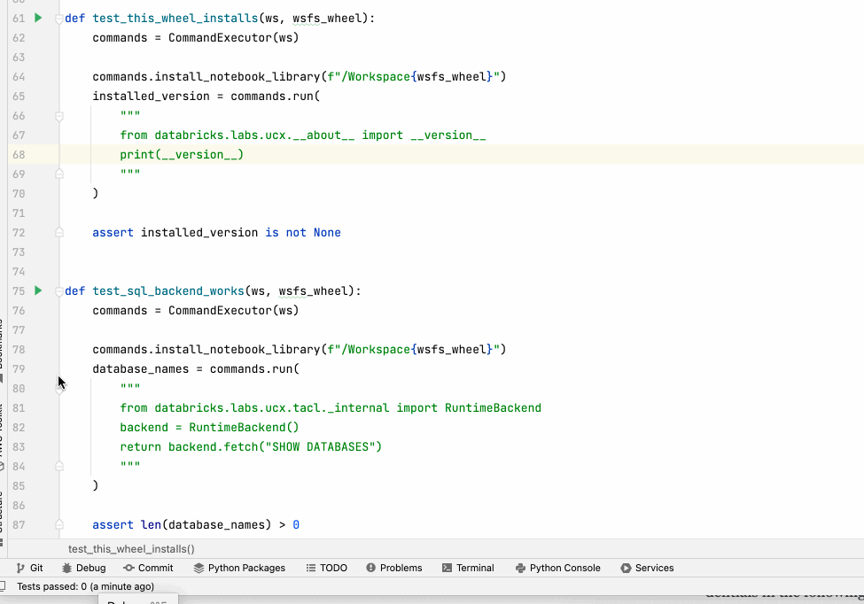

# Contributing

## First Principles

We must use the [Databricks SDK for Python](https://databricks-sdk-py.readthedocs.io/) in this project. It is a toolkit for our project. 
If something doesn't naturally belong to the `WorkspaceClient`, it must go through a "mixin" process before it can be used with the SDK.
Imagine the `WorkspaceClient` as the main control center and the "mixin" process as a way to adapt other things to work with it.
You can find an example of how mixins are used with `StatementExecutionExt`. There's a specific example of how to make something 
work with the WorkspaceClient using `StatementExecutionExt`. This example can help you understand how mixins work in practice.

## Code Organization

When writing code, divide it into two main parts: **Components for API Interaction** and **Components for Business Logic**.
API Interaction should only deal with talking to external systems through APIs. They are usually integration-tested, and mocks are simpler.
Business Logic handles the actual logic of your application, like calculations, data processing, and decision-making.

_Keep API components simple._ In the components responsible for API interactions, try to keep things as straightforward as possible.
Refrain from overloading them with complex logic; instead, focus on making API calls and handling the data from those calls.

_Inject Business Logic._ If you need to use business logic in your API-calling components, don't build it directly there.
Instead, inject (or pass in) the business logic components into your API components. This way, you can keep your API components 
clean and flexible, while the business logic remains separate and reusable.

_Test your Business Logic._ It's essential to test your business logic to ensure it works correctly and thoroughly. When writing 
unit tests, avoid making actual API calls - unit tests are executed for every pull request, and **_take seconds to complete_**. 
For calling any external services, including Databricks Connect, Databricks Platform, or even Apache Spark, unit tests have 
to use "mocks" or fake versions of the APIs to simulate their behavior. This makes testing your code more manageable and catching any 
issues without relying on external systems. Focus on testing the edge cases of the logic, especially the scenarios where 
things may fail. See [this example](https://github.com/databricks/databricks-sdk-py/pull/295) as a reference of an extensive
unit test coverage suite and the clear difference between _unit tests_ and _integration tests_.

## Integration Testing Infrastructure

Integration tests must accompany all new code additions. Integration tests help us validate that various parts of 
our application work correctly when they interact with each other or external systems. This practice ensures that our 
software _**functions as a cohesive whole**_. Integration tests run every night and take approximately 15 minutes
for the entire test suite to complete.

We encourage using predefined test infrastructure provided through environment variables for integration tests. 
These fixtures are set up in advance to simulate specific scenarios, making it easier to test different use cases. These 
predefined fixtures enhance test consistency and reliability and point to the real infrastructure used by integration
testing. See [Unified Authentication Documentation](https://databricks-sdk-py.readthedocs.io/en/latest/authentication.html)
for the latest reference of environment variables related to authentication.

- `CLOUD_ENV`: This environment variable specifies the cloud environment where Databricks is hosted. The values typically 
  indicate the cloud provider being used, such as "aws" for Amazon Web Services and "azure" for Microsoft Azure.
- `DATABRICKS_ACCOUNT_ID`: This variable stores the unique identifier for your Databricks account.
- `DATABRICKS_HOST`: This variable contains the URL of your Databricks workspace. It is the web address you use to access 
  your Databricks environment and typically looks like "https://dbc-....cloud.databricks.com."
- `TEST_DEFAULT_CLUSTER_ID`: This variable holds the identifier for the default cluster used in testing. The value 
  resembles a unique cluster ID, like "0824-163015-tdtagl1h."
- `TEST_DEFAULT_WAREHOUSE_DATASOURCE_ID`: This environment variable stores the identifier for the default warehouse data 
  source used in testing. The value is a unique identifier for the data source, such as "3c0fef12-ff6c-...".
- `TEST_DEFAULT_WAREHOUSE_ID`: This variable contains the identifier for the default warehouse used in testing. The value 
  resembles a unique warehouse ID, like "49134b80d2...".
- `TEST_INSTANCE_POOL_ID`: This environment variable stores the identifier for the instance pool used in testing. 
  You must utilise existing instance pools as much as possible for cluster startup time and cost reduction. 
  The value is a unique instance pool ID, like "0824-113319-...".
- `TEST_LEGACY_TABLE_ACL_CLUSTER_ID`: This variable holds the identifier for the cluster used in testing legacy table
  access control. The value is a unique cluster ID, like "0824-161440-...".
- `TEST_USER_ISOLATION_CLUSTER_ID`: This environment variable contains the identifier for the cluster used in testing
  user isolation. The value is a unique cluster ID, like "0825-164947-...".

We'd like to encourage you to leverage the extensive set of [pytest fixtures](https://docs.pytest.org/en/latest/explanation/fixtures.html#about-fixtures). 
These fixtures follow a consistent naming pattern, starting with "make_". These functions can be called multiple 
times to _create and clean up objects as needed_ for your tests. Reusing these fixtures helps maintain clean and consistent 
test setups across the codebase. In cases where your tests require unique fixture setups, keeping the wall
clock time of fixture initialization under one second is crucial. Fast fixture initialization ensures that tests run quickly, reducing
development cycle times and allowing for more immediate feedback during development.

```python
from databricks.sdk.service.workspace import AclPermission
from databricks.labs.ucx.providers.mixins.fixtures import *  # noqa: F403

def test_secret_scope_acl(make_secret_scope, make_secret_scope_acl, make_group):
    scope_name = make_secret_scope()
    make_secret_scope_acl(scope=scope_name, principal=make_group().display_name, permission=AclPermission.WRITE)
```

Each integration test _must be debuggable within the free [IntelliJ IDEA (Community Edition)](https://www.jetbrains.com/idea/download) 
with the [Python plugin (Community Edition)](https://plugins.jetbrains.com/plugin/7322-python-community-edition). If it works within 
IntelliJ CE, then it would work in PyCharm. Debugging capabilities are essential for troubleshooting and diagnosing issues during 
development. Please make sure that your test setup allows for easy debugging by following best practices.



Adhering to these guidelines ensures that our integration tests are robust, efficient, and easily maintainable. This, 
in turn, contributes to the overall reliability and quality of our software.

Currently, VSCode IDE is not supported, as it does not offer interactive debugging single integration tests. 
However, it's possible that this limitation may be addressed in the future.

## Local Setup

This section provides a step-by-step guide to set up and start working on the project. These steps will help you set up 
your project environment and dependencies for efficient development.

To begin, you'll need to install [Hatch](https://github.com/pypa/hatch). You can do this with the following command:
```shell
pip install hatch
```

Next, create a virtual environment for your project using Hatch:
```shell
hatch env create
```

To install development dependencies, including testing and database connection packages, use the following command:
```shell
hatch run pip install -e '.[test,dbconnect]'
```

To ensure your integrated development environment (IDE) uses the newly created virtual environment, you can retrieve the Python path with this command:
```shell
hatch run python -c "import sys; print(sys.executable)"
```

Configure your IDE to use this Python path so that you work within the virtual environment when developing the project:


Before every commit, apply the consistent formatting of the code, as we want our codebase look consistent:
```shell
make fmt
```

Before every commit, run automated bug detector (`make lint`) and unit tests (`make test`) to ensure that automated
pull request checks do pass, before your code is reviewed by others: 
```shell
make lint test
```

## First contribution

Here are the example steps to submit your first contribution:

1. `git checkout main` (or `gcm` if you're using [ohmyzsh](https://ohmyz.sh/)).
2. `git pull` (or `gl` if you're using [ohmyzsh](https://ohmyz.sh/)).
3. `git checkout -b FEATURENAME` (or `gcb FEATURENAME` if you're using [ohmyzsh](https://ohmyz.sh/)).
4. .. do the work
5. `make fmt`
6. `make lint`
7. .. fix if any
8. `make test`
9. .. fix if any
10. `git commit -a`. Make sure to enter meaningful commit message title. 
11. `git push origin FEATURENAME`
12. Go to GitHub UI and create PR. Alternatively, `gh pr create` (if you have [GitHub CLI](https://cli.github.com/) installed). 
    Use a meaningful pull request title because it'll appear in the release notes. Use `Resolves #NUMBER` in pull
    request description to [automatically link it](https://docs.github.com/en/get-started/writing-on-github/working-with-advanced-formatting/using-keywords-in-issues-and-pull-requests#linking-a-pull-request-to-an-issue)
    to an existing issue.
14. announce PR for the review
