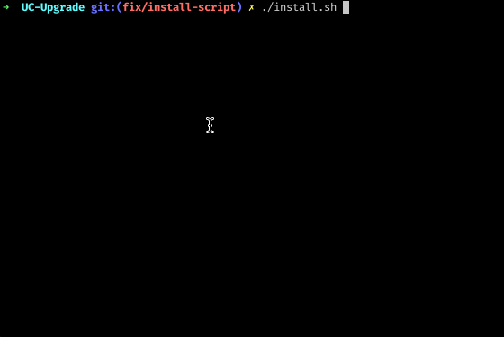
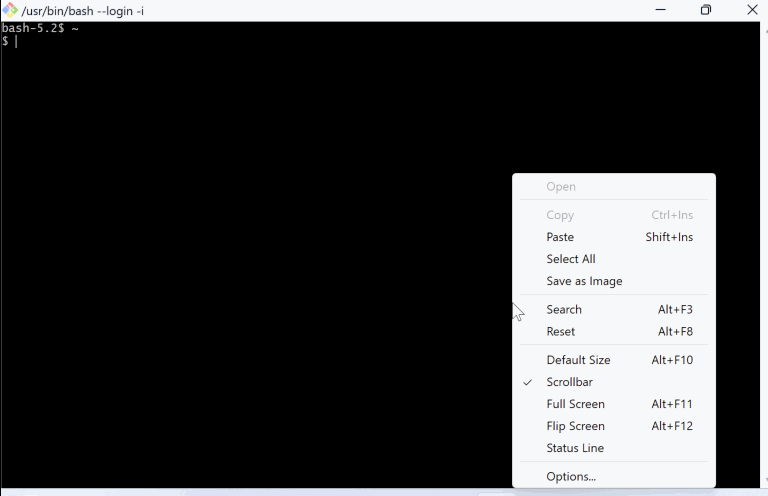
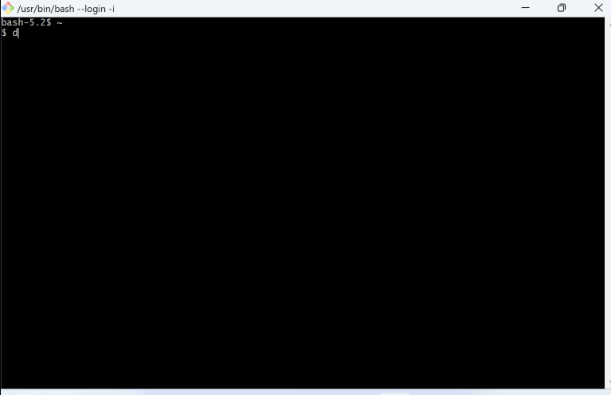
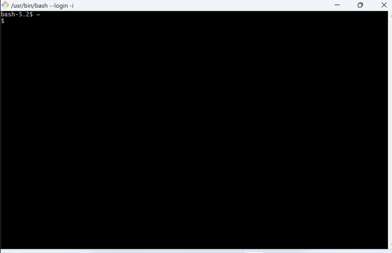

# 

Your best companion for upgrading to Unity Catalog. It helps you to upgrade all Databricks workspace assets:
Legacy Table ACLs, Entitlements, AWS instance profiles, Clusters, Cluster policies, Instance Pools, Databricks SQL warehouses, Delta Live Tables, Jobs, MLflow experiments, MLflow registry, SQL Dashboards & Queries, SQL Alerts, Token and Password usage permissions that are set on the workspace level, Secret scopes, Notebooks, Directories, Repos, Files.

[](https://github.com/databrickslabs/ucx/actions/workflows/push.yml) [](https://codecov.io/github/databrickslabs/ucx)

See [contributing instructions](CONTRIBUTING.md) to help improve this project.


## Introduction
UCX will guide you, the Databricks customer, through the process of upgrading your account, groups, workspaces, jobs etc. to Unity Catalog.

1. The upgrade process will first install code, libraries, and workflows into your workspace.
2. After installation, you will run a series of workflows and examine the output.

UCX leverages Databricks Lakehouse platform to upgrade itself. The upgrade process includes creating jobs, notebooks, and deploying code and configuration files. The `install.sh` guides you through the installation.

By running the installation you install the assessment job and several upgrade jobs. The assessment and upgrade jobs are outlined in the custom-generated README.py that is created by the installer and displayed to you by the `install.sh`. See interactive installation [tutorial here](https://app.getreprise.com/launch/G6YbWLn/).


The custom-generated `README.py`, `config.yaml`, and other assets are placed into your Databricks workspace home folder, into a subfolder named `.ucx`. See [interactive tutorial](https://app.getreprise.com/launch/zXPxBZX/).


Once the custom Databricks jobs are installed, begin by triggering the assessment job. The assessment job can be found under your workflows or via the active link in the README.py. Once the assessment job is complete, you can review the results in the custom-generated Databricks dashboard (linked to by the custom README.py found in the workspace folder created for you).


You will need an account, unity catalog, and workspace administrative authority to complete the upgrade process. To run the installer, you will need to setup `databricks-cli` and a credential, [following these instructions.](https://docs.databricks.com/en/dev-tools/cli/databricks-cli.html) Additionally, the interim metadata and config data being processed by UCX will be stored into a Hive Metastore database schema generated at install time.


For questions, troubleshooting or bug fixes, please see your Databricks account team or submit an issue to the [Databricks UCX github repo](https://github.com/databrickslabs/ucx)

## Installation
### Prerequisites
1. Get trained on UC [[free instructor-led training 2x week](https://customer-academy.databricks.com/learn/course/1683/data-governance-with-unity-catalog?generated_by=302876&hash=4eab6668f83636ba44d109880002b293e8dda6dd)] [[full training schedule](https://files.training.databricks.com/static/ilt-sessions/half-day-workshops/index.html)]
2. [[AWS](https://docs.databricks.com/en/administration-guide/users-groups/best-practices.html)] [[Azure](https://learn.microsoft.com/en-us/azure/databricks/administration-guide/users-groups/best-practices)] [[GCP](https://docs.gcp.databricks.com/administration-guide/users-groups/best-practices.html)] Account level Identity Setup
3. [[AWS](https://docs.databricks.com/en/data-governance/unity-catalog/create-metastore.html)] [[Azure](https://learn.microsoft.com/en-us/azure/databricks/data-governance/unity-catalog/create-metastore)] [[GCP](https://docs.gcp.databricks.com/data-governance/unity-catalog/create-metastore.html)] Unity Catalog Metastore Created (per region)

### Download & Install
As a customer, download the [latest release](https://github.com/databrickslabs/ucx/releases) from github onto your laptop/desktop machine. Unzip or untar the release.

The `./install.sh` script will guide you through installation process.
Make sure you have Python 3.10 (or greater) installed on your workstation, and you've configured authentication for
the [Databricks Workspace](https://databricks-sdk-py.readthedocs.io/en/latest/authentication.html#default-authentication-flow).



The easiest way to install and authenticate is through a [Databricks configuration profile](https://docs.databricks.com/en/dev-tools/auth.html#databricks-client-unified-authentication):

```shell
export DATABRICKS_CONFIG_PROFILE=ABC
./install.sh
```

You can also specify environment variables in a more direct way, like in this example for installing
on an Azure Databricks Workspace using the Azure CLI authentication:

```shell
az login
export DATABRICKS_HOST=https://adb-123....azuredatabricks.net/
./install.sh
```

Please follow the instructions in `./install.sh`, which will deploy UCX to your workspace and open a notebook with the description of all jobs to trigger. The journey starts with assessment.

### UCX on macOS
#### Install Databricks via brew


#### Install UCX


#### Upgrade UCX


#### Uninstall UCX


### UCX on Windows OS
#### Install Databricks via curl


#### Install UCX


#### Upgrade UCX


#### Uninstall UCX



### Special Consideration - External Metastores
If your Databricks Workspace relies on an external Hive Metastore (such as glue), make sure to read the [External HMS Document](docs/external_hms_glue.md).


## Star History

[](https://star-history.com/#databrickslabs/ucx)

## Project Support
Please note that all projects in the /databrickslabs github account are provided for your exploration only, and are not formally supported by Databricks with Service Level Agreements (SLAs).  They are provided AS-IS and we do not make any guarantees of any kind.  Please do not submit a support ticket relating to any issues arising from the use of these projects.

Any issues discovered through the use of this project should be filed as GitHub Issues on the Repo.  They will be reviewed as time permits, but there are no formal SLAs for support.
