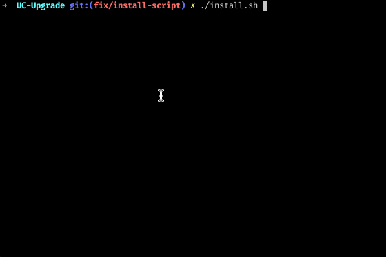

# UCX - Unity Catalog Migration Toolkit

Your best companion for enabling the Unity Catalog.

## Installation

The `./install.sh` script will guide you through installation process. Make sure you have Python 3.10 (or greater) 
installed on your workstation, and you've configured authentication for 
the [Databricks Workspace](https://databricks-sdk-py.readthedocs.io/en/latest/authentication.html#default-authentication-flow).



The easiest way to install and authenticate is through a [Databricks configuration profile](https://docs.databricks.com/en/dev-tools/auth.html#databricks-client-unified-authentication):

```shell
export DATABRICKS_CONFIG_PROFILE=ABC
./install.sh
```

You can also specify environment variables in a more direct way, like in this example for installing 
on a Azure Databricks Workspace using the Azure CLI authentication:

```shell
az login
export DATABRICKS_HOST=https://adb-123....azuredatabricks.net/
./install.sh
```

## Latest working version and how-to

Please note that current project statis is 🏗️ **WIP**, but we have a minimal set of already working utilities.

See [contributing instructions](CONTRIBUTING.md).

## Project Support
Please note that all projects in the /databrickslabs github account are provided for your exploration only, and are not formally supported by Databricks with Service Level Agreements (SLAs).  They are provided AS-IS and we do not make any guarantees of any kind.  Please do not submit a support ticket relating to any issues arising from the use of these projects.

Any issues discovered through the use of this project should be filed as GitHub Issues on the Repo.  They will be reviewed as time permits, but there are no formal SLAs for support.
