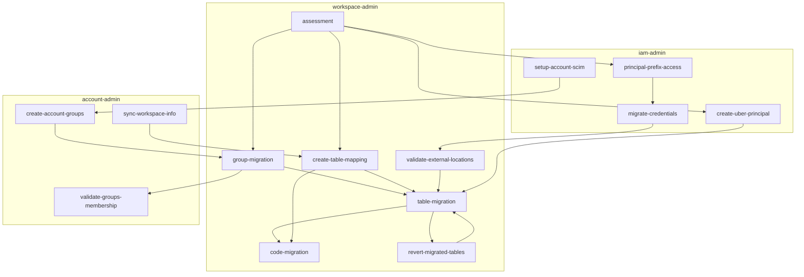
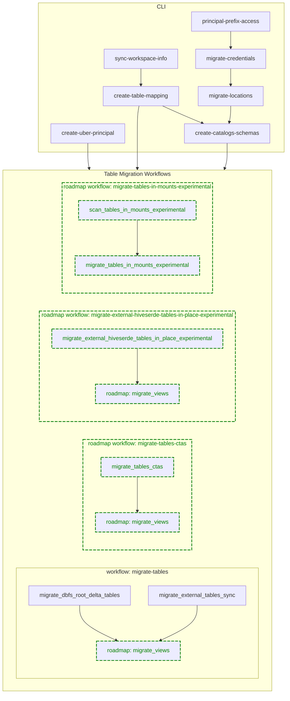

Databricks Labs UCX
===


The companion for upgrading to Unity Catalog. After [installation](#install-ucx), ensure to [trigger](#ensure-assessment-run-command) the [assessment workflow](#assessment-workflow), 
so that you'll be able to [scope the migration](docs/assessment.md) and execute the [group migration workflow](#group-migration-workflow). 
[`<installation_path>/README`](#readme-notebook) contains further instructions and explanations of these workflows. 
Then you can execute [table migration workflow](#table-migration-workflow).
More workflows, like notebook code migration is coming in the future releases. 
UCX exposes a number of command line utilities accessible via `databricks labs ucx`.

For questions, troubleshooting or bug fixes, please see our [troubleshooting guide](docs/troubleshooting.md) or submit [an issue](https://github.com/databrickslabs/ucx/issues). 
See [contributing instructions](CONTRIBUTING.md) to help improve this project.

[](https://github.com/databrickslabs/ucx/actions/workflows/push.yml) [](https://codecov.io/github/databrickslabs/ucx)  []([https://codecov.io/github/databrickslabs/ucx](https://github.com/databrickslabs/ucx))

<!-- TOC -->
* [Databricks Labs UCX](#databricks-labs-ucx)
* [Installation](#installation)
  * [Authenticate Databricks CLI](#authenticate-databricks-cli)
  * [Install UCX](#install-ucx)
  * [[ADVANCED] Force install over existing UCX](#advanced-force-install-over-existing-ucx)
  * [[ADVANCED] Installing UCX on all workspaces within a Databricks account](#advanced-installing-ucx-on-all-workspaces-within-a-databricks-account)
  * [Upgrading UCX for newer versions](#upgrading-ucx-for-newer-versions)
  * [Uninstall UCX](#uninstall-ucx)
* [Migration process](#migration-process)
* [Workflows](#workflows)
  * [Readme notebook](#readme-notebook)
  * [Assessment workflow](#assessment-workflow)
  * [Group migration workflow](#group-migration-workflow)
  * [Debug notebook](#debug-notebook)
  * [Debug logs](#debug-logs)
  * [Table Migration Workflow](#table-migration-workflow)
    * [Dependency CLI commands](#dependency-cli-commands)
    * [Table Migration Workflow Tasks](#table-migration-workflow-tasks)
    * [Other considerations](#other-considerations)
* [Utility commands](#utility-commands)
  * [`logs` command](#logs-command)
  * [`ensure-assessment-run` command](#ensure-assessment-run-command)
  * [`repair-run` command](#repair-run-command)
  * [`workflows` command](#workflows-command)
  * [`open-remote-config` command](#open-remote-config-command)
  * [`installations` command](#installations-command)
* [Metastore related commands](#metastore-related-commands)
  * [`show-all-metastores` command](#show-all-metastores-command)
  * [`assign-metastore` command](#assign-metastore-command)
* [Table migration commands](#table-migration-commands)
  * [`principal-prefix-access` command](#principal-prefix-access-command)
    * [Access for AWS S3 Buckets](#access-for-aws-s3-buckets)
    * [Access for Azure Storage Accounts](#access-for-azure-storage-accounts)
  * [`create-uber-principal` command](#create-uber-principal-command)
  * [`migrate-credentials` command](#migrate-credentials-command)
  * [`validate-external-locations` command](#validate-external-locations-command)
  * [`migrate-locations` command](#migrate-locations-command)
  * [`create-table-mapping` command](#create-table-mapping-command)
  * [`skip` command](#skip-command)
  * [`revert-migrated-tables` command](#revert-migrated-tables-command)
  * [`create-catalogs-schemas` command](#create-catalogs-schemas-command)
  * [`move` command](#move-command)
  * [`alias` command](#alias-command)
* [Code migration commands](#code-migration-commands)
  * [`migrate-local-code` command](#migrate-local-code-command)
* [Cross-workspace installations](#cross-workspace-installations)
  * [`sync-workspace-info` command](#sync-workspace-info-command)
  * [`manual-workspace-info` command](#manual-workspace-info-command)
  * [`create-account-groups` command](#create-account-groups-command)
  * [`validate-groups-membership` command](#validate-groups-membership-command)
  * [`cluster-remap` command](#cluster-remap-command)
  * [`revert-cluster-remap` command](#revert-cluster-remap-command)
* [Star History](#star-history)
* [Project Support](#project-support)
<!-- TOC -->

# Installation

- Databricks CLI v0.213 or later. See [instructions](#authenticate-databricks-cli). 
- Python 3.10 or later. See [Windows](https://www.python.org/downloads/windows/) instructions.
- Network access to your Databricks Workspace used for the [installation process](#install-ucx).
- Network access to the Internet for [pypi.org](https://pypi.org) and [github.com](https://github.com) from machine running the installation.
- Databricks Workspace Administrator privileges for the user, that runs the installation. Running UCX as a Service Principal is not supported.
- Account level Identity Setup. See instructions for [AWS](https://docs.databricks.com/en/administration-guide/users-groups/best-practices.html), [Azure](https://learn.microsoft.com/en-us/azure/databricks/administration-guide/users-groups/best-practices), and [GCP](https://docs.gcp.databricks.com/administration-guide/users-groups/best-practices.html).
- Unity Catalog Metastore Created (per region). See instructions for [AWS](https://docs.databricks.com/en/data-governance/unity-catalog/create-metastore.html), [Azure](https://learn.microsoft.com/en-us/azure/databricks/data-governance/unity-catalog/create-metastore), and [GCP](https://docs.gcp.databricks.com/data-governance/unity-catalog/create-metastore.html).
- If your Databricks Workspace relies on an external Hive Metastore (such as AWS Glue), make sure to read [this guide](docs/external_hms_glue.md).
- Databricks Workspace has to have network access to [pypi.org](https://pypi.org) to download `databricks-sdk` and `pyyaml` packages.
- A PRO or Serverless SQL Warehouse to render the [report](docs/assessment.md) for the [assessment workflow](#assessment-workflow).

Once you [install UCX](#install-ucx), you can proceed to the [assessment workflow](#assessment-workflow) to ensure 
the compatibility of your workspace with Unity Catalog.

[[back to top](#databricks-labs-ucx)]

## Authenticate Databricks CLI

We only support installations and upgrades through [Databricks CLI](https://docs.databricks.com/en/dev-tools/cli/index.html), as UCX requires an installation script run 
to make sure all the necessary and correct configurations are in place. Install Databricks CLI on macOS:


Install Databricks CLI on Windows:


Once you install Databricks CLI, authenticate your current machine to a Databricks Workspace:

```commandline
databricks auth login --host WORKSPACE_HOST
```

To enable debug logs, simply add `--debug` flag to any command.

[[back to top](#databricks-labs-ucx)]

## Install UCX

Install UCX via Databricks CLI:

```commandline
databricks labs install ucx
```

You'll be prompted to select a [configuration profile](https://docs.databricks.com/en/dev-tools/auth.html#databricks-client-unified-authentication) created by `databricks auth login` command.

Once you install, proceed to the [assessment workflow](#assessment-workflow) to ensure the compatibility of your workspace with UCX.

The `WorkspaceInstaller` class is used to create a new configuration for Unity Catalog migration in a Databricks workspace. 
It guides the user through a series of prompts to gather necessary information, such as selecting an inventory database, choosing 
a PRO or SERVERLESS SQL warehouse, specifying a log level and number of threads, and setting up an external Hive Metastore if necessary. 
Upon the first installation, you're prompted for a workspace local [group migration strategy](docs/group_name_conflict.md). 
Based on user input, the class creates a new cluster policy with the specified configuration. The user can review and confirm the configuration, 
which is saved to the workspace and can be opened in a web browser.

The [`WorkspaceInstallation`](src/databricks/labs/ucx/install.py) manages the installation and uninstallation of UCX in a workspace. It handles 
the configuration and exception management during the installation process. The installation process creates dashboards, databases, and jobs. 
It also includes the creation of a database with given configuration and the deployment of workflows with specific settings. The installation 
process can handle exceptions and infer errors from job runs and task runs. The workspace installation uploads wheels, creates cluster policies, 
and wheel runners to the workspace. It can also handle the creation of job tasks for a given task, such as job dashboard tasks, job notebook tasks, 
and job wheel tasks. The class handles the installation of UCX, including configuring the workspace, installing necessary libraries, and verifying 
the installation, making it easier for users to migrate their workspaces to UCX.

After this, UCX will be installed locally and a number of assets will be deployed in the selected workspace. 
These assets are available under the installation folder, i.e. `/Users/<your user>/.ucx/`.

You can also install a specific version by specifying it like `@v0.13.2` - `databricks labs install ucx@v0.13.2`.


[[back to top](#databricks-labs-ucx)]

## [ADVANCED] Force install over existing UCX
Using an environment variable `UCX_FORCE_INSTALL` you can force the installation of UCX over an existing installation.
The values for the environment variable are 'global' and 'user'.

Global Install: When UCX is installed at '/Applications/ucx'
User Install: When UCX is installed at '/Users/<user>/.ucx'

If there is an existing global installation of UCX, you can force a user installation of UCX over the existing installation by setting the environment variable `UCX_FORCE_INSTALL` to 'global'.

At this moment there is no global override over a user installation of UCX. As this requires migration and can break existing installations.


| global | user | expected install location | install_folder      | mode                                            |
|--------|------|---------------------------|---------------------|-------------------------------------------------|
| no     | no   | default                   | `/Applications/ucx` | install                                         |
| yes    | no   | default                   | `/Applications/ucx` | upgrade                                         |
| no     | yes  | default                   | `/Users/X/.ucx`     | upgrade (existing installations must not break) |
| yes    | yes  | default                   | `/Users/X/.ucx`     | upgrade                                         |
| yes    | no   | **USER**                  | `/Users/X/.ucx`     | install (show prompt)                           |
| no     | yes  | **GLOBAL**                | ...                 | migrate                                         |


* `UCX_FORCE_INSTALL=user databricks labs install ucx` - will force the installation to be for user only
* `UCX_FORCE_INSTALL=global databricks labs install ucx` - will force the installation to be for root only


[[back to top](#databricks-labs-ucx)]

## [ADVANCED] Installing UCX on all workspaces within a Databricks account
Setting the environment variable `UCX_FORCE_INSTALL` to 'account' will install UCX on all workspaces within a Databricks account.

* `UCX_FORCE_INSTALL=account databricks labs install ucx`

After the first installation, UCX will prompt the user to confirm whether to install UCX on the remaining workspaces with the same answers. If confirmed, the remaining installations will be completed silently.

This installation mode will automatically select the following options:
* Automatically create and enable HMS lineage init script
* Automatically create a new SQL warehouse for UCX assessment

[[back to top](#databricks-labs-ucx)]

## Upgrading UCX for newer versions

Verify that UCX is installed

```commandline
databricks labs installed

Name  Description                            Version
ucx   Unity Catalog Migration Toolkit (UCX)  <version>
```

Upgrade UCX via Databricks CLI:

```commandline
databricks labs upgrade ucx
```

The prompts will be similar to [Installation](#install-ucx)


[[back to top](#databricks-labs-ucx)]

## Uninstall UCX

Uninstall UCX via Databricks CLI:

```commandline
databricks labs uninstall ucx
```

Databricks CLI will confirm a few options:
- Whether you want to remove all ucx artefacts from the workspace as well. Defaults to no.
- Whether you want to delete the inventory database in `hive_metastore`. Defaults to no.


[[back to top](#databricks-labs-ucx)]

# Migration process

On the high level, the steps in migration process start with the [assessment workflow](#assessment-workflow), 
followed by [group migration](#group-migration-workflow), [table migration workflow](#table-migration-workflow), 
finalised with the [code migration](#code-migration-commands). It can be described as:



[[back to top](#databricks-labs-ucx)]

# Workflows

Part of this application is deployed as [Databricks Workflows](https://docs.databricks.com/en/workflows/index.html). 
You can view the status of deployed workflows via the [`workflows` command](#workflows-command).
Failed workflows can be fixed with the [`repair-run` command](#repair-run-command).

[[back to top](#databricks-labs-ucx)]

## Readme notebook


Every installation creates a `README` notebook with a detailed description of all deployed workflows and their tasks,
providing quick links to the relevant workflows and dashboards.

[[back to top](#databricks-labs-ucx)]

## Assessment workflow

The assessment workflow can be triggered using the Databricks UI, or via the [command line](#ensure-assessment-run-command). 

```commandline
databricks labs ucx ensure-assessment-run
```


Once you finish the assessment, proceed to the [group migration workflow](#group-migration-workflow). 
See the [migration process diagram](#migration-process) to understand the role of the assessment workflow in the migration process.

The assessment workflow is designed to assess the compatibility of various entities in the current workspace with Unity Catalog. 
It identifies incompatible entities and provides information necessary for planning the migration to UC. The tasks in 
the assessment workflow can be executed in parallel or sequentially, depending on the dependencies specified in the `@task` decorators.
The output of each task is stored in Delta tables in the `$inventory_database` schema, that you specify during [installation](#install-ucx), 
which can be used for further analysis and decision-making through the [assessment report](docs/assessment.md). 
The assessment workflow can be executed multiple times to ensure that all incompatible entities are identified and accounted 
for before starting the migration process.

1. `crawl_tables`: This task scans all tables in the Hive Metastore of the current workspace and persists their metadata in a Delta table named `$inventory_database.tables`. This metadata includes information such as the database name, table name, table type, and table location. This task is used for assessing which tables cannot be easily migrated to Unity Catalog.
2. `crawl_grants`: This task scans the Delta table named `$inventory_database.tables` and issues a `SHOW GRANTS` statement for every object to retrieve the permissions assigned to it. The permissions include information such as the principal, action type, and the table it applies to. This task persists the permissions in the Delta table `$inventory_database.grants`.
3. `estimate_table_size_for_migration`: This task scans the Delta table named `$inventory_database.tables` and locates tables that cannot be synced. These tables will have to be cloned in the migration process. The task assesses the size of these tables and creates the `$inventory_database.table_size` table to list these sizes. The table size is a factor in deciding whether to clone these tables.
4. `crawl_mounts`: This task scans the workspace to compile a list of all existing mount points and stores this information in the `$inventory.mounts` table. This is crucial for planning the migration.
5. `guess_external_locations`: This task determines the shared path prefixes of all the tables that utilize mount points. The goal is to identify the external locations necessary for a successful migration and store this information in the `$inventory.external_locations` table.
6. `assess_jobs`: This task scans through all the jobs and identifies those that are not compatible with UC. The list of all the jobs is stored in the `$inventory.jobs` table.
7. `assess_clusters`: This task scans through all the clusters and identifies those that are not compatible with UC. The list of all the clusters is stored in the `$inventory.clusters` table.
8. `assess_pipelines`: This task scans through all the Pipelines and identifies those pipelines that have Azure Service Principals embedded in their configurations. A list of all the pipelines with matching configurations is stored in the `$inventory.pipelines` table.
9. `assess_azure_service_principals`: This task scans through all the clusters configurations, cluster policies, job cluster configurations, Pipeline configurations, and Warehouse configuration and identifies all the Azure Service Principals who have been given access to the Azure storage accounts via spark configurations referred in those entities. The list of all the Azure Service Principals referred in those configurations is saved in the `$inventory.azure_service_principals` table.
10. `assess_global_init_scripts`: This task scans through all the global init scripts and identifies if there is an Azure Service Principal who has been given access to the Azure storage accounts via spark configurations referred in those scripts.


After UCX assessment workflow is executed, the assessment dashboard will be populated with findings and common recommendations. See [this guide](docs/assessment.md) for more details.

[[back to top](#databricks-labs-ucx)]

## Group migration workflow

You are required to complete the [assessment workflow](#assessment-workflow) before starting the group migration workflow.
See the [migration process diagram](#migration-process) to understand the role of the group migration workflow in the migration process.

See the [detailed design](docs/local-group-migration.md) of this workflow. It helps you to upgrade all Databricks workspace assets:
Legacy Table ACLs, Entitlements, AWS instance profiles, Clusters, Cluster policies, Instance Pools, 
Databricks SQL warehouses, Delta Live Tables, Jobs, MLflow experiments, MLflow registry, SQL Dashboards & Queries,
SQL Alerts, Token and Password usage permissions that are set on the workspace level, Secret scopes, Notebooks,
Directories, Repos, and Files. 

Once done with the group migration, proceed to [table migration workflow](#table-migration-workflow).

Use [`validate-groups-membership` command](#validate-groups-membership-command) for extra confidence.
If you don't have matching account groups, please run [`create-account-groups` command](#create-account-groups-command).

The group migration workflow is designed to migrate workspace-local groups to account-level groups in the Unity Catalog (UC) environment. It ensures that all the necessary groups are available in the workspace with the correct permissions, and removes any unnecessary groups and permissions. The tasks in the group migration workflow depend on the output of the assessment workflow and can be executed in sequence to ensure a successful migration. The output of each task is stored in Delta tables in the `$inventory_database` schema, which can be used for further analysis and decision-making. The group migration workflow can be executed multiple times to ensure that all the groups are migrated successfully and that all the necessary permissions are assigned.

1. `crawl_groups`: This task scans all groups for the local group migration scope.
2. `rename_workspace_local_groups`: This task renames workspace local groups by adding a `ucx-renamed-` prefix. This step is taken to avoid conflicts with account-level groups that may have the same name as workspace-local groups.
3. `reflect_account_groups_on_workspace`: This task adds matching account groups to this workspace. The matching account level group(s) must preexist(s) for this step to be successful. This step is necessary to ensure that the account-level groups are available in the workspace for assigning permissions.
4. `apply_permissions_to_account_groups`: This task assigns the full set of permissions of the original group to the account-level one. It covers local workspace-local permissions for all entities, including Legacy Table ACLs, Entitlements, AWS instance profiles, Clusters, Cluster policies, Instance Pools, Databricks SQL warehouses, Delta Live Tables, Jobs, MLflow experiments, MLflow registry, SQL Dashboards & Queries, SQL Alerts, Token and Password usage permissions, Secret Scopes, Notebooks, Directories, Repos, Files. This step is necessary to ensure that the account-level groups have the necessary permissions to manage the entities in the workspace.
5. `validate_groups_permissions`: This task validates that all the crawled permissions are applied correctly to the destination groups.
6. `delete_backup_groups`: This task removes all workspace-level backup groups, along with their permissions. This should only be executed after confirming that the workspace-local migration worked successfully for all the groups involved. This step is necessary to clean up the workspace and remove any unnecessary groups and permissions.

[[back to top](#databricks-labs-ucx)]

## Debug notebook


Every [installation](#installation) creates a debug notebook, that initializes UCX as a library,
so that you can implement missing features and 

[[back to top](#databricks-labs-ucx)]

## Debug logs


Every workflow run stores debug logs in the `logs` folder of the [installation](#installation). 
For tasks shorter than 10 minutes, they appear after task finish, whereas longer-running tasks 
flush the logs every 10 minutes.

To enable debug logs of [command-line interface](#authenticate-databricks-cli), 
simply add `--debug` flag to any command.

[[back to top](#databricks-labs-ucx)]

## Table Migration Workflow

The table migration workflow comprises multiple workflows and tasks designed to migrate tables from the Hive Metastore to the Unity Catalog. The subsequent diagram illustrates the workflow's tasks and their dependency CLI commands. 

More details can be found in the [design of table migration](docs/table_upgrade.md)

### Dependency CLI commands
- [`create-table-mapping`](#create-table-mapping-command) - Create `mapping.csv` which will be used by the workflow to identify the targets catalog, schema, table of the HMS table to be migrated. User should review and update the mapping file accordingly before proceeding with the migration workflow.
- [`principal-prefix-access`](#principal-prefix-access-command) - Identify all the storages used in the workspace and corresponding Azure Service Principal or IAM role that are used in the workspace. It outputs `azure_storage_account_info.csv` or `uc_roles_access.csv` which will be later used by [`migrate-credentials`](#migrate-credentials-command) command to create UC storage credentials. The csv can be edited to control which IAM roles or Azure Service Principals should be used to create UC storage credentials later.
- [`migrate-credentials`](#migrate-credentials-command) - Create UC storage credentials based on the Azure Service Principal or IAM role (`azure_storage_account_info.csv` or `uc_roles_access.csv`) identified by [`principal-prefix-access`](#principal-prefix-access-command) command.
- [`migrate-locations`](#migrate-locations-command) - Create missing external locations in the Unity Catalog. 
- [`create-catalogs-schemas`](#create-catalogs-schemas-command) - Create missing catalogs and schemas in the Unity Catalog. The candidate catalogs and schemas is based on `mapping.csv`
- [`create-uber-principal`](#create-uber-principal-command) - Create an Uber Principal with access to all storages used in the workspace. This principal will be used by the workflow job cluster to migrate all the tables in the workspace.

[`create-table-mapping`](#create-table-mapping-command) and [`create-uber-principal`](#create-uber-principal-command) are required to run the workflow. While other commands are optional, as long as the UC storage credentials, external locations, catalogs and schemas needed for successful migration are created.

To control the scope of the table migration, consider utilizing a combination of editing `mapping.csv`, employing [`skip`](#skip-command) command, and [`revert-migrated-tables`](#revert-migrated-tables-command) command.

See more details in [Table migration commands](#table-migration-commands)

### Table Migration Workflow Tasks
- `migrate_dbfs_root_delta_tables` - Migrate delta tables from the DBFS root using deep clone, along with legacy table ACL migrated if any.
- `migrate_external_tables_sync` - Migrate external tables using [`SYNC`](https://docs.databricks.com/en/sql/language-manual/sql-ref-syntax-aux-sync.html) command, along with legacy table ACL migrated if any.
- Following workflows/tasks are on the roadmap and being developed:
  - Migrate view
  - Migrate tables using CTAS
  - Optionally and experimentally in place migrate ParquetHiveSerDe, OrcSerde, AvroSerDe, LazySimpleSerDe, JsonSerDe, OpenCSVSerde tables.
  - Experimentally migrate Delta and Parquet data found in dbfs mount but not registered as Hive Metastore table into UC tables.

### Other considerations
- You may need to run the workflow multiple times to ensure all the tables are migrated successfully in phases.
- If your delta tables in DBFS root have large number of files, consider:
  - Setting higher Min and Max workers for auto-scale when being asked during the UCX installation. More nodes/cores in the cluster means more concurrency for calling cloud storage api to copy files when deep cloning the delta tables.
  - Setting higher "Parallelism for migrating dbfs root delta tables with deep clone" (default 200) when being asked during the UCX installation. This controls the number of Spark task/partition to be created for deep clone.
- Consider create an instance pool, and set the instance pool id when being asked during the UCX installation. This instance pool will be put into the cluster policy used by all UCX workflows job clusters.
- You may also manually edit the job cluster configration per job or per task after the workflows are deployed.

[[back to top](#databricks-labs-ucx)]

# Utility commands

## `logs` command

```text
$ databricks labs ucx logs [--workflow WORKFLOW_NAME] [--debug]
```

This command displays the logs of the last run of the specified workflow. If no workflow is specified, it displays 
the logs of the workflow that was run the last. This command is useful for developers and administrators who want to 
check the logs of the last run of a workflow and ensure that it was executed as expected. It can also be used for 
debugging purposes when a workflow is not behaving as expected. By default, only `INFO`, `WARNING`, and `ERROR` logs
are displayed. To display `DEBUG` logs, use the `--debug` flag.

[[back to top](#databricks-labs-ucx)] 

## `ensure-assessment-run` command

```commandline
databricks labs ucx ensure-assessment-run
```

This command ensures that the [assessment workflow](#assessment-workflow) was run on a workspace. 
This command will block until job finishes.
Failed workflows can be fixed with the [`repair-run` command](#repair-run-command). Workflows and their status can be 
listed with the [`workflows` command](#workflows-command).

[[back to top](#databricks-labs-ucx)]

## `repair-run` command

```commandline
databricks labs ucx repair-run --step WORKFLOW_NAME
```

This command repairs a failed [UCX Workflow](#workflows). This command is useful for developers and administrators who 
want to repair a failed job. It can also be used to debug issues related to job failures. This operation can also be 
done via [user interface](https://docs.databricks.com/en/workflows/jobs/repair-job-failures.html). Workflows and their 
status can be listed with the [`workflows` command](#workflows-command).

[[back to top](#databricks-labs-ucx)]

## `workflows` command

See the [migration process diagram](#migration-process) to understand the role of each workflow in the migration process.

```text
$ databricks labs ucx workflows
Step                                  State    Started
assessment                            RUNNING  1 hour 2 minutes ago
099-destroy-schema                    UNKNOWN  <never run>
migrate-groups                        UNKNOWN  <never run>
remove-workspace-local-backup-groups  UNKNOWN  <never run>
validate-groups-permissions           UNKNOWN  <never run>
```

This command displays the [deployed workflows](#workflows) and their state in the current workspace. It fetches the latest 
job status from the workspace and prints it in a table format. This command is useful for developers and administrators 
who want to check the status of UCX workflows and ensure that they have been executed as expected. It can also be used 
for debugging purposes when a workflow is not behaving as expected. Failed workflows can be fixed with 
the [`repair-run` command](#repair-run-command).

[[back to top](#databricks-labs-ucx)]

## `open-remote-config` command

```commandline
databricks labs ucx open-remote-config
```

This command opens the remote configuration file in the default web browser. It generates a link to the configuration file 
and opens it using the `webbrowser.open()` method. This command is useful for developers and administrators who want to view or 
edit the remote configuration file without having to manually navigate to it in the workspace. It can also be used to quickly 
access the configuration file from the command line. Here's the description of configuration properties:

  * `inventory_database`: A string representing the name of the inventory database.
  * `workspace_group_regex`: An optional string representing the regular expression to match workspace group names.
  * `workspace_group_replace`: An optional string to replace the matched group names with.
  * `account_group_regex`: An optional string representing the regular expression to match account group names.
  * `group_match_by_external_id`: A boolean value indicating whether to match groups by their external IDs.
  * `include_group_names`: An optional list of strings representing the names of groups to include for migration.
  * `renamed_group_prefix`: An optional string representing the prefix to add to renamed group names.
  * `instance_pool_id`: An optional string representing the ID of the instance pool.
  * `warehouse_id`: An optional string representing the ID of the warehouse.
  * `connect`: An optional `Config` object representing the configuration for connecting to the warehouse.
  * `num_threads`: An optional integer representing the number of threads to use for migration.
  * `database_to_catalog_mapping`: An optional dictionary mapping source database names to target catalog names.
  * `default_catalog`: An optional string representing the default catalog name.
  * `log_level`: An optional string representing the log level.
  * `workspace_start_path`: A string representing the starting path for notebooks and directories crawler in the workspace.
  * `instance_profile`: An optional string representing the name of the instance profile.
  * `spark_conf`: An optional dictionary of Spark configuration properties.
  * `override_clusters`: An optional dictionary mapping job cluster names to existing cluster IDs.
  * `policy_id`: An optional string representing the ID of the cluster policy.
  * `is_terraform_used`: A boolean value indicating whether some workspace resources are managed by Terraform.
  * `include_databases`: An optional list of strings representing the names of databases to include for migration.

[[back to top](#databricks-labs-ucx)]

## `installations` command

```text
$ databricks labs ucx installations 
...
13:49:16  INFO [d.labs.ucx] Fetching installations...
13:49:17  INFO [d.l.blueprint.parallel][finding_ucx_installations_5] finding ucx installations 10/88, rps: 22.838/sec
13:49:17  INFO [d.l.blueprint.parallel][finding_ucx_installations_9] finding ucx installations 20/88, rps: 35.002/sec
13:49:17  INFO [d.l.blueprint.parallel][finding_ucx_installations_2] finding ucx installations 30/88, rps: 51.556/sec
13:49:18  INFO [d.l.blueprint.parallel][finding_ucx_installations_9] finding ucx installations 40/88, rps: 56.272/sec
13:49:18  INFO [d.l.blueprint.parallel][finding_ucx_installations_19] finding ucx installations 50/88, rps: 67.382/sec
...
Path                                      Database  Warehouse
/Users/serge.smertin@databricks.com/.ucx  ucx       675eaf1ff976aa98
```

This command displays the [installations](#installation) by different users on the same workspace. It fetches all 
the installations where the `ucx` package is installed and prints their details in JSON format. This command is useful 
for administrators who want to see which users have installed `ucx` and where. It can also be used to debug issues 
related to multiple installations of `ucx` on the same workspace.

[[back to top](#databricks-labs-ucx)]

# Metastore related commands

These commands are used to assign a Unity Catalog metastore to a workspace. The metastore assignment is a pre-requisite
for any further migration steps.

[[back to top](#databricks-labs-ucx)]

## `show-all-metastores` command

```text
databricks labs ucx show-all-metastores [--workspace-id <workspace-id>]
```

This command lists all the metastores available to be assigned to a workspace. If no workspace is specified, it lists
all the metastores available in the account. This command is useful when there are multiple metastores available within
a region and you want to see which ones are available for assignment.

[[back to top](#databricks-labs-ucx)]

## `assign-metastore` command

```text
databricks labs ucx assign-metastore --workspace-id <workspace-id> [--metastore-id <metastore-id>]
```

This command assigns a metastore to a workspace with `workspace-id`. If there is only a single metastore in the workspace
region, it will be automatically assigned to the workspace. If there are multiple metastores available, you need to specify
the metastore id of the metastore you want to assign to the workspace.

# Table migration commands

These commands are vital part of [table migration workflow](#table-migration-workflow) process and require 
the [assessment workflow](#assessment-workflow) and 
[group migration workflow](#group-migration-workflow) to be completed. 
See the [migration process diagram](#migration-process) to understand the role of the table migration commands in 
the migration process. 

The first step is to run the [`principal-prefix-access` command](#principal-prefix-access-command) to identify all 
the storage accounts used by tables in the workspace and their permissions on each storage account.

If you don't have any storage credentials and external locations configured,  you'll need to run 
the [`migrate-credentials` command](#migrate-credentials-command) to migrate the service principals 
and [`migrate-locations` command](#migrate-locations-command) to create the external locations. 
If some of the external locations already exist, you should run 
the [`validate-external-locations` command](#validate-external-locations-command).
You'll need to create the [uber principal](#create-uber-principal-command) with the _**access to all storage**_ used to tables in 
the workspace, so that you can migrate all the tables. If you already have the principal, you can skip this step.

Ask your Databricks Account admin to run the [`sync-workspace-info` command](#sync-workspace-info-command) to sync the
workspace information with the UCX installations. Once the workspace information is synced, you can run the 
[`create-table-mapping` command](#create-table-mapping-command) to align your tables with the Unity Catalog,
[create catalogs and schemas](#create-catalogs-schemas-command) and start the migration. During multiple runs of
the table migration workflow, you can use the [`revert-migrated-tables` command](#revert-migrated-tables-command) to 
revert the tables that were migrated in the previous run. You can also skip the tables that you don't want to migrate 
using the [`skip` command](#skip-command).

Once you're done with the table migration, proceed to the [code migration](#code-migration-commands).

[[back to top](#databricks-labs-ucx)]

## `principal-prefix-access` command

```text
databricks labs ucx principal-prefix-access [--subscription-id <Azure Subscription ID>] [--aws-profile <AWS CLI profile>]
```

This command depends on results from the [assessment workflow](#assessment-workflow) and requires [AWS CLI](#access-for-aws-s3-buckets) 
or [Azure CLI](#access-for-azure-storage-accounts) to be installed and authenticated for the given machine. This command
identifies all the storage accounts used by tables in the workspace and their permissions on each storage account. 
Once you're done running this command, proceed to the [`migrate-credentials` command](#migrate-credentials-command).

[[back to top](#databricks-labs-ucx)]

### Access for AWS S3 Buckets

```commandline
databricks labs ucx principal-prefix-access --aws-profile test-profile
```

Use to identify all instance profiles in the workspace, and map their access to S3 buckets. 
Also captures the IAM roles which has UC arn listed, and map their access to S3 buckets 
This requires `aws` CLI to be installed and configured. 

Once done, proceed to the [`migrate-credentials` command](#migrate-credentials-command).

[[back to top](#databricks-labs-ucx)]

### Access for Azure Storage Accounts

```commandline
databricks labs ucx principal-prefix-access --subscription-id test-subscription-id
```

Use to identify all storage account used by tables, identify the relevant Azure service principals and their permissions 
on each storage account. This requires Azure CLI to be installed and configured via `az login`. 

Once done, proceed to the [`migrate-credentials` command](#migrate-credentials-command).

[[back to top](#databricks-labs-ucx)]

## `create-uber-principal` command

```text
databricks labs ucx create-uber-principal [--subscription-id X]
```

**Requires Cloud IAM admin privileges.** Once the [`assessment` workflow](#assessment-workflow) complete, you should run 
this command to creates a service principal with the _**read-only access to all storage**_ used by tables in this 
workspace and configure the [UCX Cluster Policy](#installation) with the details of it. Once migration is complete, this
service principal should be unprovisioned. On Azure, it creates a principal with `Storage Blob Data Reader` role 
assignment on every storage account using Azure Resource Manager APIs.

This command is one of prerequisites for the [table migration workflow](#table-migration-workflow).

[[back to top](#databricks-labs-ucx)]

## `migrate-credentials` command

```commandline
databricks labs ucx migrate-credentials
```

For Azure, this command migrate Azure Service Principals, which have `Storage Blob Data Contributor`,
`Storage Blob Data Reader`, `Storage Blob Data Owner` roles on ADLS Gen2 locations that are being used in
Databricks, to UC storage credentials. The Azure Service Principals to location mapping are listed 
in `/Users/{user_name}/.ucx/azure_storage_account_info.csv` which is generated 
by [`principal-prefix-access` command](#principal-prefix-access-command). 
Please review the file and delete the Service Principals you do not want to be migrated.
The command will only migrate the Service Principals that have client secret stored in Databricks Secret.

Once you're done with this command, run [`validate-external-locations` command](#validate-external-locations-command) after this one.

[[back to top](#databricks-labs-ucx)]

## `validate-external-locations` command

```text
databricks labs ucx validate-external-locations 
```

Once the [`assessment` workflow](#assessment-workflow) finished successfully, [storage credentials](#migrate-credentials-command) are configured, 
run this command to validate and report the missing Unity Catalog external locations to be created. 

This command validates and provides mapping to external tables to external locations, also as Terraform configurations.

Once you're done with this command, proceed to the [`migrate-locations` command](#migrate-locations-command).

[[back to top](#databricks-labs-ucx)]

## `migrate-locations` command

```text
databricks labs ucx migrate-locations 
```

Once the [`assessment` workflow](#assessment-workflow) finished successfully, and [storage credentials](#migrate-credentials-command) are configured,
run this command to have Unity Catalog external locations created. The candidate locations to be created are extracted from guess_external_locations
task in the assessment job. You can run [`validate-external-locations` command](#validate-external-locations-command) to check the candidate locations.

Once you're done with this command, proceed to the [`create-table-mapping` command](#create-table-mapping-command).

[[back to top](#databricks-labs-ucx)]

## `create-table-mapping` command

```text
databricks labs ucx create-table-mapping 
```

Once the [`assessment` workflow](#assessment-workflow) finished successfully 
[workspace info is synchronized](#sync-workspace-info-command), run this command to create the initial 
table mapping for review in CSV format in the Databricks Workspace:

```text
workspace_name,catalog_name,src_schema,dst_schema,src_table,dst_table
labs-azure,labs_azure,default,default,ucx_tybzs,ucx_tybzs
```

You are supposed to review this mapping and adjust it if necessary. This file is in CSV format, so that you can edit it 
easier in your favorite spreadsheet application.

Once you're done with this command, [create catalogs and schemas](#create-catalogs-schemas-command). During 
multiple runs of the table migration workflow, you can use the [`revert-migrated-tables` command](#revert-migrated-tables-command)
to revert the tables that were migrated in the previous run. You can also skip the tables that you don't want to migrate
using the [`skip` command](#skip-command).

This command is one of prerequisites for the [table migration workflow](#table-migration-workflow).

Once you're done with table migration, proceed to the [code migration](#code-migration-commands).

[[back to top](#databricks-labs-ucx)]

## `skip` command

```text
databricks labs ucx skip --schema X [--table Y]  
```

Anywhere after [`create-table-mapping` command](#create-table-mapping-command) is executed, you can run this command.

This command allows users to skip certain schemas or tables during the [table migration](#table-migration-workflow) process.
The command takes `--schema` and optionally `--table` flags to specify the schema and table to skip. If no `--table` flag 
is provided, all tables in the specified HMS database are skipped.
This command is useful to temporarily disable migration on a particular schema or table.

Once you're done with table migration, proceed to the [code migration](#code-migration-commands).

[[back to top](#databricks-labs-ucx)]

## `revert-migrated-tables` command

```text
databricks labs ucx revert-migrated-tables --schema X --table Y [--delete-managed]  
```

Anywhere after [`create-table-mapping` command](#create-table-mapping-command) is executed, you can run this command.

This command removes the `upgraded_from` property on a migrated table for re-migration in the [table migration](#table-migration-workflow) process. 
This command is useful for developers and administrators who want to revert the migration of a table. It can also be used 
to debug issues related to table migration.

Go back to the [`create-table-mapping` command](#create-table-mapping-command) after you're done with this command.

[[back to top](#databricks-labs-ucx)]

## `create-catalogs-schemas` command

```text
databricks labs ucx create-catalogs-schemas
```
After [`create-table-mapping` command](#create-table-mapping-command) is executed, you can run this command to have the required UC catalogs and schemas created.
This command is supposed to be run before migrating tables to UC using [table migration workflow](#table-migration-workflow).

[[back to top](#databricks-labs-ucx)]

## `move` command

```text
databricks labs ucx move --from-catalog A --from-schema B --from-table C --to-catalog D --to-schema E  
```

This command moves a UC table/tables from one schema to another schema after
the [table migration](#table-migration-workflow) process. This is useful for developers and administrators who want 
to adjust their catalog structure after tables upgrade.

Users will be prompted whether tables/view are dropped after moving to new schema. This only applies to `MANAGED` tables and views.

This command moves different table types differently:
- `MANAGED` tables are deep-cloned to the new schema. 
- `EXTERNAL` tables are dropped from the original schema, then created in the target schema using the same location. 
This is due to Unity Catalog not supporting multiple tables with overlapping paths
- `VIEW` are recreated using the same view definition.

This command supports moving multiple tables at once, by specifying `*` as the table name.

[[back to top](#databricks-labs-ucx)]

## `alias` command

```text
databricks labs ucx alias --from-catalog A --from-schema B --from-table C --to-catalog D --to-schema E  
```

This command aliases a UC table/tables from one schema to another schema in the same or different catalog. 
It takes a `WorkspaceClient` object and `from` and `to` parameters as parameters and aliases the tables using 
the `TableMove` class. This command is useful for developers and administrators who want to create an alias for a table. 
It can also be used to debug issues related to table aliasing.

[[back to top](#databricks-labs-ucx)]

# Code migration commands

See the [migration process diagram](#migration-process) to understand the role of the code migration commands in the migration process.

After you're done with the [table migration](#table-migration-workflow), you can proceed to the code migration.

Once you're done with the code migration, you can run the [`cluster-remap` command](#cluster-remap-command) to remap the
clusters to be UC compatible.

[[back to top](#databricks-labs-ucx)]

## `migrate-local-code` command

```text
databricks labs ucx migrate-local-code
```

**(Experimental)** Once [table migration](#table-migration-workflow) is complete, you can run this command to 
migrate all python and SQL files in the current working directory. This command is highly experimental and
at the moment only supports Python and SQL files and discards code comments and formatting during 
the automated transformation process.

[[back to top](#databricks-labs-ucx)]

# Cross-workspace installations

When installing UCX across multiple workspaces, administrators need to keep UCX configurations in sync.
UCX will prompt you to select an account profile that has been defined in `~/.databrickscfg`. If you don't have one,
authenticate your machine with:

* `databricks auth login --host https://accounts.cloud.databricks.com/` (AWS)
* `databricks auth login --host https://accounts.azuredatabricks.net/` (Azure)

Ask your Databricks Account admin to run the [`sync-workspace-info` command](#sync-workspace-info-command) to sync the
workspace information with the UCX installations. Once the workspace information is synced, you can run the 
[`create-table-mapping` command](#create-table-mapping-command) to align your tables with the Unity Catalog.

[[back to top](#databricks-labs-ucx)]

## `sync-workspace-info` command

```text
databricks labs ucx sync-workspace-info 
14:07:07  INFO [databricks.sdk] Using Azure CLI authentication with AAD tokens
14:07:07  INFO [d.labs.ucx] Account ID: ...
14:07:10  INFO [d.l.blueprint.parallel][finding_ucx_installations_16] finding ucx installations 10/88, rps: 16.415/sec
14:07:10  INFO [d.l.blueprint.parallel][finding_ucx_installations_0] finding ucx installations 20/88, rps: 32.110/sec
14:07:11  INFO [d.l.blueprint.parallel][finding_ucx_installations_18] finding ucx installations 30/88, rps: 39.786/sec
...
```

**Requires Databricks Account Administrator privileges.** This command uploads the workspace config to all workspaces 
in the account where `ucx` is installed. This command is necessary to create an immutable default catalog mapping for
[table migration](#table-migration-workflow) process and is the prerequisite 
for [`create-table-mapping` command](#create-table-mapping-command).

If you cannot get account administrator privileges in reasonable time, you can take the risk and 
run [`manual-workspace-info` command](#manual-workspace-info-command) to enter Databricks Workspace IDs and Databricks 
Workspace names. 

[[back to top](#databricks-labs-ucx)]

## `manual-workspace-info` command

```text
$ databricks labs ucx manual-workspace-info
14:20:36  WARN [d.l.ucx.account] You are strongly recommended to run "databricks labs ucx sync-workspace-info" by account admin,
 ... otherwise there is a significant risk of inconsistencies between different workspaces. This command will overwrite all UCX 
 ... installations on this given workspace. Result may be consistent only within https://adb-987654321.10.azuredatabricks.net
Workspace name for 987654321 (default: workspace-987654321): labs-workspace
Next workspace id (default: stop): 12345
Workspace name for 12345 (default: workspace-12345): other-workspace
Next workspace id (default: stop): 
14:21:19  INFO [d.l.blueprint.parallel][finding_ucx_installations_11] finding ucx installations 10/89, rps: 24.577/sec
14:21:19  INFO [d.l.blueprint.parallel][finding_ucx_installations_15] finding ucx installations 20/89, rps: 48.305/sec
...
14:21:20  INFO [d.l.ucx.account] Synchronised workspace id mapping for installations on current workspace
```

This command is only supposed to be run if the [`sync-workspace-info` command](#sync-workspace-info-command) cannot be 
run. It prompts the user to enter the required information manually and creates the workspace info. This command is 
useful for workspace administrators who are unable to use the `sync-workspace-info` command, because they are not 
Databricks Account Administrators. It can also be used to manually create the workspace info in a new workspace.

[[back to top](#databricks-labs-ucx)]

## `create-account-groups` command

```text
$ databricks labs ucx create-account-groups [--workspace-ids 123,456,789]
```

**Requires Databricks Account Administrator privileges.** This command creates account-level groups if a workspace local 
group is not present in the account. It crawls all workspaces configured in `--workspace-ids` flag, then creates 
account level groups if a WS local group is not present in the account. If `--workspace-ids` flag is not specified, UCX 
will create account groups for all workspaces configured in the account.

The following scenarios are supported, if a group X:
- Exist in workspaces A,B,C, and it has same members in there, it will be created in the account
- Exist in workspaces A,B but not in C, it will be created in the account
- Exist in workspaces A,B,C. It has same members in A,B, but not in C. Then, X and C_X will be created in the account

This command is useful for the setups, that don't have SCIM provisioning in place.

Once you're done with this command, proceed to the [group migration workflow](#group-migration-workflow).

[[back to top](#databricks-labs-ucx)]

## `validate-groups-membership` command

```text
$ databricks labs ucx validate-groups-membership
...
14:30:36  INFO [d.l.u.workspace_access.groups] Found 483 account groups
14:30:36  INFO [d.l.u.workspace_access.groups] No group listing provided, all matching groups will be migrated
14:30:36  INFO [d.l.u.workspace_access.groups] There are no groups with different membership between account and workspace
Workspace Group Name  Members Count  Account Group Name  Members Count  Difference
```

This command validates the groups to see if the groups at the account level and workspace level have different membership.
This command is useful for administrators who want to ensure that the groups have the correct membership. It can also be
used to debug issues related to group membership. See [group migration](docs/local-group-migration.md) and 
[group migration](#group-migration-workflow) for more details.

Valid group membership is important to ensure users has correct access after legacy table ACL is migrated in [table migration workflow](#table-migration-workflow)

[[back to top](#databricks-labs-ucx)]

## `cluster-remap` command

```text
$ databricks labs ucx cluster-remap 
21:29:38  INFO [d.labs.ucx] Remapping the Clusters to UC
Cluster Name                                            Cluster Id                                        
Field Eng Shared UC LTS Cluster                         0601-182128-dcbte59m                              
Shared Autoscaling Americas cluster                     0329-145545-rugby794
```
```text
Please provide the cluster id's as comma separated value from the above list (default: <ALL>): 
```

Once you're done with the [code migration](#code-migration-commands), you can run this command to remap the clusters to UC enabled.

This command will remap the cluster to uc enabled one. When we run this command it will list all the clusters 
and its id's and asks to provide the cluster id's as comma separated value which has to be remapped, by default it will take all cluster ids.
Once we provide the cluster id's it will update these clusters to UC enabled.Back up of the existing cluster 
config will be stored in backup folder inside the installed location(backup/clusters/cluster_id.json) as a json file.This will help 
to revert the cluster remapping.

You can revert the cluster remapping using the [`revert-cluster-remap` command](#revert-cluster-remap-command).

[[back to top](#databricks-labs-ucx)]

## `revert-cluster-remap` command

```text
$ databricks labs ucx revert-cluster-remap
21:31:29  INFO [d.labs.ucx] Reverting the Remapping of the Clusters from UC
21:31:33  INFO [d.labs.ucx] 0301-055912-4ske39iq
21:31:33  INFO [d.labs.ucx] 0306-121015-v1llqff6
Please provide the cluster id's as comma separated value from the above list (default: <ALL>):
```

If a customer want's to revert the cluster remap done using the [`cluster-remap` command](#cluster-remap-command) they can use this command to revert 
its configuration from UC to original one.It will iterate through the list of clusters from the back up folder and reverts the 
cluster configurations to original one.This will also ask the user to provide the list of clusters that has to be reverted as a prompt.
By default, it will revert all the clusters present in the backup folder

[[back to top](#databricks-labs-ucx)]

# Star History

[](https://star-history.com/#databrickslabs/ucx)

[[back to top](#databricks-labs-ucx)]

# Project Support
Please note that all projects in the databrickslabs GitHub account are provided for your exploration only, and are not formally supported by Databricks with Service Level Agreements (SLAs).  They are provided AS-IS, and we do not make any guarantees of any kind.  Please do not submit a support ticket relating to any issues arising from the use of these projects.

Any issues discovered through the use of this project should be filed as GitHub Issues on the Repo.  They will be reviewed as time permits, but there are no formal SLAs for support.
