Databricks Labs UCX
===


The companion for upgrading to Unity Catalog.

After [installation](#install-ucx), ensure to [trigger](#ensure-assessment-run-command) the [assessment workflow](#assessment-workflow),
so that you'll be able to [scope the migration](docs/assessment.md) and execute the [group migration workflow](#group-migration-workflow).

The [README notebook](#readme-notebook), which can be found in the installation folder contains further instructions and explanations of the different ucx workflows & dashboards.
Once the migration is scoped, you can start with the [table migration process](#Table-Migration).

More workflows, like notebook code migration are coming in future releases.

UCX also provides a number of command line utilities accessible via `databricks labs ucx`.

For questions, troubleshooting or bug fixes, please see our [troubleshooting guide](docs/troubleshooting.md) or submit [an issue](https://github.com/databrickslabs/ucx/issues).
See [contributing instructions](CONTRIBUTING.md) to help improve this project.

[](https://github.com/databrickslabs/ucx/actions/workflows/push.yml) [](https://codecov.io/github/databrickslabs/ucx)  

<!-- TOC -->
* [Databricks Labs UCX](#databricks-labs-ucx)
* [Installation](#installation)
  * [Authenticate Databricks CLI](#authenticate-databricks-cli)
  * [Install UCX](#install-ucx)
  * [[ADVANCED] Force install over existing UCX](#advanced-force-install-over-existing-ucx)
  * [[ADVANCED] Installing UCX on all workspaces within a Databricks account](#advanced-installing-ucx-on-all-workspaces-within-a-databricks-account)
  * [[ADVANCED] Installing UCX with company hosted PYPI mirror](#advanced-installing-ucx-with-company-hosted-pypi-mirror)
  * [Upgrading UCX for newer versions](#upgrading-ucx-for-newer-versions)
  * [Uninstall UCX](#uninstall-ucx)
* [Migration process](#migration-process)
* [Workflows](#workflows)
  * [Readme notebook](#readme-notebook)
  * [Assessment workflow](#assessment-workflow)
  * [Group migration workflow](#group-migration-workflow)
  * [Debug notebook](#debug-notebook)
  * [Debug logs](#debug-logs)
  * [Table Migration](#table-migration)
    * [Prerequisites](#prerequisites)
    * [Upgrade Process](#upgrade-process)
      * [Step 1: Mapping Metastore Tables (UCX Only)](#step-1-mapping-metastore-tables-ucx-only)
        * [Step 1.1: Create the mapping file](#step-11-create-the-mapping-file)
        * [Step 1.2: Update the mapping file](#step-12-update-the-mapping-file)
      * [Step 2: Create the necessary cloud principals for the upgrade](#step-2-create-the-necessary-cloud-principals-for-the-upgrade)
        * [Step 2.1: Map the cloud principals to the cloud "prefixes"](#step-21-map-the-cloud-principals-to-the-cloud-prefixes)
        * [Step 2.2: Create/Modify Cloud Principals and Credentials](#step-22-createmodify-cloud-principals-and-credentials)
        * [Step 2.3: Create External Locations](#step-23-create-external-locations)
        * [Step 2.4: Create "Uber Principal"](#step-24-create-uber-principal)
        * [Step 2.5: Create Catalogs and Schemas](#step-25-create-catalogs-and-schemas)
      * [Step 3: Upgrade the Metastore](#step-3-upgrade-the-metastore)
      * [Table migration workflows](#table-migration-workflows)
      * [Step 4: Odds and Ends](#step-4-odds-and-ends)
        * [Step 4.1: Skipping Table/Schema](#step-41-skipping-tableschema)
        * [Step 4.2: Moving objects](#step-42-moving-objects)
        * [Step 4.2: Aliasing objects](#step-42-aliasing-objects)
        * [Step 4.3: Reverting objects](#step-43-reverting-objects)
    * [Post Migration Data Reconciliation Task](#post-migration-data-reconciliation-task)
    * [Other considerations](#other-considerations)
    * [[EXPERIMENTAL] Scan tables in mounts Workflow](#experimental-scan-tables-in-mounts-workflow)
      * [<b>Always run this workflow AFTER the assessment has finished</b>](#balways-run-this-workflow-after-the-assessment-has-finishedb)
    * [[EXPERIMENTAL] Migrate tables in mounts Workflow](#experimental-migrate-tables-in-mounts-workflow)
  * [Jobs Static Code Analysis Workflow](#jobs-static-code-analysis-workflow)
    * [Linter message codes](#linter-message-codes)
      * [`cannot-autofix-table-reference`](#cannot-autofix-table-reference)
      * [`catalog-api-in-shared-clusters`](#catalog-api-in-shared-clusters)
      * [`changed-result-format-in-uc`](#changed-result-format-in-uc)
      * [`direct-filesystem-access-in-sql-query`](#direct-filesystem-access-in-sql-query)
      * [`direct-filesystem-access`](#direct-filesystem-access)
      * [`dependency-not-found`](#dependency-not-found)
    * [`jvm-access-in-shared-clusters`](#jvm-access-in-shared-clusters)
      * [`legacy-context-in-shared-clusters`](#legacy-context-in-shared-clusters)
      * [`not-supported`](#not-supported)
      * [`notebook-run-cannot-compute-value`](#notebook-run-cannot-compute-value)
      * [`python-udf-in-shared-clusters`](#python-udf-in-shared-clusters)
      * [`rdd-in-shared-clusters`](#rdd-in-shared-clusters)
      * [`spark-logging-in-shared-clusters`](#spark-logging-in-shared-clusters)
      * [`sql-parse-error`](#sql-parse-error)
      * [`sys-path-cannot-compute-value`](#sys-path-cannot-compute-value)
      * [`table-migrated-to-uc`](#table-migrated-to-uc)
      * [`to-json-in-shared-clusters`](#to-json-in-shared-clusters)
      * [`unsupported-magic-line`](#unsupported-magic-line)
  * [[EXPERIMENTAL] Migration Progress Workflow](#experimental-migration-progress-workflow)
* [Utility commands](#utility-commands)
  * [`logs` command](#logs-command)
  * [`ensure-assessment-run` command](#ensure-assessment-run-command)
  * [`update-migration-progress` command](#update-migration-progress-command)
  * [`repair-run` command](#repair-run-command)
  * [`workflows` command](#workflows-command)
  * [`open-remote-config` command](#open-remote-config-command)
  * [`installations` command](#installations-command)
  * [`report-account-compatibility` command](#report-account-compatibility-command)
* [Metastore related commands](#metastore-related-commands)
  * [`show-all-metastores` command](#show-all-metastores-command)
  * [`assign-metastore` command](#assign-metastore-command)
  * [`create-ucx-catalog` command](#create-ucx-catalog-command)
* [Table migration commands](#table-migration-commands)
  * [`principal-prefix-access` command](#principal-prefix-access-command)
    * [Access for AWS S3 Buckets](#access-for-aws-s3-buckets)
    * [Access for Azure Storage Accounts](#access-for-azure-storage-accounts)
  * [`create-missing-principals` command (AWS Only)](#create-missing-principals-command-aws-only)
  * [`delete-missing-principals` command (AWS Only)](#delete-missing-principals-command-aws-only)
  * [`create-uber-principal` command](#create-uber-principal-command)
  * [`migrate-credentials` command](#migrate-credentials-command)
  * [`validate-external-locations` command](#validate-external-locations-command)
  * [`migrate-locations` command](#migrate-locations-command)
  * [`create-table-mapping` command](#create-table-mapping-command)
  * [`skip` command](#skip-command)
  * [`unskip` command](#unskip-command)
  * [`create-catalogs-schemas` command](#create-catalogs-schemas-command)
  * [`migrate-tables` command](#migrate-tables-command)
  * [`revert-migrated-tables` command](#revert-migrated-tables-command)
  * [`move` command](#move-command)
  * [`alias` command](#alias-command)
* [Code migration commands](#code-migration-commands)
  * [`lint-local-code` command](#lint-local-code-command)
  * [`migrate-local-code` command](#migrate-local-code-command)
  * [`migrate-dbsql-dashboards` command](#migrate-dbsql-dashboards-command)
  * [`revert-dbsql-dashboards` command](#revert-dbsql-dashboards-command)
* [Cross-workspace installations](#cross-workspace-installations)
  * [`sync-workspace-info` command](#sync-workspace-info-command)
  * [`manual-workspace-info` command](#manual-workspace-info-command)
  * [`create-account-groups` command](#create-account-groups-command)
  * [`validate-groups-membership` command](#validate-groups-membership-command)
  * [`validate-table-locations` command](#validate-table-locations-command)
  * [`cluster-remap` command](#cluster-remap-command)
  * [`revert-cluster-remap` command](#revert-cluster-remap-command)
  * [`upload` command](#upload-command)
  * [`download` command](#download-command)
  * [`join-collection` command](#join-collection-command)
  * [collection eligible command](#collection-eligible-command)
* [Common Challenges and the Solutions](#common-challenges-and-the-solutions)
    * [Network Connectivity Issues](#network-connectivity-issues)
    * [Insufficient Privileges](#insufficient-privileges)
    * [Version Issues](#version-issues)
    * [Authentication Issues](#authentication-issues)
    * [Multiple Profiles in Databricks CLI](#multiple-profiles-in-databricks-cli)
    * [Workspace has an external Hive Metastore (HMS)](#workspace-has-an-external-hive-metastore-hms)
    * [Verify the Installation](#verify-the-installation)
* [Star History](#star-history)
* [Project Support](#project-support)
<!-- TOC -->

# Installation

- Databricks CLI v0.213 or later. See [instructions](#authenticate-databricks-cli).
- Python 3.10 or later. See [Windows](https://www.python.org/downloads/windows/) instructions.
- Databricks Premium or Enterprise workspace.
- Network access to your Databricks Workspace used for the [installation process](#install-ucx).
- Network access to the Internet for [pypi.org](https://pypi.org) and [github.com](https://github.com) from machine running the installation.
- Databricks Workspace Administrator privileges for the user, that runs the installation. Running UCX as a Service Principal is not supported.
- Account level Identity Setup. See instructions for [AWS](https://docs.databricks.com/en/administration-guide/users-groups/best-practices.html), [Azure](https://learn.microsoft.com/en-us/azure/databricks/administration-guide/users-groups/best-practices), and [GCP](https://docs.gcp.databricks.com/administration-guide/users-groups/best-practices.html).
- Unity Catalog Metastore Created (per region). See instructions for [AWS](https://docs.databricks.com/en/data-governance/unity-catalog/create-metastore.html), [Azure](https://learn.microsoft.com/en-us/azure/databricks/data-governance/unity-catalog/create-metastore), and [GCP](https://docs.gcp.databricks.com/data-governance/unity-catalog/create-metastore.html).
- If your Databricks Workspace relies on an external Hive Metastore (such as AWS Glue), make sure to read [this guide](docs/external_hms_glue.md).
- A PRO or Serverless SQL Warehouse to render the [report](docs/assessment.md) for the [assessment workflow](#assessment-workflow).

Once you [install UCX](#install-ucx), you can proceed to the [assessment workflow](#assessment-workflow) to ensure
the compatibility of your workspace with Unity Catalog.

[[back to top](#databricks-labs-ucx)]

## Authenticate Databricks CLI

We only support installations and upgrades through [Databricks CLI](https://docs.databricks.com/en/dev-tools/cli/index.html), as UCX requires an installation script run
to make sure all the necessary and correct configurations are in place. Install Databricks CLI on macOS:


Install Databricks CLI on Windows:
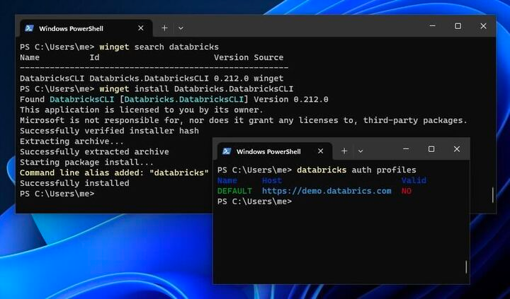

Once you install Databricks CLI, authenticate your current machine to a Databricks Workspace:

```commandline
databricks auth login --host WORKSPACE_HOST
```

To enable debug logs, simply add `--debug` flag to any command.

[[back to top](#databricks-labs-ucx)]

## Install UCX

Install UCX via Databricks CLI:

```commandline
databricks labs install ucx
```

You'll be prompted to select a [configuration profile](https://docs.databricks.com/en/dev-tools/auth.html#databricks-client-unified-authentication) created by `databricks auth login` command.

Once you install, proceed to the [assessment workflow](#assessment-workflow) to ensure the compatibility of your workspace with UCX.

The `WorkspaceInstaller` class is used to create a new configuration for Unity Catalog migration in a Databricks workspace.
It guides the user through a series of prompts to gather necessary information, such as selecting an inventory database, choosing
a PRO or SERVERLESS SQL warehouse, specifying a log level and number of threads, and setting up an external Hive Metastore if necessary.
Upon the first installation, you're prompted for a workspace local [group migration strategy](docs/group_name_conflict.md).
Based on user input, the class creates a new cluster policy with the specified configuration. The user can review and confirm the configuration,
which is saved to the workspace and can be opened in a web browser.

The [`WorkspaceInstallation`](src/databricks/labs/ucx/install.py) manages the installation and uninstallation of UCX in a workspace. It handles
the configuration and exception management during the installation process. The installation process creates dashboards, databases, and jobs.
It also includes the creation of a database with given configuration and the deployment of workflows with specific settings. The installation
process can handle exceptions and infer errors from job runs and task runs. The workspace installation uploads wheels, creates cluster policies,
and wheel runners to the workspace. It can also handle the creation of job tasks for a given task, such as job dashboard tasks, job notebook tasks,
and job wheel tasks. The class handles the installation of UCX, including configuring the workspace, installing necessary libraries, and verifying
the installation, making it easier for users to migrate their workspaces to UCX.
At the end of the installation, the user will be prompted if the current installation needs to join an existing collection (create new collection if none present).
For large organization with many workspaces, grouping workspaces into collection helps in managing UCX migration at collection level (instead of workspaces level)
User should be an account admin to be able to join a collection.

After this, UCX will be installed locally and a number of assets will be deployed in the selected workspace.
These assets are available under the installation folder, i.e. `/Applications/ucx` is the default installation folder. Please check [here](#advanced-force-install-over-existing-ucx) for more details.

You can also install a specific version by specifying it like `@v0.13.2` - `databricks labs install ucx@v0.13.2`.


[[back to top](#databricks-labs-ucx)]

## [ADVANCED] Force install over existing UCX
Using an environment variable `UCX_FORCE_INSTALL` you can force the installation of UCX over an existing installation.
The values for the environment variable are 'global' and 'user'.

Global Install: When UCX is installed at '/Applications/ucx'
User Install: When UCX is installed at '/Users/<user>/.ucx'

If there is an existing global installation of UCX, you can force a user installation of UCX over the existing installation by setting the environment variable `UCX_FORCE_INSTALL` to 'global'.

At this moment there is no global override over a user installation of UCX. As this requires migration and can break existing installations.


| global | user | expected install location | install_folder      | mode                                            |
|--------|------|---------------------------|---------------------|-------------------------------------------------|
| no     | no   | default                   | `/Applications/ucx` | install                                         |
| yes    | no   | default                   | `/Applications/ucx` | upgrade                                         |
| no     | yes  | default                   | `/Users/X/.ucx`     | upgrade (existing installations must not break) |
| yes    | yes  | default                   | `/Users/X/.ucx`     | upgrade                                         |
| yes    | no   | **USER**                  | `/Users/X/.ucx`     | install (show prompt)                           |
| no     | yes  | **GLOBAL**                | ...                 | migrate                                         |


* `UCX_FORCE_INSTALL=user databricks labs install ucx` - will force the installation to be for user only
* `UCX_FORCE_INSTALL=global databricks labs install ucx` - will force the installation to be for root only


[[back to top](#databricks-labs-ucx)]

## [ADVANCED] Installing UCX on all workspaces within a Databricks account
Setting the environment variable `UCX_FORCE_INSTALL` to 'account' will install UCX on all workspaces within a Databricks account.

* `UCX_FORCE_INSTALL=account databricks labs install ucx`

After the first installation, UCX will prompt the user to confirm whether to install UCX on the remaining workspaces with the same answers. If confirmed, the remaining installations will be completed silently.

This installation mode will automatically select the following options:
* Automatically create and enable HMS lineage init script
* Automatically create a new SQL warehouse for UCX assessment

[[back to top](#databricks-labs-ucx)]

## [ADVANCED] Installing UCX with company hosted PYPI mirror

Some enterprise block the public PYPI index and host a company controlled PYPI mirror. To install UCX while using a
company hosted PYPI mirror for finding its dependencies, add all UCX dependencies to the company hosted PYPI mirror (see
"dependencies" in [`pyproject.toml`](./pyproject.toml)) and set the environment variable `PIP_INDEX_URL` to the company
hosted PYPI mirror URL while installing UCX:

```commandline
PIP_INDEX_URL="https://url-to-company-hosted-pypi.internal" databricks labs install ucx
```

During installation reply *yes* to the question "Does the given workspace block Internet access"?

[[back to top](#databricks-labs-ucx)]

## Upgrading UCX for newer versions

Verify that UCX is installed

```commandline
databricks labs installed

Name  Description                            Version
ucx   Unity Catalog Migration Toolkit (UCX)  <version>
```

Upgrade UCX via Databricks CLI:

```commandline
databricks labs upgrade ucx
```

The prompts will be similar to [Installation](#install-ucx)


[[back to top](#databricks-labs-ucx)]

## Uninstall UCX

Uninstall UCX via Databricks CLI:

```commandline
databricks labs uninstall ucx
```

Databricks CLI will confirm a few options:
- Whether you want to remove all ucx artefacts from the workspace as well. Defaults to no.
- Whether you want to delete the inventory database in `hive_metastore`. Defaults to no.


[[back to top](#databricks-labs-ucx)]

# Migration process

On the high level, the steps in migration process start with the [assessment workflow](#assessment-workflow),
followed by [group migration](#group-migration-workflow), [table migration process](#Table-Migration),
finalised with the [code migration](#code-migration-commands). It can be described as:

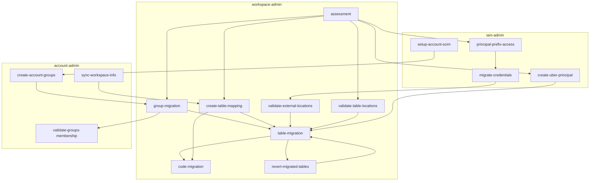

[[back to top](#databricks-labs-ucx)]

# Workflows

Part of this application is deployed as [Databricks Workflows](https://docs.databricks.com/en/workflows/index.html).
You can view the status of deployed workflows via the [`workflows` command](#workflows-command).
Failed workflows can be fixed with the [`repair-run` command](#repair-run-command).

[[back to top](#databricks-labs-ucx)]

## Readme notebook

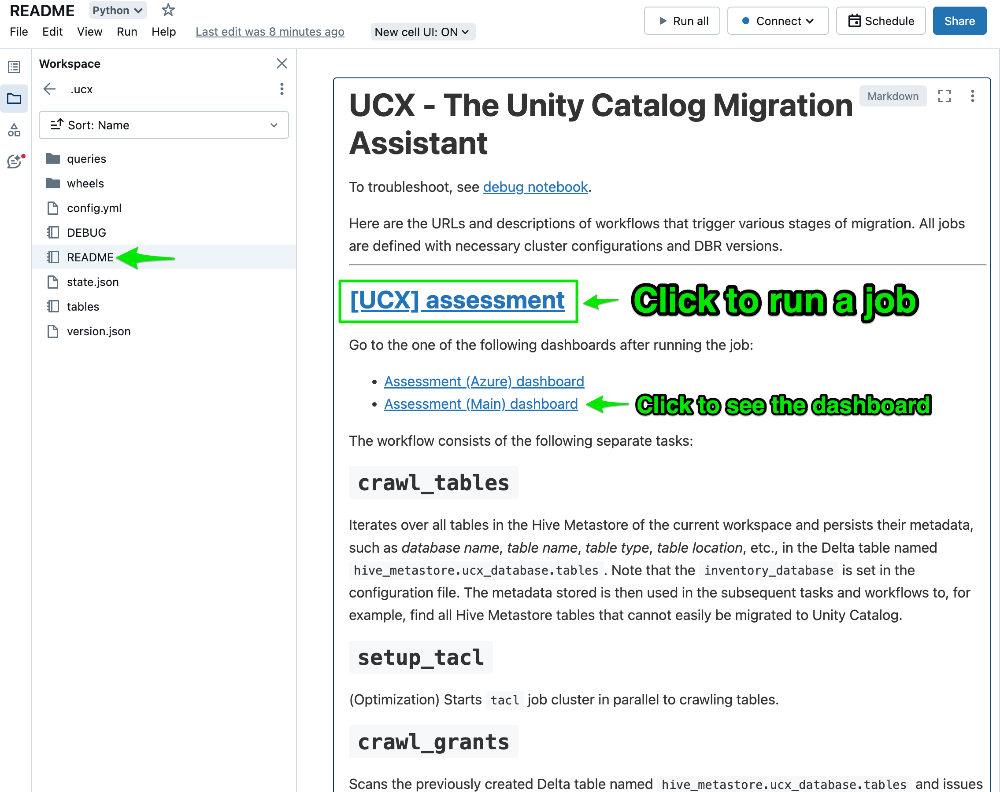

Every installation creates a `README` notebook with a detailed description of all deployed workflows and their tasks,
providing quick links to the relevant workflows and dashboards.

[[back to top](#databricks-labs-ucx)]

## Assessment workflow

The assessment workflow can be triggered using the Databricks UI, or via the [command line](#ensure-assessment-run-command).

```commandline
databricks labs ucx ensure-assessment-run
```

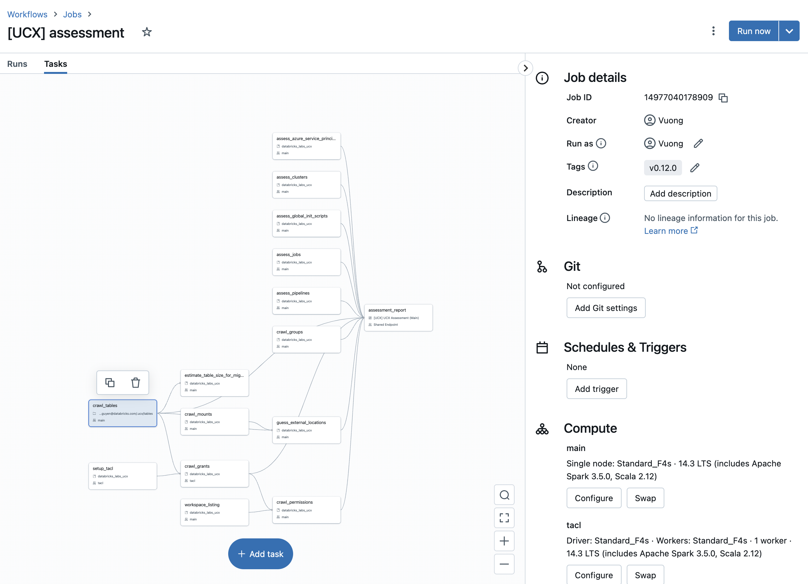

Once you finish the assessment, proceed to the [group migration workflow](#group-migration-workflow).
See the [migration process diagram](#migration-process) to understand the role of the assessment workflow in the migration process.

The assessment workflow is designed to assess the compatibility of various entities in the current workspace with Unity Catalog.
It identifies incompatible entities and provides information necessary for planning the migration to UC. The tasks in
the assessment workflow can be executed in parallel or sequentially, depending on the dependencies specified in the `@task` decorators.
The output of each task is stored in Delta tables in the `$inventory_database` schema, that you specify during [installation](#install-ucx),
which can be used for further analysis and decision-making through the [assessment report](docs/assessment.md).

1. `crawl_tables`: This task scans all tables in the Hive Metastore of the current workspace and persists their metadata in a table named `$inventory_database.tables`. This metadata includes information such as the database name, table name, table type, and table location. This task is used for assessing which tables cannot be easily migrated to Unity Catalog.
2. `crawl_udfs`: This task scans all UDFs in the Hive Metastore of the current workspace and persists their metadata in a table named `$inventory_database.udfs`. This task assesses whether the UDFs can be easily migrated to Unity Catalog.
3. `crawl_grants`: This task scans all securable objects (including tables/views and UDFs) to determine the directly assigned permissions. The scanned permissions metadata includes information such as the principal, action type, and the securable object to which it applies. This task persists the permissions in the `$inventory_database.grants` inventory table.
4. `estimate_table_size_for_migration`: This task scans the Delta table named `$inventory_database.tables` and locates tables that cannot be synced. These tables will have to be cloned in the migration process. The task assesses the size of these tables and creates the `$inventory_database.table_size` table to list these sizes. The table size is a factor in deciding whether to clone these tables.
5. `crawl_mounts`: This task scans the workspace to compile a list of all existing mount points and stores this information in the `$inventory.mounts` table. This is crucial for planning the migration.
6. `guess_external_locations`: This task determines the shared path prefixes of all the tables that utilize mount points. The goal is to identify the external locations necessary for a successful migration and store this information in the `$inventory.external_locations` table.
7. `assess_jobs`: This task scans through all the jobs and identifies those that are not compatible with UC. The list of all the jobs is stored in the `$inventory.jobs` table.
8. `assess_clusters`: This task scans through all the clusters and identifies those that are not compatible with UC. The list of all the clusters is stored in the `$inventory.clusters` table.
9. `assess_pipelines`: This task scans through all the Pipelines and identifies those pipelines that have Azure Service Principals embedded in their configurations. A list of all the pipelines with matching configurations is stored in the `$inventory.pipelines` table.
10. `assess_azure_service_principals`: This task scans through all the clusters configurations, cluster policies, job cluster configurations, Pipeline configurations, and Warehouse configuration and identifies all the Azure Service Principals who have been given access to the Azure storage accounts via spark configurations referred in those entities. The list of all the Azure Service Principals referred in those configurations is saved in the `$inventory.azure_service_principals` table.
11. `assess_global_init_scripts`: This task scans through all the global init scripts and identifies if there is an Azure Service Principal who has been given access to the Azure storage accounts via spark configurations referred in those scripts.
12. `assess_dashboards`: This task scans through all the dashboards and analyzes embedded queries for migration problems. It also collects direct filesystem access patterns that require attention.
13. `assess_workflows`: This task scans through all the jobs and tasks and analyzes notebooks and files for migration problems. It also collects direct filesystem access patterns that require attention.


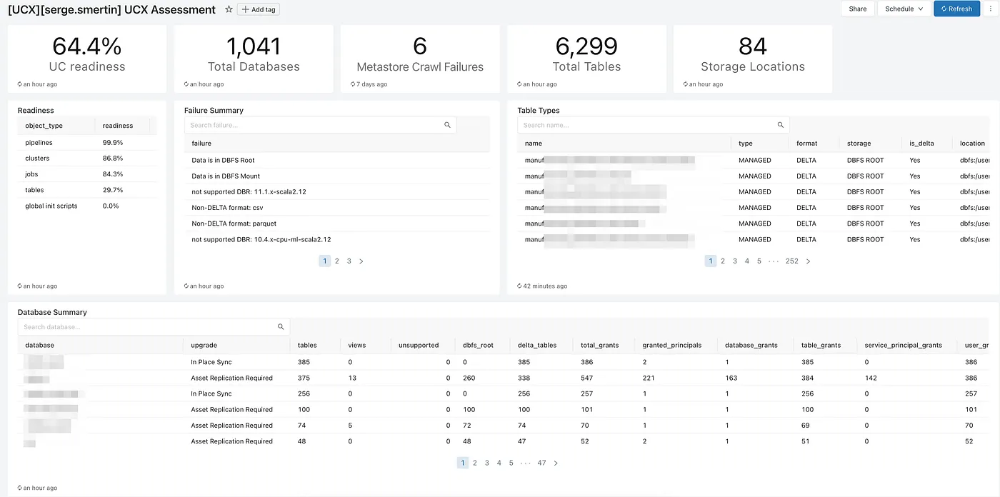

After UCX assessment workflow is executed, the assessment dashboard will be populated with findings and common recommendations. See [this guide](docs/assessment.md) for more details.

The UCX assessment workflow is intended to only run once; re-running it is not supported. If the inventory and findings for a workspace need to be updated then first reinstall UCX by [uninstalling](#uninstall-ucx) and [installing](#install-ucx) it again.

[[back to top](#databricks-labs-ucx)]

## Group migration workflow

You are required to complete the [assessment workflow](#assessment-workflow) before starting the group migration workflow.
See the [migration process diagram](#migration-process) to understand the role of the group migration workflow in the migration process.

See the [detailed design](docs/local-group-migration.md) of this workflow. It helps you to upgrade all Databricks workspace assets:
Legacy Table ACLs, Entitlements, AWS instance profiles, Clusters, Cluster policies, Instance Pools,
Databricks SQL warehouses, Delta Live Tables, Jobs, MLflow experiments, MLflow registry, SQL Dashboards & Queries,
SQL Alerts, Token and Password usage permissions that are set on the workspace level, Secret scopes, Notebooks,
Directories, Repos, and Files.

Once done with the group migration, proceed to [table migration process](#Table-Migration).

Use [`validate-groups-membership` command](#validate-groups-membership-command) for extra confidence.
If you don't have matching account groups, please run [`create-account-groups` command](#create-account-groups-command).

The group migration workflow is designed to migrate workspace-local groups to account-level groups in the Unity Catalog (UC) environment. It ensures that all the necessary groups are available in the workspace with the correct permissions, and removes any unnecessary groups and permissions. The tasks in the group migration workflow depend on the output of the assessment workflow and can be executed in sequence to ensure a successful migration. The output of each task is stored in Delta tables in the `$inventory_database` schema, which can be used for further analysis and decision-making. The group migration workflow can be executed multiple times to ensure that all the groups are migrated successfully and that all the necessary permissions are assigned.

1. `crawl_groups`: This task scans all groups for the local group migration scope.
2. `rename_workspace_local_groups`: This task renames workspace local groups by adding a `ucx-renamed-` prefix. This step is taken to avoid conflicts with account-level groups that may have the same name as workspace-local groups.
3. `reflect_account_groups_on_workspace`: This task adds matching account groups to this workspace. The matching account level group(s) must preexist(s) for this step to be successful. This step is necessary to ensure that the account-level groups are available in the workspace for assigning permissions.
4. `apply_permissions_to_account_groups`: This task assigns the full set of permissions of the original group to the account-level one. It covers local workspace-local permissions for all entities, including Legacy Table ACLs, Entitlements, AWS instance profiles, Clusters, Cluster policies, Instance Pools, Databricks SQL warehouses, Delta Live Tables, Jobs, MLflow experiments, MLflow registry, SQL Dashboards & Queries, SQL Alerts, Token and Password usage permissions, Secret Scopes, Notebooks, Directories, Repos, Files. This step is necessary to ensure that the account-level groups have the necessary permissions to manage the entities in the workspace.
5. `validate_groups_permissions`: This task validates that all the crawled permissions are applied correctly to the destination groups.
6. `delete_backup_groups`: This task removes all workspace-level backup groups, along with their permissions. This should only be executed after confirming that the workspace-local migration worked successfully for all the groups involved. This step is necessary to clean up the workspace and remove any unnecessary groups and permissions.

[[back to top](#databricks-labs-ucx)]

## Debug notebook

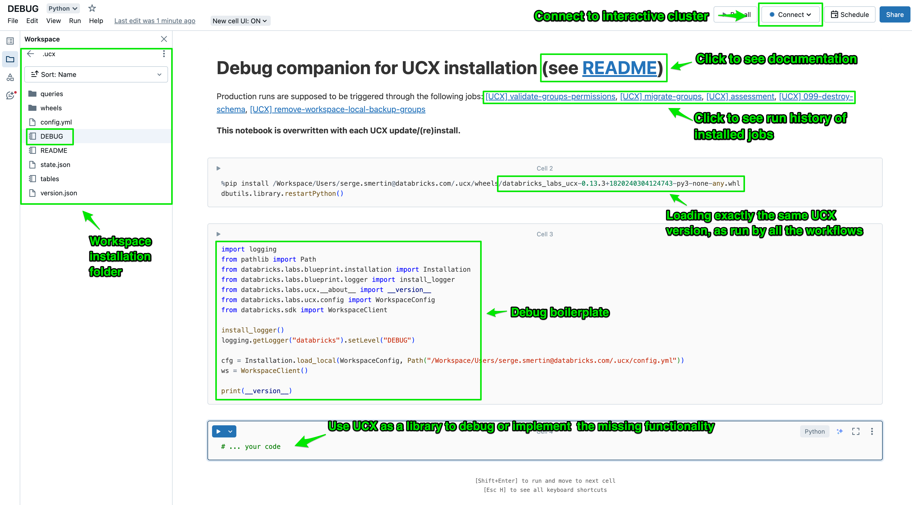

Every [installation](#installation) creates a debug notebook, that initializes UCX as a library,
so that you can implement missing features and

[[back to top](#databricks-labs-ucx)]

## Debug logs

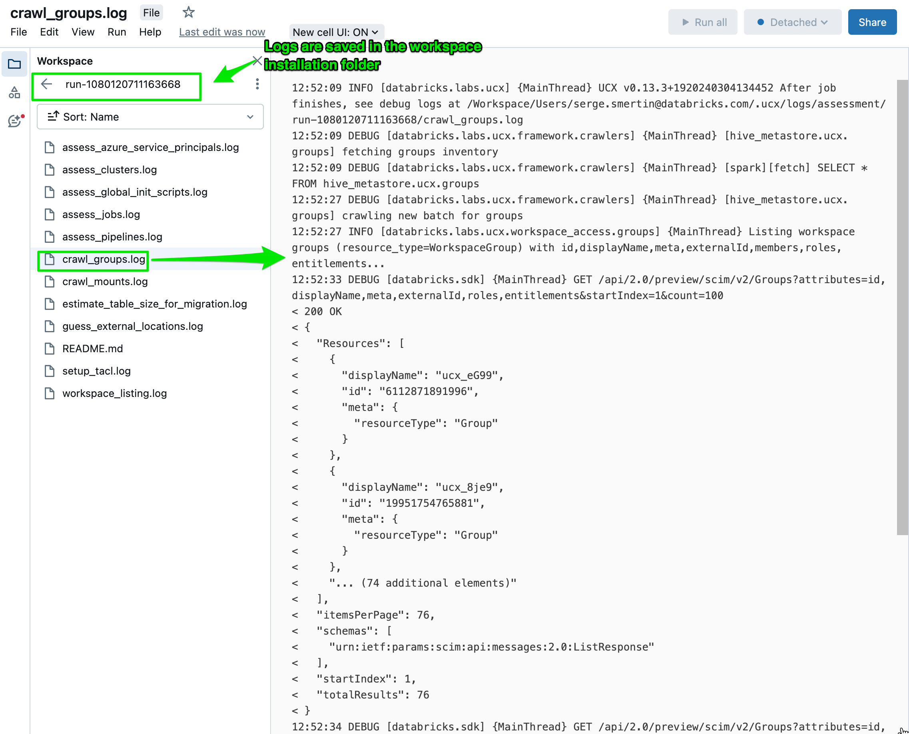

Every workflow run stores debug logs in the `logs` folder of the [installation](#installation).
For tasks shorter than 10 minutes, they appear after task finish, whereas longer-running tasks
flush the logs every 10 minutes.

To enable debug logs of [command-line interface](#authenticate-databricks-cli),
simply add `--debug` flag to any command.

[[back to top](#databricks-labs-ucx)]

## Table Migration
This Section provides a guide for upgrading the Hive metastore objects to UC using UCX.
The metastore upgrade process is composed of multiple steps.
To effectively upgrade the metastores, four principal operations are required:
1. Assess - In this step, you evaluate the existing HMS tables identified for upgrade to determine the right approach for upgrade. This step is a prerequisite and is performed by the assessment workflow.
2. Create - In this step, you create the required UC assets such as, Metastore, Catalog, Schema, Storage Credentials, External Locations. This step is part of the upgrade process.
3. Upgrade/Grant these are two steps that UCX combine.
   4. Upgrade - The metastores objects (tables/views) will be converted to a format supported by UC
   4. Grant - The table upgrade the newly created object the same permission as the original object.

### Prerequisites
For UCX to be able to upgrade the metastore. The following prerequisites must be met:
1. UCX must be installed and configured on the workspace. For more information on how to install UCX, refer to [This Guide](#installation).
2. In case of an external metastore (such as GLUE), UCX has to be configured to attach to the metastore. For more information on how to configure UCX to attach to an external metastore, refer to the [External Metastore Guide](docs/external_hms_glue.md).
3. The assessment workflow must be run.
4. It is recommended that the group migration process will be completed before upgrading the metastore. For more information on how to migrate groups, refer to the [UCX Readme](#group-migration-workflow).
5. The workspace should be configured with a Metastore follow the instruction here [Create UC Metastore](https://docs.databricks.com/en/data-governance/unity-catalog/create-metastore.html)<br>
   Metastore can be attached to the workspace using the following [UCX command](#assign-metastore-command)

### Upgrade Process
The upgrade process is done in multiple steps. For each step we will discuss the manual process and how to perform it using UCX.

#### Step 1: Mapping Metastore Tables (UCX Only)
In this step we will map the metastore tables to UC tables.

##### Step 1.1: Create the mapping file
This step can be performed using the `create-table-mapping` command documented in the [UCX Command](#create-table-mapping-command).

The CLI command will create a mapping file in the workspace UCX folder.

By default, all the tables/views will be mapped to UC tables.
All the tables will be mapped to a single catalog (by default), maintaining the schema/name of the original table.

##### Step 1.2: Update the mapping file
Update the mapping file with the required mappings. That can be performed by editing the file that was created in the previous step.

You can exclude tables from the mapping by removing the line from the mapping file.
You can also change the catalog/schema name of the UC table by changing the line in the mapping file.
The mapping file is in CSV format and can be edited using any text editor or Excel. When using any Excel make sure to save the file in CSV format.

Example:

Before:

| **workspace_name**      | **catalog_name** | **src_schema** | **dst_schema** | **src_table** | **dst_table** |
|---------------------|--------------|----------------|----------------|---------------|---------------|
| data_engineering_ws | 123333333   | sales_analysis      | sales_analysis      | ytd_sales        | ytd_sales        |

After:

| **workspace_name**      | **catalog_name** | **src_schema** | **dst_schema** | **src_table** | **dst_table** |
|---------------------|--------------|----------------|----------------|---------------|---------------|
| data_engineering_ws | data_engineering   | sales_analysis      | sales      | ytd_sales        | ytd_analysis        |

We are seeing that by default the mapping file retains the same schema name and table name. We override the schema name and table name to be different in the UC catalog.

#### Step 2: Create the necessary cloud principals for the upgrade

Throughout this guide, we will refer to IAM roles/instance profiles in AWS & service principals/managed identities in
as cloud principals. These cloud principals must be created/modified as prerequisites for the upgrade process.

This step has multiple sub steps and should be performed by a cloud account administrator.
We rely on CLI access (AWS) or API Access (Azure) to create the necessary cloud principals.
In the future we will add support for creating the necessary cloud principals using Terraform.

To understand this step it is important to understand how Databricks accesses cloud locations.
You can read about it here:
[AWS - Create External Locations](https://docs.databricks.com/en/connect/unity-catalog/external-locations.html)
[Azure - Create External Locations](https://learn.microsoft.com/en-us/azure/databricks/connect/unity-catalog/external-locations)

##### Step 2.1: Map the cloud principals to the cloud "prefixes"
In this step we are going to map all the cloud principals to the paths they have access to.
We will use the `principal-prefix-access` [UCX Command](#principal-prefix-access-command)

##### Step 2.2: Create/Modify Cloud Principals and Credentials
In this step we will create the necessary cloud principals for the UC credentials.
The manual process is documented in the following links:
[AWS-Storage Credentials](https://docs.databricks.com/en/connect/unity-catalog/storage-credentials.html)
[Azure-Storage Credentials](https://learn.microsoft.com/en-us/azure/databricks/sql/language-manual/sql-ref-storage-credentials)

For AWS we have to create fresh new AWS roles and set them up for UC access, using the `create-missing-principals` [UCX Command](#create-missing-principals-command-aws-only)

For both AWS and Azure we can use the `migrate-credentials` [UCX command](#migrate-credentials-command) to upgrade the necessary cloud principals:

##### Step 2.3: Create External Locations
Once the UC credentials are created, we can create the UC external locations.
An external location will be created for each of the locations identified in the assessment.
The Assessment dashboard displays all the locations that need to be created.
The Manual process is documented in the following links:
[AWS - Create External Locations](https://docs.databricks.com/en/connect/unity-catalog/external-locations.html)
[Azure - Create External Locations](https://learn.microsoft.com/en-us/azure/databricks/connect/unity-catalog/external-locations)

For both AWS and Azure we can use the `migrate-location` [UCX Command](#migrate-locations-command) to create the UC external locations.
This command will create the UC external locations for all the locations identified in the assessment.<br/>It will use the UC credentials created in the previous step.

##### Step 2.4: Create "Uber Principal"
The table migration cluster requires a cloud principal that have access to all the external tables' locations. We call that cloud principal "Uber Principals". These are only necessary for the migration process and not required to support ongoing UC usage.
Once the upgrade is completed, these principals can (and should) be deleted.
Use the `create-uber-principal` [UCX Command](#create-uber-principal-command) to create the Uber Principal.

##### Step 2.5: Create Catalogs and Schemas
In this step we will create the UC catalogs and schemas required for the target tables.
The `create-catalogs-schemas` [UCX command](#create-catalogs-schemas-command) can be used to create the UC catalogs and schemas.

The command will create the UC catalogs and schemas based on the mapping file created in the previous step.

#### Step 3: Upgrade the Metastore
Upgrading the metastore is done in steps.
Each step can be executed separately as a standalone command.
Each step represents a different type of metastore object.
We identified the following object types.
Each of the object that is being upgraded will be marked with an `upgraded_to` property.
This property will be used to skip the object in the next upgrade runs.
It also points to the location of the upgraded object in UC.
Each of the upgraded objects will be marked with an `upgraded_from` property.
This property will be used to identify the original location of the object in the metastore.
We also add a `upgraded_from_workspace_id` property to the upgraded object, to identify the source workspace.

| Object Type         | Description                                                                                                                                                                        | Upgrade Method                                                                                                                                                                                                                                                                                                                                                                                                                                                                                                                                                                        |
|---------------------|------------------------------------------------------------------------------------------------------------------------------------------------------------------------------------|---------------------------------------------------------------------------------------------------------------------------------------------------------------------------------------------------------------------------------------------------------------------------------------------------------------------------------------------------------------------------------------------------------------------------------------------------------------------------------------------------------------------------------------------------------------------------------------|
| EXTERNAL_SYNC       | Tables not saved to the DBFS file system that are supported by the sync command.<br/> These tables are in one of the following formats: DELTA, PARQUET, CSV, JSON, ORC, TEXT, AVRO | During the upgrade process, these table contents will remain intact and the metadata will be recreated in UC using the sync SQL command.<br/>More information about the sync command can be found [here](https://docs.databricks.com/en/sql/language-manual/sql-ref-syntax-aux-sync.html)                                                                                                                                                                                                                                                                                             |
| EXTERNAL_HIVESERDE  | Tables with table type "HIVE" that are not supported by the sync command                                                                                                           | We provide two workflows for hiveserde table migration:<br/>1. Migrate all hiveserde tables using CTAS which we officially support.<br/>2. Migrate certain types of hiveserde in place, which is technically working, but the user need to accept the risk that the old files created by hiveserde may not be processed correctly by Spark datasource in corner cases. User will need to decide which workflow to runs first which will migrate the hiveserde tables and mark the `upgraded_to` property and hence those tables will be skipped in the migration workflow runs later. |
| EXTERNAL_NO_SYNC    | Tables not saved to the DBFS file system that are not supported by the sync command                                                                                                | The current upgrade process will migrate these tables to UC by creating a new managed table in UC and copying the data from the old table to the new table. The new table's format will be Delta.                                                                                                                                                                                                                                                                                                                                                                                     |
| DBFS_ROOT_DELTA     | Tables saved to the DBFS file system that are in Delta format                                                                                                                      | The current upgrade process will create a copy of these tables in UC using the "deep clone" command.<br/>More information about the deep clone command can be found [here](https://docs.databricks.com/en/sql/language-manual/delta-clone.html)                                                                                                                                                                                                                                                                                                                                       |
| DBFS_ROOT_NON_DELTA | Tables saved to the DBFS file system that are not in Delta format                                                                                                                  | The current upgrade process will create a managed table using CTAS                                                                                                                                                                                                                                                                                                                                                                                                                                                                                                                    |                                                                                                                                                                                                                                                                                                                                                                                                                                                                                                                   |
| VIEW                | Datbase Views                                                                                                                                                                      | Views are recreated during the upgrade process. The view's definition will be modified to repoint to the new UC tables. Views should be migrated only after all the dependent tables have been migrated. The upgrade process account for View to View dependencies.                                                                                                                                                                                                                                                                                                                   |

The upgrade process can be triggered using the `migrate-tables` [UCX command](#migrate-tables-command)

Or by running the table migration workflows deployed to the workspace.

#### Table migration workflows

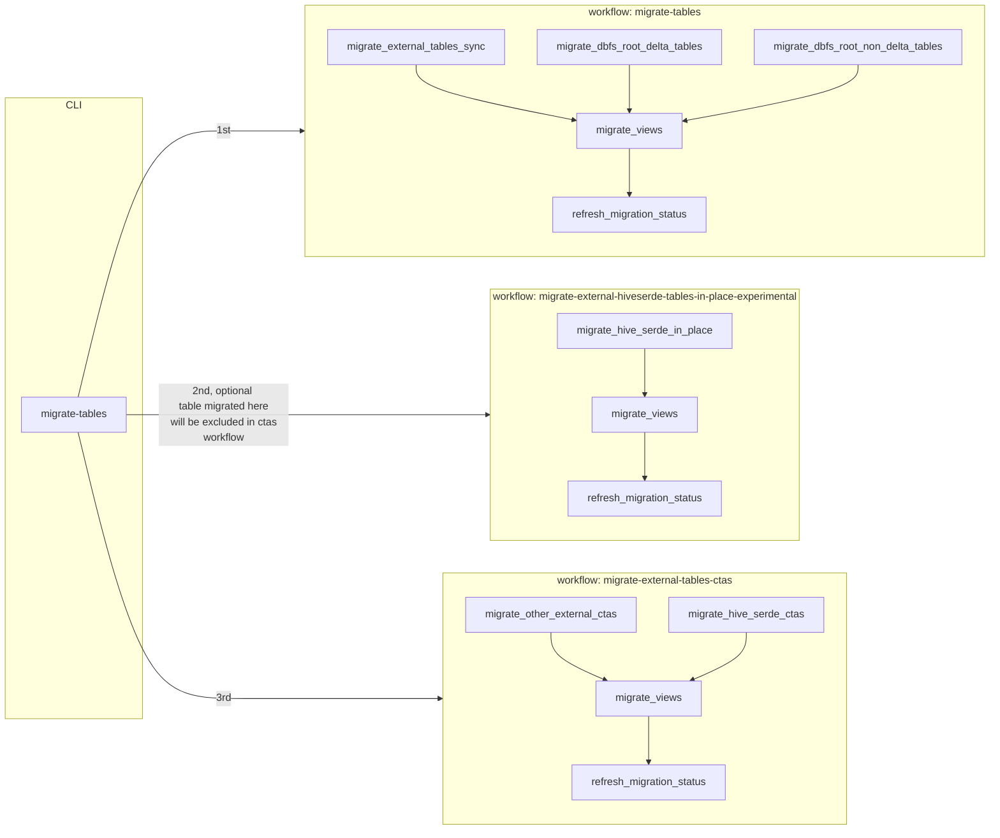


#### Step 4: Odds and Ends
The following steps can be used to repair/amend the metastore after the upgrade process.

##### Step 4.1: Skipping Table/Schema
```bash
databricks labs ucx skip --schema X [--table Y]
```
This command will mark the table or schema as skipped. The table will not be upgraded in the next run of the upgrade process.

##### Step 4.2: Moving objects
```bash
databricks labs ucx move --from-catalog A --from-schema B --from-table C --to-catalog D --to-schema E
```
This command will move the object from the source location to the target location.
The `upgraded_from` property will be updated to reflect the new location on the source object.
This command should be used in case the object was created in the wrong location.

##### Step 4.2: Aliasing objects
```bash
databricks labs ucx alias --from-catalog A --from-schema B --from-table C --to-catalog D --to-schema E
```
This command will create an alias for the object in the target location. It will create a view for tables that need aliasing.
It will create a mirror view to view that is marked as alias.
The use of this command is in case we need multiple identical tables or views in multiple locations.
HMS allows creating multiple tables pointing to the same location.
UC does not support creating multiple tables pointing to the same location, thus we need to create an alias for the table.

##### Step 4.3: Reverting objects
```bash
databricks labs ucx revert-migrated-tables --schema X --table Y [--delete-managed]
```
This command will remove the upgraded table and reset the `upgraded_from` property. It will allow for upgrading the table again.

### Post Migration Data Reconciliation Task
UCX also provides `migrate-data-reconciliation` workflow to validate the integrity of the migrated tables:
- Compare the schema of the source and target tables. The result is `schema_matches`, and column by column comparison
is stored as `column_comparison` struct.
- Compare the row counts of the source and target tables. If the row count is within the reconciliation threshold
(defaults to 5%), `data_matches` is True.
- Compare the content of individual row between source and target tables to identify any discrepancies (when `compare_rows`
flag is enabled). This is done using hash comparison, and number of missing rows are stored as `source_missing_count`
and `target_missing_count`

Once the workflow completes, the output will be stored in `$inventory_database.reconciliation_results` view, and displayed
in the Migration dashboard.

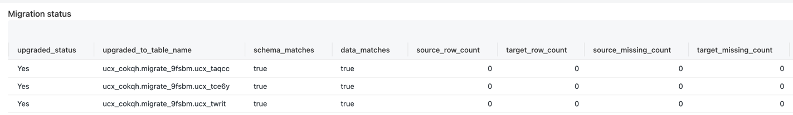

### Other considerations
- You may need to run the workflow multiple times to ensure all the tables are migrated successfully in phases.
- If your Delta tables in DBFS root have a large number of files, consider:
  - Setting higher `Min` and `Max workers for auto-scale` when being asked during the UCX installation. More cores in the cluster means more concurrency for calling cloud storage API to copy files when deep cloning the Delta tables.
  - Setting higher `Parallelism for migrating DBFS root Delta tables with deep clone` (default 200) when being asked during the UCX installation. This controls the number of Spark tasks/partitions to be created for deep clone.
- Consider creating an instance pool, and setting its id when prompted during the UCX installation. This instance pool will be specified in the cluster policy used by all UCX workflows job clusters.
- You may also manually edit the job cluster configration per job or per task after the workflows are deployed.

### [EXPERIMENTAL] Scan tables in mounts Workflow
#### <b>Always run this workflow AFTER the assessment has finished</b>
- This experimental workflow attemps to find all Tables inside mount points that are present on your workspace.
- If you do not run this workflow, then `migrate-tables-in-mounts-experimental` won't do anything.
- It writes all results to `hive_metastore.<inventory_database>.tables`, you can query those tables found by filtering on database values that starts with `mounted_`
- This command is incremental, meaning that each time you run it, it will overwrite the previous tables in mounts found.
- Current format are supported:
  - DELTA - PARQUET - CSV - JSON
  - Also detects partitioned DELTA and PARQUET
- You can configure these workflows with the following options available on conf.yml:
  - include_mounts : A list of mount points to scans, by default the workflow scans for all mount points
  - exclude_paths_in_mount : A list of paths to exclude in all mount points
  - include_paths_in_mount : A list of paths to include in all mount points

### [EXPERIMENTAL] Migrate tables in mounts Workflow
- An experimental workflow that migrates tables in mount points using a `CREATE TABLE` command, optinally sets a default tables owner if provided in `default_table_owner` conf parameter.
- You must do the following in order to make this work:
  - run the Assessment [workflow](#assessment-workflow)
  - run the scan tables in mounts [workflow](#EXPERIMENTAL-scan-tables-in-mounts-workflow)
  - run the [`create-table-mapping` command](#create-table-mapping-command)
    - or manually create a `mapping.csv` file in Workspace -> Applications -> ucx


[[back to top](#databricks-labs-ucx)]

## Jobs Static Code Analysis Workflow

> Please note that this is an experimental workflow.

The `experimental-workflow-linter` workflow lints accessible code from 2 sources:
 - all workflows/jobs present in the workspace
 - all dashboards/queries present in the workspace
The linting emits problems indicating what to resolve for making the code Unity Catalog compatible.
The linting also locates direct filesystem access that need to be migrated.

Once the workflow completes:
 - problems are stored in the `$inventory_database.workflow_problems`/`$inventory_database.query_problems` table
 - direct filesystem access are stored in the `$inventory_database.directfs_in_paths`/`$inventory_database.directfs_in_queries` table
 - all the above are displayed in the Migration dashboard.

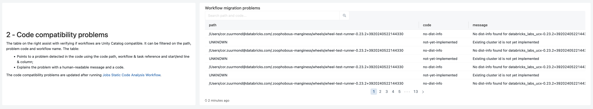

[[back to top](#databricks-labs-ucx)]

### Linter message codes

Here's the detailed explanation of the linter message codes:

#### `cannot-autofix-table-reference`

This indicates that the linter has found a table reference that cannot be automatically fixed. The user must manually
update the table reference to point to the correct table in Unity Catalog. This mostly occurs, when table name is
computed dynamically, and it's too complex for our static code analysis to detect it. We detect this problem anywhere
where table name could be used: `spark.sql`, `spark.catalog.*`, `spark.table`, `df.write.*` and many more. Code examples
that trigger this problem:

```python
spark.table(f"foo_{some_table_name}")
# ..
df = spark.range(10)
df.write.saveAsTable(f"foo_{some_table_name}")
# .. or even
df.write.insertInto(f"foo_{some_table_name}")
```

Here the `some_table_name` variable is not defined anywhere in the visible scope. Though, the analyser would
successfully detect table name if it is defined:

```python
some_table_name = 'bar'
spark.table(f"foo_{some_table_name}")
```

We even detect string constants when coming either from `dbutils.widgets.get` (via job named parameters) or through
loop variables. If `old.things` table is migrated to `brand.new.stuff` in Unity Catalog, the following code will
trigger two messages: [`table-migrated-to-uc`](#table-migrated-to-uc) for the first query, as the contents are clearly
analysable, and `cannot-autofix-table-reference` for the second query.

```python
# ucx[table-migrated-to-uc:+4:4:+4:20] Table old.things is migrated to brand.new.stuff in Unity Catalog
# ucx[cannot-autofix-table-reference:+3:4:+3:20] Can't migrate table_name argument in 'spark.sql(query)' because its value cannot be computed
table_name = f"table_{index}"
for query in ["SELECT * FROM old.things", f"SELECT * FROM {table_name}"]:
    spark.sql(query).collect()
```

[[back to top](#databricks-labs-ucx)]

#### `catalog-api-in-shared-clusters`

`spark.catalog.*` functions require Databricks Runtime 14.3 LTS or above on Unity Catalog clusters in Shared access
mode, so of your code has `spark.catalog.tableExists("table")` or `spark.catalog.listDatabases()`, you need to ensure
that your cluster is running the correct runtime version and data security mode.

[[back to top](#databricks-labs-ucx)]

#### `changed-result-format-in-uc`

Calls to these functions would return a list of `<catalog>.<database>.<table>` instead of `<database>.<table>`. So if
you have code like this:

```python
for table in spark.catalog.listTables():
    do_stuff_with_table(table)
```

you need to make sure that `do_stuff_with_table` can handle the new format.

[[back to top](#databricks-labs-ucx)]

#### `direct-filesystem-access-in-sql-query`

Direct filesystem access is deprecated in Unity Catalog.
DBFS is no longer supported, so if you have code like this:

```python
df = spark.sql("SELECT * FROM parquet.`/mnt/foo/path/to/parquet.file`")
```

you need to change it to use UC tables.

[[back to top](#databricks-labs-ucx)]

#### `direct-filesystem-access`

Direct filesystem access is deprecated in Unity Catalog.
DBFS is no longer supported, so if you have code like this:

```python
display(spark.read.csv('/mnt/things/data.csv'))
```

or this:

```python
display(spark.read.csv('s3://bucket/folder/data.csv'))
```

You need to change it to use UC tables or UC volumes.

[[back to top](#databricks-labs-ucx)]

#### `dependency-not-found`

This message indicates that the linter has found a dependency, like Python source file or a notebook, that is not
available in the workspace. The user must ensure that the dependency is available in the workspace. This usually
means an error in the user code.

[[back to top](#databricks-labs-ucx)]

### `jvm-access-in-shared-clusters`

You cannot access Spark Driver JVM on Unity Catalog clusters in Shared Access mode. If you have code like this:

```python
spark._jspark._jvm.com.my.custom.Name()
```

or like this:

```python
log4jLogger = sc._jvm.org.apache.log4j
LOGGER = log4jLogger.LogManager.getLogger(__name__)
```

you need to change it to use Python equivalents.

[[back to top](#databricks-labs-ucx)]

#### `legacy-context-in-shared-clusters`

SparkContext (`sc`) is not supported on Unity Catalog clusters in Shared access mode. Rewrite it using SparkSession
(`spark`). Example code that triggers this message:

```python
df = spark.createDataFrame(sc.emptyRDD(), schema)
```

or this:

```python
sc.parallelize([1, 2, 3])
```

[[back to top](#databricks-labs-ucx)]

#### `not-supported`

Installing eggs is no longer supported on Databricks 14.0 or higher.

[[back to top](#databricks-labs-ucx)]

#### `notebook-run-cannot-compute-value`

Path for `dbutils.notebook.run` cannot be computed and requires adjusting the notebook path.
It is not clear for automated code analysis where the notebook is located, so you need to simplify the code like:

```python
b = some_function()
dbutils.notebook.run(b)
```

to something like this:

```python
a = "./leaf1.py"
dbutils.notebook.run(a)
```

[[back to top](#databricks-labs-ucx)]

#### `python-udf-in-shared-clusters`

`applyInPandas` requires DBR 14.3 LTS or above on Unity Catalog clusters in Shared access mode. Example:

```python
df.groupby("id").applyInPandas(subtract_mean, schema="id long, v double").show()
```

Arrow UDFs require DBR 14.3 LTS or above on Unity Catalog clusters in Shared access mode.

```python
@udf(returnType='int', useArrow=True)
def arrow_slen(s):
    return len(s)
```

It is not possible to register Java UDF from Python code on Unity Catalog clusters in Shared access mode. Use a
`%scala` cell to register the Scala UDF using `spark.udf.register`. Example code that triggers this message:

```python
spark.udf.registerJavaFunction("func", "org.example.func", IntegerType())
```

[[back to top](#databricks-labs-ucx)]

#### `rdd-in-shared-clusters`

RDD APIs are not supported on Unity Catalog clusters in Shared access mode. Use mapInArrow() or Pandas UDFs instead.

```python
df.rdd.mapPartitions(myUdf)
```

[[back to top](#databricks-labs-ucx)]

#### `spark-logging-in-shared-clusters`

Cannot set Spark log level directly from code on Unity Catalog clusters in Shared access mode. Remove the call and set
the cluster spark conf `spark.log.level` instead:

```python
sc.setLogLevel("INFO")
setLogLevel("WARN")
```

Another example could be:

```python
log4jLogger = sc._jvm.org.apache.log4j
LOGGER = log4jLogger.LogManager.getLogger(__name__)
```

or

```python
sc._jvm.org.apache.log4j.LogManager.getLogger(__name__).info("test")
```

[[back to top](#databricks-labs-ucx)]

#### `sql-parse-error`

This is a generic message indicating that the SQL query could not be parsed. The user must manually check the SQL query.

[[back to top](#databricks-labs-ucx)]

#### `sys-path-cannot-compute-value`

Path for `sys.path.append` cannot be computed and requires adjusting the path. It is not clear for automated code
analysis where the path is located.

[[back to top](#databricks-labs-ucx)]

#### `table-migrated-to-uc`

This message indicates that the linter has found a table that has been migrated to Unity Catalog. The user must ensure
that the table is available in Unity Catalog.

[[back to top](#databricks-labs-ucx)]

#### `to-json-in-shared-clusters`

`toJson()` is not available on Unity Catalog clusters in Shared access mode. Use `toSafeJson()` on DBR 13.3 LTS or
above to get a subset of command context information. Example code that triggers this message:

```python
dbutils.notebook.entry_point.getDbutils().notebook().getContext().toSafeJson()
```

[[back to top](#databricks-labs-ucx)]

#### `unsupported-magic-line`

This message indicates the code that could not be analysed by UCX. User must check the code manually.

[[back to top](#databricks-labs-ucx)]

## [EXPERIMENTAL] Migration Progress Workflow

The `migration-progress-experimental` workflow updates a subset of the inventory tables to track migration status of
workspace resources that need to be migrated. Besides updating the inventory tables, this workflow tracks the migration
progress by updating the following [UCX catalog](#create-ucx-catalog-command) tables:

- `workflow_runs`: Tracks the status of the workflow runs.

_Note: A subset of the inventory is updated, *not* the complete inventory that is initially gathered by
the [assessment workflow](#assessment-workflow)._

[[back to top](#databricks-labs-ucx)]

# Utility commands

## `logs` command

```text
$ databricks labs ucx logs [--workflow WORKFLOW_NAME] [--debug]
```

This command displays the logs of the last run of the specified workflow. If no workflow is specified, it displays
the logs of the workflow that was run the last. This command is useful for developers and administrators who want to
check the logs of the last run of a workflow and ensure that it was executed as expected. It can also be used for
debugging purposes when a workflow is not behaving as expected. By default, only `INFO`, `WARNING`, and `ERROR` logs
are displayed. To display `DEBUG` logs, use the `--debug` flag.

[[back to top](#databricks-labs-ucx)]

## `ensure-assessment-run` command

```commandline
databricks labs ucx ensure-assessment-run
```

This command ensures that the [assessment workflow](#assessment-workflow) was run on a workspace.
This command will block until job finishes.
Failed workflows can be fixed with the [`repair-run` command](#repair-run-command). Workflows and their status can be
listed with the [`workflows` command](#workflows-command).

[[back to top](#databricks-labs-ucx)]

## `update-migration-progress` command

```commandline
databricks labs ucx update-migration-progress
```

This command runs the [(experimental) migration progress workflow](#experimental-migration-progress-workflow) to update
the migration status of workspace resources that need to be migrated. It does this by triggering
the `migration-progress-experimental` workflow to run on a workspace and waiting for
it to complete.

Workflows and their status can be listed with the [`workflows` command](#workflows-commandr), while failed workflows can
be fixed with the [`repair-run` command](#repair-run-command).

[[back to top](#databricks-labs-ucx)]

## `repair-run` command

```commandline
databricks labs ucx repair-run --step WORKFLOW_NAME
```

This command repairs a failed [UCX Workflow](#workflows). This command is useful for developers and administrators who
want to repair a failed job. It can also be used to debug issues related to job failures. This operation can also be
done via [user interface](https://docs.databricks.com/en/workflows/jobs/repair-job-failures.html). Workflows and their
status can be listed with the [`workflows` command](#workflows-command).

[[back to top](#databricks-labs-ucx)]

## `workflows` command

See the [migration process diagram](#migration-process) to understand the role of each workflow in the migration process.

```text
$ databricks labs ucx workflows
Step                                  State    Started
assessment                            RUNNING  1 hour 2 minutes ago
099-destroy-schema                    UNKNOWN  <never run>
migrate-groups                        UNKNOWN  <never run>
remove-workspace-local-backup-groups  UNKNOWN  <never run>
validate-groups-permissions           UNKNOWN  <never run>
```

This command displays the [deployed workflows](#workflows) and their state in the current workspace. It fetches the latest
job status from the workspace and prints it in a table format. This command is useful for developers and administrators
who want to check the status of UCX workflows and ensure that they have been executed as expected. It can also be used
for debugging purposes when a workflow is not behaving as expected. Failed workflows can be fixed with
the [`repair-run` command](#repair-run-command).

[[back to top](#databricks-labs-ucx)]

## `open-remote-config` command

```commandline
databricks labs ucx open-remote-config
```

This command opens the remote configuration file in the default web browser. It generates a link to the configuration file
and opens it using the `webbrowser.open()` method. This command is useful for developers and administrators who want to view or
edit the remote configuration file without having to manually navigate to it in the workspace. It can also be used to quickly
access the configuration file from the command line. Here's the description of configuration properties:

  * `inventory_database`: A string representing the name of the inventory database.
  * `workspace_group_regex`: An optional string representing the regular expression to match workspace group names.
  * `workspace_group_replace`: An optional string to replace the matched group names with.
  * `account_group_regex`: An optional string representing the regular expression to match account group names.
  * `group_match_by_external_id`: A boolean value indicating whether to match groups by their external IDs.
  * `include_group_names`: An optional list of strings representing the names of groups to include for migration.
  * `renamed_group_prefix`: An optional string representing the prefix to add to renamed group names.
  * `instance_pool_id`: An optional string representing the ID of the instance pool.
  * `warehouse_id`: An optional string representing the ID of the warehouse.
  * `connect`: An optional `Config` object representing the configuration for connecting to the warehouse.
  * `num_threads`: An optional integer representing the number of threads to use for migration.
  * `database_to_catalog_mapping`: An optional dictionary mapping source database names to target catalog names.
  * `default_catalog`: An optional string representing the default catalog name.
  * `log_level`: An optional string representing the log level.
  * `workspace_start_path`: A string representing the starting path for notebooks and directories crawler in the workspace.
  * `instance_profile`: An optional string representing the name of the instance profile.
  * `spark_conf`: An optional dictionary of Spark configuration properties.
  * `override_clusters`: An optional dictionary mapping job cluster names to existing cluster IDs.
  * `policy_id`: An optional string representing the ID of the cluster policy.
  * `include_databases`: An optional list of strings representing the names of databases to include for migration.

[[back to top](#databricks-labs-ucx)]

## `installations` command

```text
$ databricks labs ucx installations
...
13:49:16  INFO [d.labs.ucx] Fetching installations...
13:49:17  INFO [d.l.blueprint.parallel][finding_ucx_installations_5] finding ucx installations 10/88, rps: 22.838/sec
13:49:17  INFO [d.l.blueprint.parallel][finding_ucx_installations_9] finding ucx installations 20/88, rps: 35.002/sec
13:49:17  INFO [d.l.blueprint.parallel][finding_ucx_installations_2] finding ucx installations 30/88, rps: 51.556/sec
13:49:18  INFO [d.l.blueprint.parallel][finding_ucx_installations_9] finding ucx installations 40/88, rps: 56.272/sec
13:49:18  INFO [d.l.blueprint.parallel][finding_ucx_installations_19] finding ucx installations 50/88, rps: 67.382/sec
...
Path                                      Database  Warehouse
/Users/serge.smertin@databricks.com/.ucx  ucx       675eaf1ff976aa98
```

This command displays the [installations](#installation) by different users on the same workspace. It fetches all
the installations where the `ucx` package is installed and prints their details in JSON format. This command is useful
for administrators who want to see which users have installed `ucx` and where. It can also be used to debug issues
related to multiple installations of `ucx` on the same workspace.

[[back to top](#databricks-labs-ucx)]


## `report-account-compatibility` command

```text
databricks labs ucx report-account-compatibility --profile labs-azure-account
12:56:09  INFO [databricks.sdk] Using Azure CLI authentication with AAD tokens
12:56:09  INFO [d.l.u.account.aggregate] Generating readiness report
12:56:10  INFO [databricks.sdk] Using Azure CLI authentication with AAD tokens
12:56:10  INFO [databricks.sdk] Using Azure CLI authentication with AAD tokens
12:56:15  INFO [databricks.sdk] Using Azure CLI authentication with AAD tokens
12:56:15  INFO [d.l.u.account.aggregate] Querying Schema ucx
12:56:21  WARN [d.l.u.account.aggregate] Workspace 4045495039142306 does not have UCX installed
12:56:21  INFO [d.l.u.account.aggregate] UC compatibility: 30.303030303030297% (69/99)
12:56:21  INFO [d.l.u.account.aggregate] cluster type not supported : LEGACY_TABLE_ACL: 22 objects
12:56:21  INFO [d.l.u.account.aggregate] cluster type not supported : LEGACY_SINGLE_USER: 24 objects
12:56:21  INFO [d.l.u.account.aggregate] unsupported config: spark.hadoop.javax.jdo.option.ConnectionURL: 10 objects
12:56:21  INFO [d.l.u.account.aggregate] Uses azure service principal credentials config in cluster.: 1 objects
12:56:21  INFO [d.l.u.account.aggregate] No isolation shared clusters not supported in UC: 1 objects
12:56:21  INFO [d.l.u.account.aggregate] Data is in DBFS Root: 23 objects
12:56:21  INFO [d.l.u.account.aggregate] Non-DELTA format: UNKNOWN: 5 objects
```

[[back to top](#databricks-labs-ucx)]

# Metastore related commands

These commands are used to assign a Unity Catalog metastore to a workspace. The metastore assignment is a pre-requisite
for any further migration steps.

[[back to top](#databricks-labs-ucx)]

## `show-all-metastores` command

```text
databricks labs ucx show-all-metastores [--workspace-id <workspace-id>]
```

This command lists all the metastores available to be assigned to a workspace. If no workspace is specified, it lists
all the metastores available in the account. This command is useful when there are multiple metastores available within
a region, and you want to see which ones are available for assignment.

[[back to top](#databricks-labs-ucx)]

## `assign-metastore` command

```text
databricks labs ucx assign-metastore --workspace-id <workspace-id> [--metastore-id <metastore-id>]
```

This command assigns a metastore to a workspace with `--workspace-id`. If there is only a single metastore in the
workspace region, the command automatically assigns that metastore to the workspace. If there are multiple metastores
available, the command prompts for specification of the metastore (id) you want to assign to the workspace.

[[back to top](#databricks-labs-ucx)]

## `create-ucx-catalog` command

```commandline
databricks labs ucx create-ucx-catalog
16:12:59  INFO [d.l.u.hive_metastore.catalog_schema] Validating UC catalog: ucx
Please provide storage location url for catalog: ucx (default: metastore): ...
16:13:01  INFO [d.l.u.hive_metastore.catalog_schema] Creating UC catalog: ucx
```

Create and setup UCX artifact catalog. Amongst other things, the artifacts are used for tracking the migration progress
across workspaces.

# Table migration commands

These commands are vital part of [table migration process](#Table-Migration) process and require
the [assessment workflow](#assessment-workflow) and
[group migration workflow](#group-migration-workflow) to be completed.
See the [migration process diagram](#migration-process) to understand the role of the table migration commands in
the migration process.

The first step is to run the [`principal-prefix-access` command](#principal-prefix-access-command) to identify all
the storage accounts used by tables in the workspace and their permissions on each storage account.

If you don't have any storage credentials and external locations configured,  you'll need to run
the [`migrate-credentials` command](#migrate-credentials-command) to migrate the service principals
and [`migrate-locations` command](#migrate-locations-command) to create the external locations.
If some of the external locations already exist, you should run
the [`validate-external-locations` command](#validate-external-locations-command).
You'll need to create the [uber principal](#create-uber-principal-command) with the _**access to all storage**_ used to tables in
the workspace, so that you can migrate all the tables. If you already have the principal, you can skip this step.

Ask your Databricks Account admin to run the [`sync-workspace-info` command](#sync-workspace-info-command) to sync the
workspace information with the UCX installations. Once the workspace information is synced, you can run the
[`create-table-mapping` command](#create-table-mapping-command) to align your tables with the Unity Catalog,
[create catalogs and schemas](#create-catalogs-schemas-command) and start the migration using [`migrate-tables` command](#migrate-tables-command). During multiple runs of
the table migration workflow, you can use the [`revert-migrated-tables` command](#revert-migrated-tables-command) to
revert the tables that were migrated in the previous run. You can also skip the tables that you don't want to migrate
using the [`skip` command](#skip-command).

Once you're done with the table migration, proceed to the [code migration](#code-migration-commands).

[[back to top](#databricks-labs-ucx)]

## `principal-prefix-access` command

```text
databricks labs ucx principal-prefix-access [--subscription-ids <Azure Subscription ID>] [--aws-profile <AWS CLI profile>]
```

This command depends on results from the [assessment workflow](#assessment-workflow) and requires [AWS CLI](#access-for-aws-s3-buckets)
or [Azure CLI](#access-for-azure-storage-accounts) to be installed and authenticated for the given machine. This command
identifies all the storage accounts used by tables in the workspace and their permissions on each storage account.
Once you're done running this command, proceed to the [`migrate-credentials` command](#migrate-credentials-command).


[[back to top](#databricks-labs-ucx)]

### Access for AWS S3 Buckets

```commandline
databricks labs ucx principal-prefix-access --aws-profile test-profile
```

Use to identify all instance profiles in the workspace, and map their access to S3 buckets.
Also captures the IAM roles which has UC arn listed, and map their access to S3 buckets
This requires `aws` CLI to be installed and configured.

For AWS this command produces a file named `aws_instance_profile_info.csv`.
It has the following format:

| **role_arn**                                         | **resource_type** | **privilege** | **resource_path**     |
|------------------------------------------------------|-------------------|---------------|-----------------------|
| arn:aws:iam::1234:instance-profile/instance-profile1 | s3                | WRITE_FILES   | s3://s3_bucket1/path1 |


Once done, proceed to the [`migrate-credentials` command](#migrate-credentials-command).

[[back to top](#databricks-labs-ucx)]

### Access for Azure Storage Accounts

```commandline
databricks labs ucx principal-prefix-access --subscription-ids test-subscription-id
```

Use to identify all storage account used by tables, identify the relevant Azure service principals and their permissions
on each storage account. The command is used to identify Azure Service Principals, which have `Storage Blob Data Contributor`,
`Storage Blob Data Reader`, `Storage Blob Data Owner` roles, or custom read/write roles on ADLS Gen2 locations that are being
used in Databricks. This requires Azure CLI to be installed and configured via `az login`. It outputs azure_storage_account_info.csv
which will be later used by migrate-credentials command to create UC storage credentials.
Note: This cmd only lists azure storage account gen2, storage format wasb:// or adl:// are not supported in UC and those storage info
will be skipped.

Once done, proceed to the [`migrate-credentials` command](#migrate-credentials-command).

[[back to top](#databricks-labs-ucx)]

## `create-missing-principals` command (AWS Only)
```bash
databricks labs ucx create-missing-principals --aws-profile <aws_profile> --single-role <single_role>
```
This command identifies all the S3 locations that are missing a UC compatible role and creates them.
It takes single-role optional parameter.
If set to True, it will create a single role for all the S3 locations.
Otherwise, it will create a role for each S3 location.

Two optional parameter are available for this command:
`--role-name` - This parameter is used to set the prefix for the role name. The default value is `UCX-ROLE`.
`--role-policy` - This parameter is used to set the prefix for the role policy name. The default value is `UCX-POLICY`.

[[back to top](#databricks-labs-ucx)]

## `delete-missing-principals` command (AWS Only)
```bash
databricks labs ucx delete-missing-principals --aws-profile <aws_profile>
```
This command helps to delete the IAM role created by UCX. It lists all the IAM Roles generated by the principal-prefix-access
command and allows user to select multiple roles to delete. It also checks if selected roles are mapped to any storage credentials
and asks for confirmation from user. Once confirmed, it deletes the role and its associated inline policy.

[[back to top](#databricks-labs-ucx)]

## `create-uber-principal` command

```text
databricks labs ucx create-uber-principal [--subscription-ids X]
```

**Requires Cloud IAM admin privileges.**

Once the [`assessment` workflow](#assessment-workflow) complete, you should run this command to create a service principal with the
_**read-only access to all storage**_ used by tables in this workspace. It will also configure the
[UCX Cluster Policy](#installation) & SQL Warehouse data access configuration to use this service principal for migration
workflows. Once migration is complete, this service principal should be unprovisioned.

On Azure, it creates a principal with `Storage Blob Data Contributor` role assignment on every storage account using
Azure Resource Manager APIs.

This command is one of prerequisites for the [table migration process](#table-migration).

[[back to top](#databricks-labs-ucx)]

## `migrate-credentials` command

```commandline
databricks labs ucx migrate-credentials
```

For Azure, this command prompts to confirm performing the following credential migration steps:
1. [RECOMMENDED] For each storage account, create access connectors with managed identities that have the
   `Storage Blob Data Contributor` role on the respective storage account. A storage credential is created for each
    access connector.
2. Migrate Azure Service Principals, which have `Storage Blob Data Contributor`,
   `Storage Blob Data Reader`, `Storage Blob Data Owner`, or custom roles on ADLS Gen2 locations that are being used in
   Databricks, to UC storage credentials. The Azure Service Principals to location mapping are listed
   in `/Users/{user_name}/.ucx/azure_storage_account_info.csv` which is generated by
   [`principal-prefix-access` command](#principal-prefix-access-command). Please review the file and delete the Service
   Principals you do not want to be migrated. The command will only migrate the Service Principals that have client
   secret stored in Databricks Secret.

  **Warning**: Service principals used to access storage accounts behind firewalls might cause connectivity issues. We
  recommend to use access connectors instead.

For AWS, this command migrates AWS Instance Profiles that are being used in Databricks, to UC storage credentials.
The AWS Instance Profiles to location mapping are listed in
{workspace ucx folder}/aws_instance_profile_info.csv which is generated by principal_prefix_access command.
Please review the file and delete the Instance Profiles you do not want to be migrated. <br/>The aws_profile parameter indicates the aws profile to use.

Once you're done with this command, run [`validate-external-locations` command](#validate-external-locations-command) after this one.

[[back to top](#databricks-labs-ucx)]

## `validate-external-locations` command

```text
databricks labs ucx validate-external-locations
```

Once the [`assessment` workflow](#assessment-workflow) finished successfully, [storage credentials](#migrate-credentials-command) are configured,
run this command to validate and report the missing Unity Catalog external locations to be created.

This command validates and provides mapping to external tables to external locations, also as Terraform configurations.

Once you're done with this command, proceed to the [`migrate-locations` command](#migrate-locations-command).

[[back to top](#databricks-labs-ucx)]

## `migrate-locations` command

```text
databricks labs ucx migrate-locations
```

Once the [`assessment` workflow](#assessment-workflow) finished successfully, and [storage credentials](#migrate-credentials-command) are configured,
run this command to have Unity Catalog external locations created. The candidate locations to be created are extracted from guess_external_locations
task in the assessment job. You can run [`validate-external-locations` command](#validate-external-locations-command) to check the candidate locations.

**Location ACLs:**
`migrate-locations` command applies any location ACL from existing cluster.
For Azure, it checks if there are any interactive cluster or SQL warehouse
which has service principals configured to access storage. It maps the storage account to the external location created and grants `CREATE_EXTERNAL_TABLE`,
`CREATE_EXTERNAL_VOLUME` and `READ_FILES` permission on the location to all the user who have access to the interactive cluster or SQL warehouse
For AWS, it checks any instance profiles mapped to the interactive cluster or SQL warehouse. It checks the mapping of instance profiles to the bucket. It then
maps the bucket to the external locations created and grants `CREATE_EXTERNAL_TABLE`, `CREATE_EXTERNAL_VOLUME` and `READ_FILES` permission on the location to all the user who have access to the interactive cluster
or SQL warehouse

Once you're done with this command, proceed to the [`create-table-mapping` command](#create-table-mapping-command).

[[back to top](#databricks-labs-ucx)]

## `create-table-mapping` command

```text
databricks labs ucx create-table-mapping
```

Once the [`assessment` workflow](#assessment-workflow) finished successfully
[workspace info is synchronized](#sync-workspace-info-command), run this command to create the initial
table mapping for review in CSV format in the Databricks Workspace:

```text
workspace_name,catalog_name,src_schema,dst_schema,src_table,dst_table
labs-azure,labs_azure,default,default,ucx_tybzs,ucx_tybzs
```

The format of the mapping file is as follows:

| **columns:** | **workspace_name**      | **catalog_name** | **src_schema** | **dst_schema** | **src_table** | **dst_table** |
|--------------|---------------------|--------------|----------------|----------------|---------------|---------------|
| values:      | data_engineering_ws | de_catalog   | database1      | database1      | table1        | table1        |

You are supposed to review this mapping and adjust it if necessary. This file is in CSV format, so that you can edit it
easier in your favorite spreadsheet application.

Once you're done with this command, [create catalogs and schemas](#create-catalogs-schemas-command). During
multiple runs of the table migration workflow, you can use the [`revert-migrated-tables` command](#revert-migrated-tables-command)
to revert the tables that were migrated in the previous run. You can also skip the tables that you don't want to migrate
using the [`skip` command](#skip-command).

This command is one of prerequisites for the [table migration process](#Table-Migration).

Once you're done with table migration, proceed to the [code migration](#code-migration-commands).

[[back to top](#databricks-labs-ucx)]

## `skip` command

```text
databricks labs ucx skip --schema X [--table Y]
```

Anytime after [`create-table-mapping` command](#create-table-mapping-command) is executed, you can run this command.

This command allows users to skip certain schemas or tables during the [table migration](#table-migration) process.
The command takes `--schema` and optionally `--table` flags to specify the schema and table to skip. If no `--table` flag
is provided, all tables in the specified HMS database are skipped.
This command is useful to temporarily disable migration of a particular schema or table.

Once you're done with table migration, proceed to the [code migration](#code-migration-commands).

[[back to top](#databricks-labs-ucx)]

## `unskip` command

```commandline
databricks labs ucx unskip --schema X [--table Y]
```
This command removes the mark set by the [`skip` command](#skip-command) on the given schema or table.

[[back to top](#databricks-labs-ucx)]

## `create-catalogs-schemas` command

```text
databricks labs ucx create-catalogs-schemas
```
After [`create-table-mapping` command](#create-table-mapping-command) is executed, you can run this command to have the required UC catalogs and schemas created.
This command is supposed to be run before migrating tables to UC using [table migration process](#Table-Migration).
Catalog & Schema ACL:
`create-catalogs-schemas` command also applies any catalog and schema ACL from existing clusters.
For Azure it checks if there are any interactive cluster or sql warehouse which has service principals configured to access storage.
It maps the storage account to the tables which has external location on those storage account created and grants `USAGE` access to
the schema and catalog if at least one such table is migrated to it.
For AWS, it checks any instance profiles mapped to the interactive cluster or sql warehouse. It checks the mapping of instance profiles
to the bucket. It then maps the bucket to the tables which has external location on those bucket created and grants `USAGE` access to
the schema and catalog if at least one such table is migrated to it.
[[back to top](#databricks-labs-ucx)]

## `migrate-tables` command

```text
databricks labs ucx migrate-tables
```

Anytime after [`create-table-mapping` command](#create-table-mapping-command) is executed, you can run this command.

This command kicks off the [table migration](#Table-Migration) process. It triggers the `migrate-tables` workflow,
and if there are HiveSerDe tables detected, prompt whether to trigger the `migrate-external-hiveserde-tables-in-place-experimental` workflow.

Table and View ACL:
`migrate-tables` command also applies any table and view ACL from existing clusters.
For Azure it checks if there are any interactive cluster or sql warehouse which has service principals configured to access storage.
It maps the storage account to the tables which has external location on those storage account created and grants either `SELECT` permission if
the service principal only has read access on the storage account and `ALL_PRIVILEGES` if the service principal has write access on the storage account
For AWS, it checks any instance profiles mapped to the interactive cluster or sql warehouse. It checks the mapping of instance profiles
to the bucket. It then maps the bucket to the tables which has external location on those bucket created and grants either `SELECT` permission if
the instance profile only has read access on the bucket and `ALL_PRIVILEGES` if the instance profile has write access on the bucket.

[[back to top](#databricks-labs-ucx)]

## `revert-migrated-tables` command

```text
databricks labs ucx revert-migrated-tables --schema X --table Y [--delete-managed]
```

Anytime after [`create-table-mapping` command](#create-table-mapping-command) is executed, you can run this command.

This command removes the `upgraded_from` property on a migrated table for re-migration in the [table migration](#Table-Migration) process.
This command is useful for developers and administrators who want to revert the migration of a table. It can also be used
to debug issues related to table migration.

Go back to the [`create-table-mapping` command](#create-table-mapping-command) after you're done with this command.

[[back to top](#databricks-labs-ucx)]

## `move` command

```text
databricks labs ucx move --from-catalog A --from-schema B --from-table C --to-catalog D --to-schema E
```

This command moves a UC table/tables from one schema to another schema after
the [table migration](#Table-Migration) process. This is useful for developers and administrators who want
to adjust their catalog structure after tables upgrade.

Users will be prompted whether tables/view are dropped after moving to new schema. This only applies to `MANAGED` tables and views.

This command moves different table types differently:
- `MANAGED` tables are deep-cloned to the new schema.
- `EXTERNAL` tables are dropped from the original schema, then created in the target schema using the same location.
This is due to Unity Catalog not supporting multiple tables with overlapping paths
- `VIEW` are recreated using the same view definition.

This command supports moving multiple tables at once, by specifying `*` as the table name.

[[back to top](#databricks-labs-ucx)]

## `alias` command

```text
databricks labs ucx alias --from-catalog A --from-schema B --from-table C --to-catalog D --to-schema E
```

This command aliases a UC table/tables from one schema to another schema in the same or different catalog.
It takes a `WorkspaceClient` object and `from` and `to` parameters as parameters and aliases the tables using
the `TableMove` class. This command is useful for developers and administrators who want to create an alias for a table.
It can also be used to debug issues related to table aliasing.

[[back to top](#databricks-labs-ucx)]

# Code migration commands

See the [migration process diagram](#migration-process) to understand the role of the code migration commands in the migration process.

After you're done with the [table migration](#Table-Migration), you can proceed to the code migration.

Once you're done with the code migration, you can run the [`cluster-remap` command](#cluster-remap-command) to remap the
clusters to be UC compatible.

[[back to top](#databricks-labs-ucx)]

## `lint-local-code` command

```text
databricks labs ucx lint-local-code
```

At any time, you can run this command to assess all migrations required in a local directory or a file. It only takes seconds to run and it
gives you an initial overview of what needs to be migrated without actually performing any migration. A great way to start a migration!

This command detects all dependencies, and analyzes them. It is still experimental and at the moment only supports Python and SQL files.
We expect this command to run within a minute on code bases up to 50.000 lines of code.
Future versions of `ucx` will add support for more source types, and more migration details.

When run from an IDE terminal, this command generates output as follows:
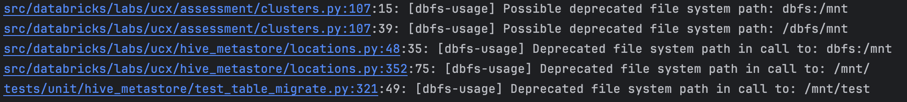
With modern IDEs, clicking on the file link opens the file at the problematic line

[[back to top](#databricks-labs-ucx)]

## `migrate-local-code` command

```text
databricks labs ucx migrate-local-code
```

**(Experimental)** Once [table migration](#Table-Migration) is complete, you can run this command to
migrate all python and SQL files in the current working directory. This command is highly experimental and
at the moment only supports Python and SQL files and discards code comments and formatting during
the automated transformation process.

[[back to top](#databricks-labs-ucx)]

## `migrate-dbsql-dashboards` command

```text
databricks labs ucx migrate-dbsql-dashboards [--dashboard-id <dashboard-id>]
```

**(Experimental)** Once [table migration](#Table-Migration) is complete, you can run this command to
migrate all Databricks SQL dashboards in the workspace. At this moment, this command is highly experimental and discards
formatting during the automated transformation process.

This command tags dashboards & queries that have been migrated with `migrated by UCX` tag. The original queries are
also backed up in the ucx installation folder, to allow for easy rollback (see [`revert-dbsql-dashboards` command](#revert-dbsql-dashboards-command)).

This command can be run with `--dashboard-id` flag to migrate a specific dashboard.

This command is incremental and can be run multiple times to migrate new dashboards.

[[back to top](#databricks-labs-ucx)]

## `revert-dbsql-dashboards` command

```text
databricks labs ucx revert-dbsql-dashboards [--dashboard-id <dashboard-id>]
```

**(Experimental)** This command reverts the migration of Databricks SQL dashboards in the workspace, after
`migrate-dbsql-dashboards` command is executed.

This command can be run with `--dashboard-id` flag to migrate a specific dashboard.

[[back to top](#databricks-labs-ucx)]

# Cross-workspace installations

When installing UCX across multiple workspaces, administrators need to keep UCX configurations in sync.
UCX will prompt you to select an account profile that has been defined in `~/.databrickscfg`. If you don't have one,
authenticate your machine with:

* `databricks auth login --host https://accounts.cloud.databricks.com/` (AWS)
* `databricks auth login --host https://accounts.azuredatabricks.net/` (Azure)

Ask your Databricks Account admin to run the [`sync-workspace-info` command](#sync-workspace-info-command) to sync the
workspace information with the UCX installations. Once the workspace information is synced, you can run the
[`create-table-mapping` command](#create-table-mapping-command) to align your tables with the Unity Catalog.

[[back to top](#databricks-labs-ucx)]

## `sync-workspace-info` command

```text
databricks --profile ACCOUNTS labs ucx sync-workspace-info
14:07:07  INFO [databricks.sdk] Using Azure CLI authentication with AAD tokens
14:07:07  INFO [d.labs.ucx] Account ID: ...
14:07:10  INFO [d.l.blueprint.parallel][finding_ucx_installations_16] finding ucx installations 10/88, rps: 16.415/sec
14:07:10  INFO [d.l.blueprint.parallel][finding_ucx_installations_0] finding ucx installations 20/88, rps: 32.110/sec
14:07:11  INFO [d.l.blueprint.parallel][finding_ucx_installations_18] finding ucx installations 30/88, rps: 39.786/sec
...
```

> Requires Databricks Account Administrator privileges. Use `--profile` to select the Databricks cli profile configured
> with access to the Databricks account console (with endpoint "https://accounts.cloud.databricks.com/"
> or "https://accounts.azuredatabricks.net").

This command uploads the workspace config to all workspaces in the account where `ucx` is installed. This command is
necessary to create an immutable default catalog mapping for [table migration](#Table-Migration) process and is the prerequisite
for [`create-table-mapping` command](#create-table-mapping-command).

If you cannot get account administrator privileges in reasonable time, you can take the risk and
run [`manual-workspace-info` command](#manual-workspace-info-command) to enter Databricks Workspace IDs and Databricks
Workspace names.

[[back to top](#databricks-labs-ucx)]

## `manual-workspace-info` command

```text
$ databricks labs ucx manual-workspace-info
14:20:36  WARN [d.l.ucx.account] You are strongly recommended to run "databricks labs ucx sync-workspace-info" by account admin,
 ... otherwise there is a significant risk of inconsistencies between different workspaces. This command will overwrite all UCX
 ... installations on this given workspace. Result may be consistent only within https://adb-987654321.10.azuredatabricks.net
Workspace name for 987654321 (default: workspace-987654321): labs-workspace
Next workspace id (default: stop): 12345
Workspace name for 12345 (default: workspace-12345): other-workspace
Next workspace id (default: stop):
14:21:19  INFO [d.l.blueprint.parallel][finding_ucx_installations_11] finding ucx installations 10/89, rps: 24.577/sec
14:21:19  INFO [d.l.blueprint.parallel][finding_ucx_installations_15] finding ucx installations 20/89, rps: 48.305/sec
...
14:21:20  INFO [d.l.ucx.account] Synchronised workspace id mapping for installations on current workspace
```

This command is only supposed to be run if the [`sync-workspace-info` command](#sync-workspace-info-command) cannot be
run. It prompts the user to enter the required information manually and creates the workspace info. This command is
useful for workspace administrators who are unable to use the `sync-workspace-info` command, because they are not
Databricks Account Administrators. It can also be used to manually create the workspace info in a new workspace.

[[back to top](#databricks-labs-ucx)]

## `create-account-groups` command

```text
$ databricks labs ucx create-account-groups [--workspace-ids 123,456,789]
```

**Requires Databricks Account Administrator privileges.** This command creates account-level groups if a workspace local
group is not present in the account. It crawls all workspaces configured in `--workspace-ids` flag, then creates
account level groups if a WS local group is not present in the account. If `--workspace-ids` flag is not specified, UCX
will create account groups for all workspaces configured in the account.

The following scenarios are supported, if a group X:
- Exist in workspaces A,B,C, and it has same members in there, it will be created in the account
- Exist in workspaces A,B but not in C, it will be created in the account
- Exist in workspaces A,B,C. It has same members in A,B, but not in C. Then, X and C_X will be created in the account

This command is useful for the setups, that don't have SCIM provisioning in place.

Once you're done with this command, proceed to the [group migration workflow](#group-migration-workflow).

[[back to top](#databricks-labs-ucx)]

## `validate-groups-membership` command

```text
$ databricks labs ucx validate-groups-membership
...
14:30:36  INFO [d.l.u.workspace_access.groups] Found 483 account groups
14:30:36  INFO [d.l.u.workspace_access.groups] No group listing provided, all matching groups will be migrated
14:30:36  INFO [d.l.u.workspace_access.groups] There are no groups with different membership between account and workspace
Workspace Group Name  Members Count  Account Group Name  Members Count  Difference
```

This command validates the groups to see if the groups at the account level and workspace level have different membership.
This command is useful for administrators who want to ensure that the groups have the correct membership. It can also be
used to debug issues related to group membership. See [group migration](docs/local-group-migration.md) and
[group migration](#group-migration-workflow) for more details.

Valid group membership is important to ensure users has correct access after legacy table ACL is migrated in [table migration process](#Table-Migration)

[[back to top](#databricks-labs-ucx)]

## `validate-table-locations` command

```text
$ databricks labs ucx validate-table-locations [--workspace-ids 123,456,789]
...
11:39:36  WARN [d.l.u.account.aggregate] Workspace 99999999 does not have UCX installed
11:39:37  WARN [d.l.u.account.aggregate] Overlapping table locations: 123456789:hive_metastore.database.table and 987654321:hive_metastore.database.table
11:39:37  WARN [d.l.u.account.aggregate] Overlapping table locations: 123456789:hive_metastore.database.table and 123456789:hive_metastore.another_database.table
```

This command validates the table locations by checking for overlapping table locations in the workspace and across
workspaces. Unity catalog does not allow overlapping table locations, also not between tables in different catalogs.
Overlapping table locations need to be resolved by the user before running the table migration.

Options to resolve tables with overlapping locations are:
- Move one table and [skip](#skip-command) the other(s).
- Duplicate the tables by copying the data into a managed table and [skip](#skip-command) the original tables.

Considerations when resolving tables with overlapping locations are:
- Migrate the tables one workspace at a time:
  - Let later migrated workspaces read tables from the earlier migrated workspace catalogs.
  - [Move](#move-command) tables between schemas and catalogs when it fits the data management model.
- The tables might have different:
  - Metadata, like:
    - Column schema (names, types, order)
    - Description
    - Tags
  - ACLs

[[back to top](#databricks-labs-ucx)]

## `cluster-remap` command

```text
$ databricks labs ucx cluster-remap
21:29:38  INFO [d.labs.ucx] Remapping the Clusters to UC
Cluster Name                                            Cluster Id
Field Eng Shared UC LTS Cluster                         0601-182128-dcbte59m
Shared Autoscaling Americas cluster                     0329-145545-rugby794
```
```text
Please provide the cluster id's as comma separated value from the above list (default: <ALL>):
```

Once you're done with the [code migration](#code-migration-commands), you can run this command to remap the clusters to UC enabled.

This command will remap the cluster to uc enabled one. When we run this command it will list all the clusters
and its id's and asks to provide the cluster id's as comma separated value which has to be remapped, by default it will take all cluster ids.
Once we provide the cluster id's it will update these clusters to UC enabled.Back up of the existing cluster
config will be stored in backup folder inside the installed location(backup/clusters/cluster_id.json) as a json file.This will help
to revert the cluster remapping.

You can revert the cluster remapping using the [`revert-cluster-remap` command](#revert-cluster-remap-command).

[[back to top](#databricks-labs-ucx)]

## `revert-cluster-remap` command

```text
$ databricks labs ucx revert-cluster-remap
21:31:29  INFO [d.labs.ucx] Reverting the Remapping of the Clusters from UC
21:31:33  INFO [d.labs.ucx] 0301-055912-4ske39iq
21:31:33  INFO [d.labs.ucx] 0306-121015-v1llqff6
Please provide the cluster id's as comma separated value from the above list (default: <ALL>):
```

If a customer want's to revert the cluster remap done using the [`cluster-remap` command](#cluster-remap-command) they can use this command to revert
its configuration from UC to original one.It will iterate through the list of clusters from the backup folder and reverts the
cluster configurations to original one.This will also ask the user to provide the list of clusters that has to be reverted as a prompt.
By default, it will revert all the clusters present in the backup folder

[[back to top](#databricks-labs-ucx)]

## `upload` command

```text
$ databricks labs ucx upload --file <file_path> --run-as-collection True
21:31:29 WARNING [d.labs.ucx] The schema of CSV files is NOT validated, ensure it is correct
21:31:29 INFO [d.labs.ucx] Finished uploading: <file_path>
```

Upload a file to a single workspace (`--run-as-collection False`) or a collection of workspaces
(`--run-as-collection True`). This command is especially useful when uploading the same file to multiple workspaces.

## `download` command

```text
$ databricks labs ucx download --file <file_path> --run-as-collection True
21:31:29 INFO [d.labs.ucx] Finished downloading: <file_path>
```

Download a csv file from a single workspace (`--run-as-collection False`) or a collection of workspaces
(`--run-as-collection True`). This command is especially useful when downloading the same file from multiple workspaces.

## `join-collection` command

```text
$ databricks labs ucx join-collection --workspace-ids <comma seperate list of workspace ids> --profile <account-profile>
```

`join-collection` command joins 2 or more workspaces into a collection. This helps in running supported cli commands as a collection
`join-collection` command updates config.yml file on each workspace ucx installation with installed_workspace_ids attribute.
In order to run `join-collectioon` command a user should:
 - be an Account admin on the Databricks account
 - be a Workspace admin on all the workspaces to be joined as a collection) or a collection of workspaces
 - have installed UCX on the workspace
The `join-collection` command will fail and throw an error msg if the above conditions are not met.

## collection eligible command

Once `join-collection` command is run, it allows user to run multiple cli commands as a collection. The following cli commands
are eligible to be run as a collection. User can run the below commands as collection by passing an additional flag `--run-as-collection=True`
- `ensure-assessment-run`
- `create-table-mapping`
- `principal-prefix-access`
- `migrate-credentials`
- `create-uber-principal`
- `create-missing-principals`
- `validate-external-location`
- `migrate-locations`
- `create-catalog-schemas`
- `migrate-tables`
- `migrate-acls`
- `migrate-dbsql-dashboards`
- `validate-group-membership`
Ex: `databricks labs ucx ensure-assessment-run --run-as-collection=True`


# Common Challenges and the Solutions
Users might encounter some challenges while installing and executing UCX. Please find the listing of some common challenges and the solutions below.

[[back to top](#databricks-labs-ucx)]

### Network Connectivity Issues

**From local machine to the Databricks Account and Workspace:** UCX
installation process has to be run from the local laptop using
Databricks CLI and it will deploy the latest version of UCX into the
Databricks workspace. For this reason, the Databricks account and
workspace needs to be accessible from the laptop. Sometimes, the
workspace might have a network isolation, like it can only be reached
from a VPC, or from a specific IP range.

**Solution:** Please check that your laptop has network connectivity to
the Databricks account and workspace. If not, you might need to be
connected to a VPN or configure an HTTP proxy to access your workspace.

**From local machine to GitHub:** UCX needs internet access to connect to GitHub (https://api.github.com
and https://raw.githubusercontent.com) for downloading the tool from the machine running the installation. The
installation will fail if there is no internet connectivity to these URLs.

**Solution:** Ensure that GitHub is reachable from the local machine. If
not, make necessary changes to the network/firewall settings.

**From Databricks workspace to PyPi:** There are some dependent
libraries which need to be installed from
[<u>pypi.org</u>](https://pypi.org/) to run the UCX workflows from the
Databricks workspace. If the workspace doesn’t have network
connectivity, then the job might fail with
NO_MATCHING_DISTRIBUTION_ERROR.

**Solution:** Version 0.24.0 of UCX supports workspace with no internet
access. Please upgrade UCX and rerun the installation. Reply *yes* to
the question "Does the given workspace block Internet access?" asked
during installation. It will then upload all necessary dependencies to
the workspace. Also, please note that UCX uses both UC and non-UC
enabled clusters. If you have different proxy settings for each, then
please update the necessary proxies (eg. with init scripts) for each
cluster type.

**Local machine to Databricks Account and Workspace connection failed due to proxy and self-signed cert:**
When customer uses web proxy and self-singed certification, UCX may not be able to connect to Account and Workspace
with following errors:
```
File "/Users/userabc/.databricks/labs/ucx/state/venv/lib/python3.10/site-packages/urllib3/connectionpool.py", line 466, in _make_request
    self._validate_conn(conn)
  File "/Users/userabc/.databricks/labs/ucx/state/venv/lib/python3.10/site-packages/urllib3/connectionpool.py", line 1095, in _validate_conn
    conn.connect()
  File "/Users/userabc/.databricks/labs/ucx/state/venv/lib/python3.10/site-packages/urllib3/connection.py", line 652, in connect
    sock_and_verified = _ssl_wrap_socket_and_match_hostname(
  File "/Users/userabc/.databricks/labs/ucx/state/venv/lib/python3.10/site-packages/urllib3/connection.py", line 805, in _ssl_wrap_socket_and_match_hostname
    ssl_sock = ssl_wrap_socket(
  File "/Users/userabc/.databricks/labs/ucx/state/venv/lib/python3.10/site-packages/urllib3/util/ssl_.py", line 465, in ssl_wrap_socket
    ssl_sock = _ssl_wrap_socket_impl(sock, context, tls_in_tls, server_hostname)
  File "/Users/userabc/.databricks/labs/ucx/state/venv/lib/python3.10/site-packages/urllib3/util/ssl_.py", line 509, in _ssl_wrap_socket_impl
    return ssl_context.wrap_socket(sock, server_hostname=server_hostname)
  File "/opt/homebrew/Cellar/python@3.10/3.10.14/Frameworks/Python.framework/Versions/3.10/lib/python3.10/ssl.py", line 513, in wrap_socket
    return self.sslsocket_class._create(
  File "/opt/homebrew/Cellar/python@3.10/3.10.14/Frameworks/Python.framework/Versions/3.10/lib/python3.10/ssl.py", line 1104, in _create
    self.do_handshake()
  File "/opt/homebrew/Cellar/python@3.10/3.10.14/Frameworks/Python.framework/Versions/3.10/lib/python3.10/ssl.py", line 1375, in do_handshake
    self._sslobj.do_handshake()
ssl.SSLCertVerificationError: [SSL: CERTIFICATE_VERIFY_FAILED] certificate verify failed: self-signed certificate in certificate chain (_ssl.c:1007)
```

**Solution:**  set both `REQUESTS_CA_BUNDLE` and `CURL_CA_BUNDLE`
[to force requests library to set verify=False](https://github.com/psf/requests/blob/8c211a96cdbe9fe320d63d9e1ae15c5c07e179f8/requests/sessions.py#L718)
as well as set `SSL_CERT_DIR` env var pointing to the proxy CA cert for the urllib3 library.

[[back to top](#databricks-labs-ucx)]

### Insufficient Privileges

**User is not a Databricks workspace administrator:** User running the
installation needs to be a workspace administrator as the CLI will
deploy the UCX tool into the workspace, create jobs, and dashboards.

**Solution:** Identify a workspace admin from your team and ask them to
install UCX with their authentication, or request a workspace
administrator to grant you temporary administrator privileges to run the
installation. More details on the issues that you can run into if
you are not an admin (and some possible solutions) can be found
[here](docs/troubleshooting.md#resolving-common-errors-on-ucx-install).

**User is not a Cloud IAM Administrator:** Cloud CLI needs to be
installed in the local machine for certain cloud related activities,
like creating an [<u>uber
principal</u>](#create-uber-principal-command).
For this, the user needs Cloud IAM Administrator privileges.

**Solution:** Work with a cloud administrator in your organization to
run the commands that need cloud administrator rights.

Admin privileges required for commands:

| **CLI command**                                                                                  | **Admin privileges** |
|--------------------------------------------------------------------------------------------------|----|
| [<u>install</u>](#install-ucx)                                                                   | Workspace Admin |
| [<u>account install</u>](#advanced-installing-ucx-on-all-workspaces-within-a-databricks-account) | Account Admin |
| [<u>create-account-groups</u>](#create-account-groups-command)                                   | Account Admin |
| [<u>validate-groups-membership</u>](#validate-groups-membership-command)                         | Account Admin |
| [<u>create-uber-principal</u>](#create-uber-principal-command)                                   | Cloud Admin |
| [<u>principal-prefix-access</u>](#principal-prefix-access-command)                               | Cloud Admin |
| [<u>create-missing-principals</u>](#create-missing-principals-command-aws-only)                  | Cloud Admin |
| [<u>delete-missing-principals</u>](#delete-missing-principals-command-aws-only)                  | Cloud Admin |
| [<u>migrate-credentials</u>](#migrate-credentials-command)                                       | Cloud Admin, Account Admin / Metastore Admin / CREATE STORAGE CREDENTIAL privilege |
| [<u>migrate-location</u>](#migrate-locations-command)                                            | Metastore Admin / CREATE EXTERNAL LOCATION privilege |
| [<u>create-catalogs-schemas</u>](#create-catalogs-schemas-command)                               | Metastore Admin / CREATE CATALOG privilege |
| [<u>sync-workspace-info</u>](#sync-workspace-info-command)                                       | Account Admin |
| [<u>manual-workspace-info</u>](#manual-workspace-info-command)                                   | Workspace Admin |

[[back to top](#databricks-labs-ucx)]

### Version Issues

**Python:** UCX needs Python version 3.10 or later.

**Solution:** Check the current version using `python --version`. If the
version is lower than 3.10, upgrade the local Python version to 3.10 or
higher.

**Databricks CLI:** Databricks CLI v0.213 or higher is needed.

**Solution:** Check the current version with `databricks --version`. For
lower versions of CLI,
[<u>update</u>](https://docs.databricks.com/en/dev-tools/cli/install.html#update)
the Databricks CLI on the local machine.

**UCX:** When you install UCX, you get the latest version. But since UCX
is being actively developed, new versions are released frequently. There
might be issues if you have run the assessment with a much earlier
version, and then trying to run the migration workflows with the latest
UCX version.

**Solution:** Upgrade UCX, and rerun the assessment job before running
the migration workflows. For some reason, if you want to install a
specific version of UCX, you can do it using the command
`databricks labs install ucx@\<version\>`, for example,
`databricks labs install ucx@v0.21.0`.

[[back to top](#databricks-labs-ucx)]

### Authentication Issues

**Workspace Level:** If you are facing authentication issues while
setting up Databricks CLI, please refer to the
[Cryptic errors on authentication](docs/troubleshooting.md#cryptic-errors-on-authentication)
section to resolve the common errors related to authentication,
profiles, and tokens.

**Account Level:** Not only workspace, but account level authentication
is also needed for installing UCX. If you do not have an account
configured in .databrickscfg, you will get an error message
".databrickscfg does not contain account profiles; please create one
first".

**Solution:** To authenticate with a Databricks account, consider using
one of the following authentication types: [<u>OAuth machine-to-machine
(M2M)
authentication</u>](https://docs.databricks.com/en/dev-tools/cli/authentication.html#m2m-auth),
[<u>OAuth user-to-machine (U2M)
authentication</u>](https://docs.databricks.com/en/dev-tools/cli/authentication.html#u2m-auth),
[<u>Basic authentication
(legacy)</u>](https://docs.databricks.com/en/dev-tools/cli/authentication.html#basic-auth).

[[back to top](#databricks-labs-ucx)]

### Multiple Profiles in Databricks CLI

**Workspace Level:** More than one workspace profile can be configured
in the .databrickscfg file. For example, you can have profiles set for
Dev and Prod workspaces. You want to install UCX only for the Prod
workspace.

**Solution:** The Databricks CLI provides an option to select the
[<u>profile</u>](https://docs.databricks.com/en/dev-tools/cli/profiles.html)
using `--profile \<profile_name\>` or `-p \<profile_name\>`. You can
test that the correct workspace is getting selected by running any
Databricks CLI command. For example, you can run `databricks clusters
list -p prod` and check that the Prod clusters are being returned. Once
the profile is verified, you can run UCX install for that specific
profile: `databricks labs install ucx -p prod`.

**Account Level:** Multiple account level profiles are set in the
.databrickscfg file.

**Solution:** The installation command `databricks labs install ucx`
will provide an option to select one account profile.

[[back to top](#databricks-labs-ucx)]

### Workspace has an external Hive Metastore (HMS)

**External HMS connectivity from UCX clusters:** If the workspace has an
external HMS, the clusters running the UCX jobs need to have specific
configurations to connect to the external HMS. Otherwise, UCX assessment
will not be able to assess the tables on HMS.

**Solution:** Use a cluster policy before installation to set the
required Spark config for connecting to the external HMS, or manually
edit the cluster post-installation to have the correct configurations.
Detailed steps can be found
[<u>here</u>](docs/external_hms_glue.md).

**External HMS connectivity from UCX SQL warehouse:** UCX requires a SQL
warehouse to create tables, run queries, create and refresh dashboards.
If you already have a Pro or Serverless warehouse connected to the
external HMS, you can select the same warehouse for UCX. You will also
be given an option (during installation) to create a new warehouse for
UCX. If you have never used a warehouse before, the new warehouse
created might not have proper configuration set to connect to the
external HMS.

**Solution:** Set Spark configuration for connecting to external HMS in
the Admin Settings of SQL warehouse. This will only be needed if the
admin settings do not have the configurations already set. For example,
add *spark.hadoop.javax.jdo.option.ConnectionURL \<connectionstring\>*
under Data Access Configuration of SQL Warehouse Admin Settings.

[[back to top](#databricks-labs-ucx)]

### Verify the Installation

Once the UCX command `databricks labs install ucx` has completed
successfully, the installation can be verified with the following steps:

1.  Go to the Databricks Catalog Explorer and check if a new schema for
    ucx is available in Hive Metastore with all empty tables.

2.  Check that the UCX jobs are visible under Workflows.

3.  Run the assessment. This will start the UCX clusters, crawl through
    the workspace, and display results in the UCX dashboards. In case of
    external HMS, verify from the results that the assessment has
    analyzed the external HMS tables.

[[back to top](#databricks-labs-ucx)]

# Star History

[](https://star-history.com/#databrickslabs/ucx)

[[back to top](#databricks-labs-ucx)]

# Project Support
Please note that all projects in the databrickslabs GitHub account are provided for your exploration only, and are not formally supported by Databricks with Service Level Agreements (SLAs).  They are provided AS-IS, and we do not make any guarantees of any kind.  Please do not submit a support ticket relating to any issues arising from the use of these projects.

Any issues discovered through the use of this project should be filed as GitHub Issues on the Repo.  They will be reviewed as time permits, but there are no formal SLAs for support.
