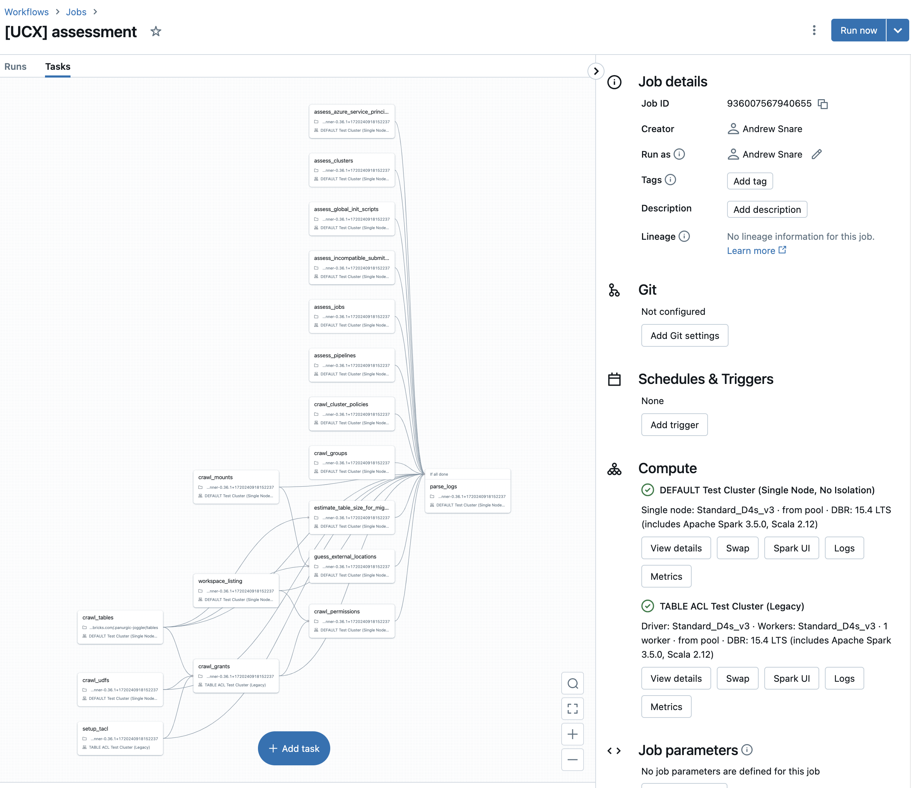

Databricks Labs UCX
---


Your best companion for upgrading to Unity Catalog. It helps you to upgrade all Databricks workspace assets:
Legacy Table ACLs, Entitlements, AWS instance profiles, Clusters, Cluster policies, Instance Pools, Databricks SQL warehouses, Delta Live Tables, Jobs, MLflow experiments, MLflow registry, SQL Dashboards & Queries, SQL Alerts, Token and Password usage permissions that are set on the workspace level, Secret scopes, Notebooks, Directories, Repos, Files.

[](https://github.com/databrickslabs/ucx/actions/workflows/push.yml) [](https://codecov.io/github/databrickslabs/ucx)  []([https://codecov.io/github/databrickslabs/ucx](https://github.com/databrickslabs/ucx))

See [contributing instructions](CONTRIBUTING.md) to help improve this project.

<!-- TOC -->
  * [Introduction](#introduction)
  * [Installation](#installation)
    * [Download Databricks Command Line interface](#download-databricks-command-line-interface)
    * [Install UCX - `databricks labs install ucx`](#install-ucx---databricks-labs-install-ucx-)
    * [Upgrade UCX - `databricks labs upgrade ucx`](#upgrade-ucx---databricks-labs-upgrade-ucx)
    * [Uninstall UCX](#uninstall-ucx)
  * [Using UCX command-line interface - `databricks labs ucx ...`](#using-ucx-command-line-interface---databricks-labs-ucx-)
  * [Utility commands](#utility-commands)
    * [`ensure-assessment-run` command](#ensure-assessment-run-command)
    * [`repair-run` command](#repair-run-command)
    * [`open-remote-config` command](#open-remote-config-command)
    * [`workflows` command](#workflows-command)
    * [`installations` command](#installations-command)
    * [`validate-groups-membership` command](#validate-groups-membership-command)
  * [Table migration commands](#table-migration-commands)
    * [`create-table-mapping` command](#create-table-mapping-command)
    * [`skip` command](#skip-command)
    * [`revert-migrated-tables` command](#revert-migrated-tables-command)
    * [`move` command](#move-command)
    * [`alias` command](#alias-command)
  * [Multi-workspace commands](#multi-workspace-commands)
    * [`sync-workspace-info` command](#sync-workspace-info-command)
    * [`manual-workspace-info` command](#manual-workspace-info-command)
    * [`create-account-groups` command](#create-account-groups-command)
  * [Getting information from AWS or Azure](#getting-information-from-aws-or-azure)
    * [`principal-prefix-access` command](#principal-prefix-access-command)
    * [`migrate-credentials` command](#migrate-credentials-command)
    * [`validate-external-locations` command](#validate-external-locations-command)
    * [Executing assessment job](#executing-assessment-job)
    * [Understanding assessment report](#understanding-assessment-report)
    * [Scanning for legacy credentials and mapping access](#scanning-for-legacy-credentials-and-mapping-access)
      * [AWS](#aws)
      * [Azure](#azure)
    * [Producing table mapping](#producing-table-mapping)
    * [Managing cross-workspace installation](#managing-cross-workspace-installation)
    * [Validating group membership](#validating-group-membership)
    * [Creating account groups](#creating-account-groups)
  * [Star History](#star-history)
  * [Project Support](#project-support)
<!-- TOC -->

## Introduction
UCX will guide you, the Databricks customer, through the process of upgrading your account, groups, workspaces, jobs etc. to Unity Catalog.

1. The upgrade process will first install code, libraries, and workflows into your workspace.
2. After installation, you will run a series of workflows and examine the output.

UCX leverages Databricks Lakehouse platform to upgrade itself. The upgrade process includes creating jobs, notebooks, and deploying code and configuration files. 

By running the installation you install the assessment job and several upgrade jobs. The assessment and upgrade jobs are outlined in the custom-generated README.py that is created by the installer.

The custom-generated `README.py`, `config.yaml`, and other assets are placed into your Databricks workspace home folder, into a sub-folder named `.ucx`. See [interactive tutorial](https://app.getreprise.com/launch/zXPxBZX/).

Once the custom Databricks jobs are installed, begin by triggering the assessment job. The assessment job can be found under your workflows or via the active link in the README.py. Once the assessment job is complete, you can review the results in the custom-generated Databricks dashboard (linked to by the custom README.py found in the workspace folder created for you).

You will need an account, unity catalog, and workspace administrative authority to complete the upgrade process. To run the installer, you will need to set up `databricks-cli` and a credential, [following these instructions.](https://docs.databricks.com/en/dev-tools/cli/databricks-cli.html) Additionally, the interim metadata and config data being processed by UCX will be stored into a Hive Metastore database schema generated at install time.


For questions, troubleshooting or bug fixes, please see your Databricks account team or submit an issue to the [Databricks UCX GitHub repo](https://github.com/databrickslabs/ucx)

[[back to top](#databricks-labs-ucx)]

## Installation

1. Get trained on UC [[free instructor-led training 2x week]](https://customer-academy.databricks.com/learn/course/1683/data-governance-with-unity-catalog?generated_by=302876&hash=4eab6668f83636ba44d109880002b293e8dda6dd) [[full training schedule]](https://files.training.databricks.com/static/ilt-sessions/half-day-workshops/index.html)
2. You will need a desktop computer, running Windows, macOS, or Linux; This computer is used to install the UCX toolkit onto the Databricks workspace, the computer will also need:
    -  Network access to your Databricks Workspace
    -  Network access to the Internet to retrieve additional Python packages (e.g. PyYAML, databricks-sdk,...) and access https://github.com
    -  Python 3.10 or later - [Windows instructions](https://www.python.org/downloads/)
    -  Databricks CLI with a workspace [configuration profile](https://docs.databricks.com/en/dev-tools/auth.html#databricks-client-unified-authentication) for workspace - [instructions](https://docs.databricks.com/en/dev-tools/cli/install.html)
    -  Your Windows computer will need a shell environment (GitBash or ([WSL](https://learn.microsoft.com/en-us/windows/wsl/about))
3. Within the Databricks Workspace you will need:
    - Workspace administrator access permissions
    - The ability for the installer to upload Python Wheel files to DBFS and Workspace FileSystem
    - A PRO or Serverless SQL Warehouse
    - The Assessment workflow will create a legacy "No Isolation Shared" and a legacy "Table ACL" jobs clusters needed to inventory Hive Metastore Table ACLS
    - If your Databricks Workspace relies on an external Hive Metastore (such as AWS Glue), make sure to read the [External HMS Document](docs/external_hms_glue.md).
4. A number of commands also require Databricks account administrator access permissions, e.g. `sync-workspace-info`
5. [[AWS]](https://docs.databricks.com/en/administration-guide/users-groups/best-practices.html) [[Azure]](https://learn.microsoft.com/en-us/azure/databricks/administration-guide/users-groups/best-practices)] [[GCP]](https://docs.gcp.databricks.com/administration-guide/users-groups/best-practices.html) Account level Identity Setup
6. [[AWS]](https://docs.databricks.com/en/data-governance/unity-catalog/create-metastore.html) [[Azure]](https://learn.microsoft.com/en-us/azure/databricks/data-governance/unity-catalog/create-metastore) [[GCP]](https://docs.gcp.databricks.com/data-governance/unity-catalog/create-metastore.html) Unity Catalog Metastore Created (per region)


 The `WorkspaceInstaller` class is used to create a new configuration for Unity Catalog (UCX) migration in a Databricks workspace. 
 It guides the user through a series of prompts to gather necessary information, such as selecting an inventory database, choosing 
 a PRO or SERVERLESS SQL warehouse, specifying a log level and number of threads, and setting up an external Hive Metastore if necessary. 
 Based on user input, the class creates a new cluster policy with the specified configuration. The user can review and confirm the configuration, 
 which is saved to the workspace and can be opened in a web browser. The class handles the installation of UCX, including configuring the workspace, 
 installing necessary libraries, and verifying the installation, making it easier for users to migrate their workspaces to UCX.


The `WorkspaceInstallation` is used to manage the installation and uninstallation of UCX in a workspace. It has various methods to 
initialize the installation, get the configuration, create and run jobs, upload wheels, and handle exceptions. 

The `run` method installs the product by creating dashboards, database, and jobs. It also handles exceptions that may occur during
the installation process. The `config_file_link` method returns the link to the configuration file. The `_create_database` method 
creates a database with the given configuration. The `_create_dashboards` method creates dashboards in the workspace. 
The `run_workflow` method runs a workflow with a given step. The `_infer_error_from_job_run` method infers the error from a job run. 
The `_infer_task_exception` method infers the exception from a task run. 
The `_warehouse_id` method gets the warehouse ID from the configuration or lists the available warehouses and selects the first one. 
The `_my_username` method gets the username of the current user. The `_short_name` method gets the short name of the user. 
The `_config_file` method gets the path to the configuration file. The `_name` method creates a name with a prefix. 
The `_upload_wheel` method uploads the wheel to DBFS and WSFS. The `_upload_cluster_policy` method uploads the cluster policy to the workspace. 
The `create_jobs` method creates jobs from tasks and handles exceptions. 
The `_deploy_workflow` method deploys a workflow with a given name and settings. 
The `_sorted_tasks` method returns a list of tasks sorted by their task ID. The `_step_list` method returns a list of steps. 
The `_create_readme` method creates a README markdown file with the job and dashboard links. 
The `_replace_inventory_variable` method replaces a variable in a text. 
The `_create_debug` method creates a debug notebook in the workspace. 
The `_job_settings` method creates job settings for a given step. 
The `_upload_wheel_runner` method uploads a wheel runner notebook to the workspace. 
The `_apply_cluster_overrides` method applies cluster overrides to the job settings. 
The `_job_task` method creates a job task for a given task. 
The `_job_dashboard_task` method creates a job dashboard task for a given task. 
The `_job_notebook_task` method creates a job notebook task for a given task. 
The `_job_wheel_task` method creates a job wheel task for a given task. 
The `_job_clusters` method creates job clusters for a given list of names. 
The `_readable_timedelta` method converts a timedelta object to a human-readable string. 
The `latest_job_status` method gets the latest job status for all steps. 
The `repair_run` method repairs a failed run for a given workflow. 
The `uninstall` method uninstalls the product from the workspace. 
The `_remove_database` method removes the inventory database. 
The `_remove_jobs` method removes all jobs. 
The `_remove_warehouse` method removes the warehouse. 
The `_remove_policies` method removes the cluster policy. 
The `validate_step` method validates if a given step is successful or not. 
The `validate_and_run` method validates if a given step is successful, and if not, runs the workflow for that step.

[[back to top](#databricks-labs-ucx)]

### Download Databricks Command Line interface

We only support installations and upgrades through [Databricks CLI](https://docs.databricks.com/en/dev-tools/cli/index.html), as UCX requires an installation script run to make sure all the necessary and correct configurations are in place. Install Databricks CLI on macOS:


Install Databricks CLI on Windows:


[[back to top](#databricks-labs-ucx)]

### Install UCX - `databricks labs install ucx` 
Install UCX via Databricks CLI:
```commandline
databricks labs install ucx
```

This will start an interactive installer with a number of configuration questions:
- Select a workspace profile that has been defined in `~/.databrickscfg`
- Provide the name of the inventory database where UCX will store the assessment results. This will be in the workspace `hive_metastore`. Defaults to `ucx`
- Create a new or select an existing SQL warehouse to run assessment dashboards on. The existing warehouse must be Pro or Serverless.
- Configurations for workspace local groups migration:
  - Provide a backup prefix. This is used to rename workspace local groups after they have been migrated. Defaults to `db-temp-`
  - Select a workspace local groups migration strategy. UCX offers matching by name or external ID, using a prefix/suffix, or using regex. See [this](docs/group_name_conflict.md) for more details
  - Provide a specific list of workspace local groups (or all groups) to be migrated.
- Select a Python log level, e.g. `DEBUG`, `INFO`. Defaults to `INFO`
- Provide the level of parallelism, which limit the number of concurrent operation as UCX scans the workspace. Defaults to 8.
- Select whether UCX should connect to the external HMS, if a cluster policy with external HMS is detected. Defaults to no.

After this, UCX will be installed locally and a number of assets will be deployed in the selected workspace. These assets are available under the installation folder, i.e. `/Users/<your user>/.ucx/`

You can also install a specific version by specifying it like `@v0.13.2` - `databricks labs install ucx@v0.13.2`.


[[back to top](#databricks-labs-ucx)]

### Upgrade UCX - `databricks labs upgrade ucx`
Verify that UCX is installed
```text
databricks labs installed

Name  Description                            Version
ucx   Unity Catalog Migration Toolkit (UCX)  <version>
```
Upgrade UCX via Databricks CLI:
```commandline
databricks labs upgrade ucx
```
The prompts will be similar to [Installation](#install-ucx)


[[back to top](#databricks-labs-ucx)]

### Uninstall UCX
Uninstall UCX via Databricks CLI:
```commandline
databricks labs uninstall ucx
```

Databricks CLI will confirm a few options:
- Whether you want to remove all ucx artefacts from the workspace as well. Defaults to no.
- Whether you want to delete the inventory database in `hive_metastore`. Defaults to no.


[[back to top](#databricks-labs-ucx)]

# Workflows

Part of this application is deployed as Databricks Workflows

[[back to top](#databricks-labs-ucx)]

## Assessment workflow

The assessment workflow can be triggered using the Databricks UI, or via the command line. 
```commandline
databricks labs ucx ensure-assessment-run
```


The assessment workflow is designed to assess the compatibility of various entities in the current workspace with Unity Catalog (UC). It identifies incompatible entities and provides information necessary for planning the migration to UC. The tasks in the assessment workflow can be executed in parallel or sequentially, depending on the dependencies specified in the `@task` decorators. The output of each task is stored in Delta tables in the `$inventory_database` schema, which can be used for further analysis and decision-making. The assessment workflow can be executed multiple times to ensure that all incompatible entities are identified and accounted for before starting the migration process.

1. `crawl_tables`: This task scans all tables in the Hive Metastore of the current workspace and persists their metadata in a Delta table named `$inventory_database.tables`. This metadata includes information such as the database name, table name, table type, and table location. This task is used for assessing which tables cannot be easily migrated to Unity Catalog.
2. `crawl_grants`: This task scans the Delta table named `$inventory_database.tables` and issues a `SHOW GRANTS` statement for every object to retrieve the permissions assigned to it. The permissions include information such as the principal, action type, and the table it applies to. This task persists the permissions in the Delta table `$inventory_database.grants`.
3. `estimate_table_size_for_migration`: This task scans the Delta table named `$inventory_database.tables` and locates tables that cannot be synced. These tables will have to be cloned in the migration process. The task assesses the size of these tables and creates the `$inventory_database.table_size` table to list these sizes. The table size is a factor in deciding whether to clone these tables.
4. `crawl_mounts`: This task scans the workspace to compile a list of all existing mount points and stores this information in the `$inventory.mounts` table. This is crucial for planning the migration.
5. `guess_external_locations`: This task determines the shared path prefixes of all the tables that utilize mount points. The goal is to identify the external locations necessary for a successful migration and store this information in the `$inventory.external_locations` table.
6. `assess_jobs`: This task scans through all the jobs and identifies those that are not compatible with UC. The list of all the jobs is stored in the `$inventory.jobs` table.
7. `assess_clusters`: This task scans through all the clusters and identifies those that are not compatible with UC. The list of all the clusters is stored in the `$inventory.clusters` table.
8. `assess_pipelines`: This task scans through all the Pipelines and identifies those pipelines that have Azure Service Principals embedded in their configurations. A list of all the pipelines with matching configurations is stored in the `$inventory.pipelines` table.
9. `assess_azure_service_principals`: This task scans through all the clusters configurations, cluster policies, job cluster configurations, Pipeline configurations, and Warehouse configuration and identifies all the Azure Service Principals who have been given access to the Azure storage accounts via spark configurations referred in those entities. The list of all the Azure Service Principals referred in those configurations is saved in the `$inventory.azure_service_principals` table.
10. `assess_global_init_scripts`: This task scans through all the global init scripts and identifies if there is an Azure Service Principal who has been given access to the Azure storage accounts via spark configurations referred in those scripts.

After UCX assessment workflow is executed, the assessment dashboard will be populated with findings and common recommendations.
[This guide](docs/assessment.md) talks about them in more details.

[[back to top](#databricks-labs-ucx)]

# Group migration workflow

The group migration workflow is designed to migrate workspace-local groups to account-level groups in the Unity Catalog (UC) environment. It ensures that all the necessary groups are available in the workspace with the correct permissions, and removes any unnecessary groups and permissions. The tasks in the group migration workflow depend on the output of the assessment workflow and can be executed in sequence to ensure a successful migration. The output of each task is stored in Delta tables in the `$inventory_database` schema, which can be used for further analysis and decision-making. The group migration workflow can be executed multiple times to ensure that all the groups are migrated successfully and that all the necessary permissions are assigned.

1. `crawl_groups`: This task scans all groups for the local group migration scope.
2. `rename_workspace_local_groups`: This task renames workspace local groups by adding a `ucx-renamed-` prefix. This step is taken to avoid conflicts with account-level groups that may have the same name as workspace-local groups.
3. `reflect_account_groups_on_workspace`: This task adds matching account groups to this workspace. The matching account level group(s) must preexist(s) for this step to be successful. This step is necessary to ensure that the account-level groups are available in the workspace for assigning permissions.
4. `apply_permissions_to_account_groups`: This task assigns the full set of permissions of the original group to the account-level one. It covers local workspace-local permissions for all entities, including Legacy Table ACLs, Entitlements, AWS instance profiles, Clusters, Cluster policies, Instance Pools, Databricks SQL warehouses, Delta Live Tables, Jobs, MLflow experiments, MLflow registry, SQL Dashboards & Queries, SQL Alerts, Token and Password usage permissions, Secret Scopes, Notebooks, Directories, Repos, Files. This step is necessary to ensure that the account-level groups have the necessary permissions to manage the entities in the workspace.
5. `validate_groups_permissions`: This task validates that all the crawled permissions are applied correctly to the destination groups.
6. `delete_backup_groups`: This task removes all workspace-level backup groups, along with their permissions. This should only be executed after confirming that the workspace-local migration worked successfully for all the groups involved. This step is necessary to clean up the workspace and remove any unnecessary groups and permissions.

[[back to top](#databricks-labs-ucx)]

# Using UCX command-line interface - `databricks labs ucx ...`

After installation, a number of UCX workflows will be available in the workspace. `<installation_path>/README` contains further instructions and explanations of these workflows.
UCX also provides a number of command line utilities accessible via `databricks labs ucx`.

[[back to top](#databricks-labs-ucx)]

## Utility commands

### `ensure-assessment-run` command

This command ensures that the assessment job was run on a workspace. It takes a `WorkspaceClient` object as a parameter 
and validates the assessment job using the `WorkspaceInstallation` class. This command is useful for developers and 
administrators who want to ensure that the assessment job has been run on a workspace. It can also be used to debug 
issues related to the assessment job.

[[back to top](#databricks-labs-ucx)]

### `repair-run` command

This command repairs a failed job. It takes a `WorkspaceClient` object and a `step` parameter as parameters and repairs 
the specified step using the `WorkspaceInstallation` class. This command is useful for developers and administrators who 
want to repair a failed job. It can also be used to debug issues related to job failures.

[[back to top](#databricks-labs-ucx)]

### `open-remote-config` command

This command opens the remote configuration file in the default web browser. It generates a link to the configuration file 
and opens it using the `webbrowser.open()` method. This command is useful for developers and administrators who want to view or 
edit the remote configuration file without having to manually navigate to it in the workspace. It can also be used to quickly 
access the configuration file from the command line. Here's the description of configuration properties:

  * `inventory_database`: A string representing the name of the inventory database.
  * `workspace_group_regex`: An optional string representing the regular expression to match workspace group names.
  * `workspace_group_replace`: An optional string to replace the matched group names with.
  * `account_group_regex`: An optional string representing the regular expression to match account group names.
  * `group_match_by_external_id`: A boolean value indicating whether to match groups by their external IDs.
  * `include_group_names`: An optional list of strings representing the names of groups to include for migration.
  * `renamed_group_prefix`: An optional string representing the prefix to add to renamed group names.
  * `instance_pool_id`: An optional string representing the ID of the instance pool.
  * `warehouse_id`: An optional string representing the ID of the warehouse.
  * `connect`: An optional `Config` object representing the configuration for connecting to the warehouse.
  * `num_threads`: An optional integer representing the number of threads to use for migration.
  * `database_to_catalog_mapping`: An optional dictionary mapping source database names to target catalog names.
  * `default_catalog`: An optional string representing the default catalog name.
  * `log_level`: An optional string representing the log level.
  * `workspace_start_path`: A string representing the starting path for notebooks and directories crawler in the workspace.
  * `instance_profile`: An optional string representing the name of the instance profile.
  * `spark_conf`: An optional dictionary of Spark configuration properties.
  * `override_clusters`: An optional dictionary mapping job cluster names to existing cluster IDs.
  * `policy_id`: An optional string representing the ID of the cluster policy.

[[back to top](#databricks-labs-ucx)]

### `workflows` command

This command displays the deployed workflows and their state in the current workspace. It fetches the latest job status from 
the workspace and prints it in JSON format. This command is useful for developers and administrators who want to check the status 
of their workflows and ensure that they are running as expected. It can also be used for debugging purposes when a workflow 
is not behaving as expected.

[[back to top](#databricks-labs-ucx)]

### `installations` command

This command displays the installations by different users on the same workspace. It fetches all the installations where 
the `ucx` package is installed and prints their details in JSON format. This command is useful for administrators who 
want to see which users have installed `ucx` and where. It can also be used to debug issues related to multiple 
installations of `ucx` on the same workspace.

[[back to top](#databricks-labs-ucx)]

### `validate-groups-membership` command

This command validates the groups to see if the groups at the account level and workspace level have different membership. 
It takes a `WorkspaceClient` object as a parameter and validates the group membership using the `GroupManager` class. 
This command is useful for administrators who want to ensure that the groups have the correct membership. It can also be
used to debug issues related to group membership.

[[back to top](#databricks-labs-ucx)]

## Table migration commands

### `create-table-mapping` command

This command creates initial table mapping for review. It takes a `WorkspaceClient` object as a parameter and creates 
the table mapping using the `TableMapping` and `TablesCrawler` classes. This command is useful for developers and 
administrators who want to review the table mapping before it is used in the assessment process. It can also be used to 
debug issues related to table mapping.

[[back to top](#databricks-labs-ucx)]

### `skip` command

This command creates a skip comment on a schema or a table. It allows users to skip certain schemas or tables during 
the assessment process. The command takes `schema` and `table` parameters to specify the schema and table to skip. 
This command is useful for developers and administrators who want to exclude certain schemas or tables from 
the assessment process. It can also be used to temporarily disable assessment on a particular schema or table.

[[back to top](#databricks-labs-ucx)]

### `revert-migrated-tables` command

This command removes the notation on a migrated table for re-migration.  It takes a `WorkspaceClient` object as 
a parameter and removes the notation using the `TablesMigrate` and `TableMove` classes. 
This command is useful for developers and administrators who want to revert the migration of a table. It can also be used 
to debug issues related to table migration.

[[back to top](#databricks-labs-ucx)]

### `move` command

This command moves a UC table/tables from one schema to another schema in the same or different catalog. 
It takes a `WorkspaceClient` object and `from` and `to` parameters as parameters and moves the tables using 
the `TableMove` class. This command is useful for developers and administrators who want to move tables between schemas. 
It can also be used to debug issues related to table movement.

[[back to top](#databricks-labs-ucx)]

### `alias` command

This command aliases a UC table/tables from one schema to another schema in the same or different catalog. 
It takes a `WorkspaceClient` object and `from` and `to` parameters as parameters and aliases the tables using 
the `TableMove` class. This command is useful for developers and administrators who want to create an alias for a table. 
It can also be used to debug issues related to table aliasing.

[[back to top](#databricks-labs-ucx)]

## Multi-workspace commands

### `sync-workspace-info` command

This command uploads the workspace config to all workspaces in the account where `ucx` is installed. 
It takes an `AccountClient` object as a parameter and syncs the workspace info using the `sync_workspace_info()` method. 
This command is useful for administrators who want to ensure that all workspaces in the account have the same configuration. 
It can also be used to update the configuration on all workspaces after making changes to the configuration file.

[[back to top](#databricks-labs-ucx)]

### `manual-workspace-info` command

This command is only supposed to be run if the `sync-workspace-info` command cannot be run. It prompts the user to enter 
the required information manually and creates the workspace info. This command is useful for developers and administrators 
who are unable to use the `sync-workspace-info` command for some reason. It can also be used to manually create 
the workspace info in a new workspace.

[[back to top](#databricks-labs-ucx)]

### `create-account-groups` command

This command creates account-level groups if a workspace local group is not present in the account. 
It takes an `AccountClient` object as a parameter and creates the account groups using 
the `create_account_level_groups()` method. This command is useful for administrators who want to manage access to 
resources at the account level. It can also be used to ensure that all workspaces in the account have the same groups 
and permissions.

[[back to top](#databricks-labs-ucx)]

## Getting information from AWS or Azure

### `principal-prefix-access` command

This command identifies all the storage accounts used by tables in the workspace and their permissions on each storage 
account. It takes a `WorkspaceClient` object, `subscription_id`, and `aws_profile` as parameters and identifies 
the permissions using the `AzureResourcePermissions` and `AWSResourcePermissions` classes. This command is useful for 
developers and administrators who want to ensure that their storage accounts have the correct permissions. It can also 
be used to debug issues related to storage account permissions.

[[back to top](#databricks-labs-ucx)]

### `migrate-credentials` command

This command migrates Azure Service Principals, which have `Storage Blob Data Contributor`, `Storage Blob Data Reader`, 
`Storage Blob Data Owner` roles on ADLS Gen2 locations that are being used in Databricks, to UC storage credentials. 
It takes a `WorkspaceClient` object as a parameter and migrates the credentials using the `ServicePrincipalMigration` class.
This command is useful for developers and administrators who want to migrate their Azure Service Principal credentials 
to UC storage credentials. It can also be used to debug issues related to Azure Service Principal credentials.

[[back to top](#databricks-labs-ucx)]

### `validate-external-locations` command

This command validates and provides mapping to external tables to external locations and shared generation TF scripts. 
It takes a `WorkspaceClient` object as a parameter and validates the external locations using the `ExternalLocations` 
and `TablesCrawler` classes. This command is useful for developers and administrators who want to ensure that their 
external locations are correctly mapped and accessible. It can also be used to debug issues related to external locations.

[[back to top](#databricks-labs-ucx)]

### Scanning for legacy credentials and mapping access
#### AWS
Use to identify all instance profiles in the workspace, and map their access to S3 buckets. 
Also captures the IAM roles which has UC arn listed, and map their access to S3 buckets 
This requires `awscli` to be installed and configured.

```commandline
databricks labs ucx principal-prefix-access --aws-profile test-profile
```

[[back to top](#databricks-labs-ucx)]

#### Azure
Use to identify all storage account used by tables, identify the relevant Azure service principals and their permissions on each storage account.
This requires `azure-cli` to be installed and configured. 

```commandline
databricks labs ucx principal-prefix-access --subscription-id test-subscription-id
```

[[back to top](#databricks-labs-ucx)]

### Producing table mapping
Use to create a table mapping CSV file, which provides the target mapping for all `hive_metastore` tables identified by the assessment workflow.
This file can be reviewed offline and later will be used for table migration.

```commandline
databricks labs ucx table-mapping 
```

[[back to top](#databricks-labs-ucx)]

### Managing cross-workspace installation
When installing UCX across multiple workspaces, users needs to keep UCX configurations in sync. The below commands address that.

**Recommended:** An account administrator executes `sync-workspace-info` to upload the current UCX workspace configurations to all workspaces in the account where UCX is installed. 
UCX will prompt you to select an account profile that has been defined in `~/.databrickscfg`.

```commandline
databricks labs ucx sync-workspace-info
```

**Not recommended:** If an account admin is not available to execute `sync-workspace-info`, workspace admins can manually upload the current ucx workspace config to specific target workspaces.
UCX will ask to confirm the current workspace name, and the ID & name of the target workspaces

```commandline
databricks labs ucx manual-workspace-info
```

[[back to top](#databricks-labs-ucx)]

### Validating group membership
Use to validate workspace-level & account-level groups to identify any discrepancies in membership after migration.

```commandline
databricks labs ucx validate-groups-membership
```

[[back to top](#databricks-labs-ucx)]

### Creating account groups
Crawl all workspaces configured in workspace_ids, then creates account level groups if a WS local group is not present 
    in the account.
If workspace_ids is not specified, it will create account groups for all workspaces configured in the account.

The following scenarios are supported, if a group X:
- Exist in workspaces A,B,C and it has same members in there, it will be created in the account
- Exist in workspaces A,B but not in C, it will be created in the account
- Exist in workspaces A,B,C. It has same members in A,B, but not in C. Then, X and C_X will be created in the
account

```commandline
databricks labs ucx create-account-groups --workspace_ids <comma separated list of workspace id>
```

[[back to top](#databricks-labs-ucx)]

## Star History

[](https://star-history.com/#databrickslabs/ucx)

[[back to top](#databricks-labs-ucx)]

## Project Support
Please note that all projects in the databrickslabs GitHub account are provided for your exploration only, and are not formally supported by Databricks with Service Level Agreements (SLAs).  They are provided AS-IS, and we do not make any guarantees of any kind.  Please do not submit a support ticket relating to any issues arising from the use of these projects.

Any issues discovered through the use of this project should be filed as GitHub Issues on the Repo.  They will be reviewed as time permits, but there are no formal SLAs for support.
