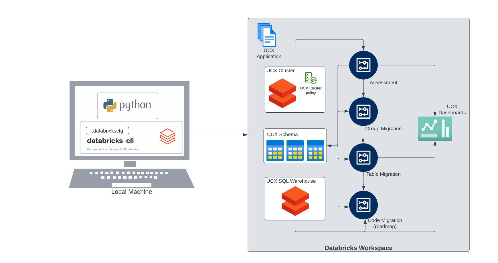

## 

## What is UCX?

[<u>UCX</u>](https://github.com/databrickslabs/ucx), or Unity Catalog
Upgrade Automation, is a Databricks Labs project designed to streamline
the process of upgrading to Unity Catalog. It's an open tool that helps
Databricks customers upgrade their workspace groups, jobs, data with
ease to Unity Catalog.

The UCX tool has several functions including Assessment, Group Upgrade,
Cloud Storage Setup, and Metastore Objects Upgrade (Tables/Views). UCX
has recently introduced tools for code compatibility checks and linting.

UCX provides a detailed **assessment** of various assets such as Hive
Metastore Databases and Tables, Data Sizes, Data Grants, Data and
workspace permissions, Workflows, Clusters, External Locations, Mount
Points, and Service Principals (Azure). The other workflows can be used
for the actual migration of workspace **groups**, **tables** and
notebook/SQL **code** (roadmap).

So, UCX is the go-to tool for an automated upgrade to UC, as it helps
with the following functions:

- **Assessment:** Assesses the UC readiness and effort of migrating the
  account/workspace to UC.

- **Attach Metastore:** Helps with enabling UC in a workspace.

- **Group Upgrade:** Migrates workspace level group permissions to
  account level groups.

- **Cloud Storage Setup:** Creates IAM roles or managed identities for
  cloud connectivity with UC.

- **Metastore Objects Upgrade (Tables/Views):** Migrates HMS tables and
  views to UC.

- **Workflows/Notebook Upgrade (Q3):** Makes notebook code and SQL
  queries to be compatible with UC.

## Installation and Execution

To install UCX, you need to review the prerequisites, download and
install Python, set up the DB CLI environment, verify connection and
authentication to a workspace, and then issue the command: ***databricks
labs install ucx***. These will need to be done from a computer/laptop
running Databricks CLI that will use your authentication to install UCX
into the Databricks workspace.

The prerequisites for installing UCX can be found
[<u>here</u>](https://github.com/databrickslabs/ucx?tab=readme-ov-file#installation).
It includes the following steps:

- Python 3.10 or later installed.

- Databricks CLI v0.213 or later to be set up in the local machine.

- Databricks Premium or Enterprise workspace.

- CLI Authentication to the Databricks workspace and Account.

Once installed, you can run the UCX **workflows** such as
[<u>assessment</u>](https://github.com/databrickslabs/ucx?tab=readme-ov-file#assessment-workflow),
[<u>migrate-groups</u>](https://github.com/databrickslabs/ucx?tab=readme-ov-file#group-migration-workflow),
[<u>migrate-tables</u>](https://github.com/databrickslabs/ucx?tab=readme-ov-file#table-migration-workflow)
and **CLI commands** such as
[<u>create-table-mapping</u>](https://github.com/databrickslabs/ucx?tab=readme-ov-file#create-table-mapping-command),
[<u>create-catalog-schemas</u>](https://github.com/databrickslabs/ucx?tab=readme-ov-file#create-catalogs-schemas-command),
and more. Some workflows are dependent on the CLI commands, so the CLI
commands will need to be run before triggering the workflow execution.

Please note that UCX is a Labs project and is currently in Beta
Stability. That said, it has very high standards of completion,
documentation, and testing.

## Common Challenges with Installing and Running UCX

### Network Connectivity Issues

**From local machine to the Databricks Account and Workspace:** UCX
installation process has to be run from the local laptop using
Databricks CLI and it will deploy the latest version of UCX into the
Databricks workspace. For this reason, the Databricks account and
workspace needs to be accessible from the laptop. Sometimes, the
workspace might have a network isolation, like it can only be reached
from a VPC, or from a specific IP range.

**Solution:** Please check that your laptop has network connectivity to
the Databricks account and workspace. If not, you might need to be
connected to a VPN to access your workspace.

**From local machine to GitHub:** UCX needs internet access to connect
to [<u>github.com</u>](https://github.com) (to download the tool) from
the machine running the installation. The installation will fail if
there is no internet connectivity.

**Solution:** Ensure that GitHub is reachable from the local machine. If
not, make necessary changes to the network/firewall settings.

**From Databricks workspace to PyPi:** There are some dependent
libraries which need to be installed from
[<u>pypi.org</u>](https://pypi.org/) to run the UCX workflows from the
Databricks workspace. If the workspace doesn’t have network
connectivity, then the job might fail with
NO_MATCHING_DISTRIBUTION_ERROR.

**Solution:** Version 0.24.0 of UCX supports workspace with no internet
access. Please upgrade UCX and rerun the installation. Reply *yes* to
the question “Does the given workspace block Internet access?” asked
during installation. It will then upload all necessary dependencies to
the workspace. Also, please note that UCX uses both UC and non-UC
enabled clusters. If you have different proxy settings for each, then
please update the necessary proxies (eg. with init scripts) for each
cluster type.

### Insufficient Privileges

**User is not a Databricks workspace administrator:** User running the
installation needs to be a workspace administrator as the CLI will
deploy the UCX tool into the workspace, create jobs, and dashboards.

**Solution:** Identify a workspace admin from your team and ask them to
install UCX with their authentication, or request a workspace
administrator to grant you temporary administrator privileges to run the
installation.

**User is not a Cloud IAM Administrator:** Cloud CLI needs to be
installed in the local machine for certain cloud related activities,
like creating an [<u>uber
principal</u>](https://github.com/databrickslabs/ucx?tab=readme-ov-file#create-uber-principal-command).
For this, the user needs Cloud IAM Administrator privileges.

**Solution:** Work with a cloud administrator in your organization to
run the commands that need cloud administrator rights.

Admin privileges required for commands:

| **CLI command** | **Admin privileges** |
|----|----|
| [<u>install</u>](https://github.com/databrickslabs/ucx?tab=readme-ov-file#install-ucx) | Workspace Admin |
| [<u>account install</u>](https://github.com/databrickslabs/ucx?tab=readme-ov-file#advanced-installing-ucx-on-all-workspaces-within-a-databricks-account) | Account Admin |
| [<u>create-account-groups</u>](https://github.com/databrickslabs/ucx?tab=readme-ov-file#create-account-groups-command) | Account Admin |
| [<u>validate-groups-membership</u>](https://github.com/databrickslabs/ucx?tab=readme-ov-file#validate-groups-membership-command) | Account Admin |
| [<u>create-uber-principal</u>](https://github.com/databrickslabs/ucx?tab=readme-ov-file#create-uber-principal-command) | Cloud Admin |
| [<u>principal-prefix-access</u>](https://github.com/databrickslabs/ucx?tab=readme-ov-file#principal-prefix-access-command) | Cloud Admin |
| [<u>create-missing-principals</u>](https://github.com/databrickslabs/ucx?tab=readme-ov-file#create-missing-pricipals-command-aws-only) | Cloud Admin |
| [<u>migrate-credentials</u>](https://github.com/databrickslabs/ucx?tab=readme-ov-file#migrate-credentials-command) | Cloud Admin, Account Admin / Metastore Admin / CREATE STORAGE CREDENTIAL privilege |
| [<u>migrate-location</u>](https://github.com/databrickslabs/ucx?tab=readme-ov-file#migrate-locations-command) | Metastore Admin / CREATE EXTERNAL LOCATION privilege |
| [<u>create-catalogs-schemas</u>](https://github.com/databrickslabs/ucx?tab=readme-ov-file#create-catalogs-schemas-command) | Metastore Admin / CREATE CATALOG privilege |
| [<u>sync-workspace-info</u>](https://github.com/databrickslabs/ucx?tab=readme-ov-file#sync-workspace-info-command) | Account Admin |
| [<u>manual-workspace-info</u>](https://github.com/databrickslabs/ucx?tab=readme-ov-file#manual-workspace-info-command) | Workspace Admin |

### Version Issues

**Python:** UCX needs Python version 3.10 or later.

**Solution:** Check the current version using “python --version”. If the
version is lower than 3.10, upgrade the local Python version to 3.10 or
higher.

**Databricks CLI:** Databricks CLI v0.213 or higher is needed.

**Solution:** Check the current version with “databricks --version”. For
lower versions of CLI,
[<u>update</u>](https://docs.databricks.com/en/dev-tools/cli/install.html#update)
the Databricks CLI on the local machine.

**UCX:** When you install UCX, you get the latest version. But since UCX
is being actively developed, new versions are released frequently. There
might be issues if you have run the assessment with a much earlier
version, and then trying to run the migration workflows with the latest
UCX version.

**Solution:** Upgrade UCX, clean the UCX schema tables, and rerun the
assessment job before running the migration workflows. For some reason,
if you want to install a specific version of UCX, you can do it using
the command “databricks labs install ucx@\<version\>”, for example,
“databricks labs install ucx@v0.21.0”.

### Multiple Profiles in Databricks CLI

**Workspace Level:** More than one workspace profile can be configured
in the .databrickscfg file. For example, you can have profiles set for
Dev and Prod workspaces. You want to install UCX only for the Prod
workspace.

**Solution:** The Databricks CLI provides an option to select the
[<u>profile</u>](https://docs.databricks.com/en/dev-tools/cli/profiles.html)
using “*--profile \<profile_name\>*” or “*-p \<profile_name\>*”. You can
test that the correct workspace is getting selected by running any
Databricks CLI command. For example, you can run “*databricks clusters
list -p prod*” and check that the Prod clusters are being returned. Once
the profile is verified, you can run UCX install for that specific
profile: “*databricks labs install ucx -p prod*”.

**Account Level:** Multiple account level profiles are set in the
.databrickscfg file.

**Solution:** The installation command “*databricks labs install ucx*”
will provide an option to select one account profile.

### Authentication Issues

**Account Level:** Not only workspace, but account level authentication
is also needed for installing UCX. If you do not have an account
configured in .databrickscfg, you will get an error message
“.databrickscfg does not contain account profiles; please create one
first”.

**Solution:** To authenticate with a Databricks account, consider using
one of the following authentication types: [<u>OAuth machine-to-machine
(M2M)
authentication</u>](https://docs.databricks.com/en/dev-tools/cli/authentication.html#m2m-auth),
[<u>OAuth user-to-machine (U2M)
authentication</u>](https://docs.databricks.com/en/dev-tools/cli/authentication.html#u2m-auth),
[<u>Basic authentication
(legacy)</u>](https://docs.databricks.com/en/dev-tools/cli/authentication.html#basic-auth).

### Workspace has an external Hive Metastore (HMS)

**External HMS connectivity from UCX clusters:** If the workspace has an
external HMS, the clusters running the UCX jobs need to have specific
configurations to connect to the external HMS. Otherwise, UCX assessment
will not be able to assess the tables on HMS.

**Solution:** Use a cluster policy before installation to set the
required Spark config for connecting to the external HMS, or manually
edit the cluster post-installation to have the correct configurations.
Detailed steps can be found
[<u>here</u>](https://github.com/databrickslabs/ucx/blob/main/docs/external_hms_glue.md).

**External HMS connectivity from UCX SQL warehouse:** UCX requires a SQL
warehouse to create tables, run queries, create and refresh dashboards.
If you already have a Pro or Serverless warehouse connected to the
external HMS, you can select the same warehouse for UCX. You will also
be given an option (during installation) to create a new warehouse for
UCX. If you have never used a warehouse before, the new warehouse
created might not have proper configuration set to connect to the
external HMS.

**Solution:** Set Spark configuration for connecting to external HMS in
the Admin Settings of SQL warehouse. This will only be needed if the
admin settings do not have the configurations already set. For example,
add *spark.hadoop.javax.jdo.option.ConnectionURL \<connectionstring\>*
under Data Access Configuration of SQL Warehouse Admin Settings.

## Verify the Installation

Once the UCX command “*databricks labs install ucx*” has completed
successfully, the installation can be verified with the following steps:

1.  Go to the Databricks Catalog Explorer and check if a new schema for
    ucx is available in Hive Metastore with all empty tables.

2.  Check that the UCX jobs are visible under Workflows.

3.  Run the assessment. This will start the UCX clusters, crawl through
    the workspace, and display results in the UCX dashboards. In case of
    external HMS, verify from the results that the assessment has
    analyzed the external HMS tables.

## Contact Us

For any concerns/issues:

- File an [<u>issue</u>](https://github.com/databrickslabs/ucx/issues)

- Reach out to Databricks support

- Contact your Databricks SA/DSA

## Conclusion

Navigating the complexities of UCX installation and operation can be
challenging, but understanding common issues and their solutions can
make the process smoother. As we continue to improve and develop UCX, we
hope this blog serves as a valuable resource for Databricks customers,
helping them to avoid common pitfalls and successfully upgrade to Unity
Catalog.
