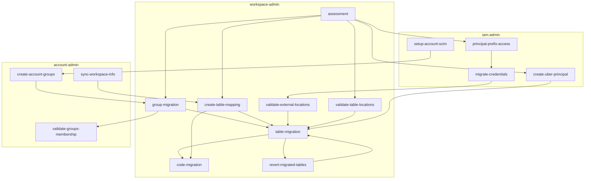

On a high level, the steps in migration process are:
1. [assessment](#assessment-workflow)
2. [group migration](#group-migration-workflow)
3. [table migration](#table-migration-process)
4. [data reconciliation](#post-migration-data-reconciliation-workflow)
5. [code migration](#code-migration-commands)

The migration process can be schematic visualized as:

