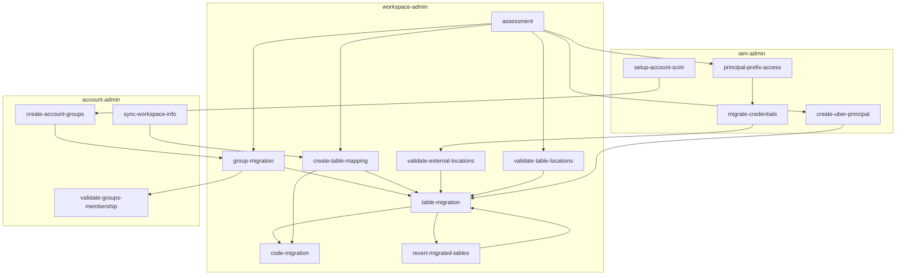

On a high level, the steps in migration process are:

{}

### Assessment

Please follow the [assessment workflow](docs/reference/workflows/assessment.md) 

### Group Migration

Please follow the [group migration workflow](docs/reference/workflows/group_migration.md)

### Table Migration

Please follow the [table migration process](docs/process/table_migration.md)

### Post Migration Data Reconciliation

Please follow the [post-migration data reconciliation workflow](docs/reference/workflows/reconciliation.md)

### Code Migration

Please follow the [code migration commands](docs/reference/commands/code.md)

{}

The migration process can be schematic visualized as:

