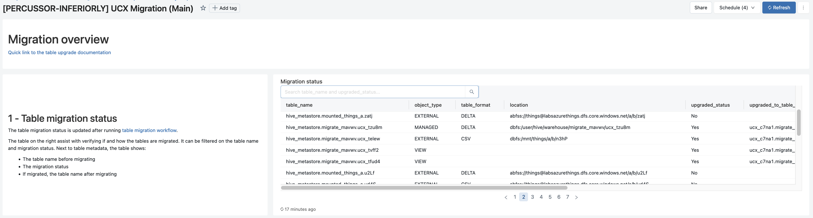

Table Upgrade
===

<!-- TOC -->
* [Table Upgrade](#table-upgrade)
* [Migration dashboard](#migration-dashboard)
* [Common considerations](#common-considerations)
  * [Tables (Parquet/Delta) on DBFS root](#tables-parquetdelta-on-dbfs-root)
  * [Tables (Parquet/Delta) on Cloud Storage](#tables-parquetdelta-on-cloud-storage)
  * [Tables (None Parquet/Delta)](#tables-none-parquetdelta)
  * [Views](#views)
  * [Functions](#functions)
  * [Account Consideration](#account-consideration)
  * [Open Questions](#open-questions)
* [Design](#design)
  * [Data Access Permissions](#data-access-permissions)
  * [External Storage](#external-storage)
  * [Table Mapping](#table-mapping)
  * [Migrating Tables](#migrating-tables)
  * [Moving tables](#moving-tables)
  * [Table Size Estimation](#table-size-estimation)
  * [Table Crawler](#table-crawler)
  * [Table](#table)
<!-- TOC -->

The Hive Metastore migration process will upgrade the following Assets:

- Tables ond DBFS root
- External Tables
- Views

We don't expect this process to be a "one and done" process. The table migration typically is an iterative process
and may require a few runs. The migration process is implemented within a workflow that can be invoked multiple times.
Each time it will upgrade tables it can and report the ones it can't.

[[back to top](#table-upgrade)]

# Migration dashboard

We keep track of the migration and provide the user continuous feedback of the progress and status of the
upgrade. This feedback is presented in the migration dashboard:

[[back to top](#table-upgrade)]

# Common considerations

1. One view per workspace summarizing all the table inventory and various counters
1. By default, we create a single catalog per HMS (<prefix (optional)>_<workspace_name>), happens at the account level.
1. Workspace Name would be set up as part of the installation at the account level.
1. Consider other mappings of environments/database to catalog/database.
    1. The user will be able to specify a default catalog for the workspace.
1. We have to annotate the status of assets that were migrated.
1. We will roll up the migration status to the workspace/account level. Showing migration state.
1. Aggregation of migration failures
    1. View of object migration:

   | Object Type | Object ID                             | Migrated | Migration Failures               |
   |-------------|---------------------------------------|----------|----------------------------------|
   | View        | hive_metastore.finance.transaction_vw | 1        | []                               |
   | Table       | hive_metastore.finance.transactions   | 0        | ["Table uses SERDE: csv"]        |
   | Table       | hive_metastore.finance.accounts       | 0        | []                               |
   | Cluster     | klasd-kladef-01265                    | 0        | ["Uses Passthru authentication"] |

1. By default, the target is the target_catalog/database_name
1. The assessment will generate a mapping file/table. The file will be in CSV format.

   | Source Database | Target Catalog | Target Database |
   |-----------------|----------------|-----------------|
   | finance         | de_dev         | finance         |
   | hr              | de_dev         | human_resources |
   | sales           | ucx-dev_ws     | sales           |
1. The user can download the mapping file, override the targets and upload it to the workspace .csx folder.
1. By default, we copy the table content (CTAS)
1. Allow skipping individual tables/databases
1. Explore sizing tables or another threshold (recursively count bytes)
1. By default, we copy the table into a managed table/managed location
1. Allow overriding target to an external table
1. We should migrate ACLs for the tables (where applicable). We should highlight cases where we can't (no direct
    translation/conflicts)
1. We should consider automating ACLs based on Instance Profiles / Service Principals and other legacy security
    mechanisms

[[back to top](#table-upgrade)]

## Tables (Parquet/Delta) on DBFS root

1. By default, we copy the table content (CTAS)
1. Allow skipping individual tables/databases
1. Explore sizing tables or another threshold (recursively count bytes)
1. By default, we copy the table into a managed table/managed location
1. Allow overriding target to an external table
1. Allow an exception list in case we want to skip certain tables

[[back to top](#table-upgrade)]

## Tables (Parquet/Delta) on Cloud Storage

1. Verify that we have the external locations for these tables
1. Automate creation of External Locations (Future)
1. Use sync to upgrade these tables "in place". Use the default or override catalog.database destination.
1. Update the source table with "upgraded_to" property

[[back to top](#table-upgrade)]

## Tables (None Parquet/Delta)

1. Copy this table using CTAS or Deep Clone. (Consider bringing history)
1. Copy the Metadata
1. Skip tables as needed based on size threshold or an exception list
1. Update the source table with "upgraded_to" property

[[back to top](#table-upgrade)]

## Views

1. Make a "best effort" attempt to upgrade view
1. Create a view in the new location
1. Upgrade table reference to the new tables (based on the upgraded_to table property)
1. Handle nested views
1. Handle or highlight other cases (functions/storage references/ETC)
1. Create an exception list with views failures

[[back to top](#table-upgrade)]

## Functions

1. We should migrate (if possible) functions
1. Address incompatibilities

[[back to top](#table-upgrade)]

## Account Consideration

1. HMS on multiple workspaces may point to the same assets. We need to dedupe upgrades.
1. Allow running assessment on all the accounts workspaces or on a group of workspaces.
1. We have to test on Glue and other external Metastores
1. Create an exception list at the account level the list should contain
    1. Tables that show up on more than one workspace (pointing to the same cloud storage location)
    1. Tables that show up on more than one workspace with different metadata
    1. Tables that show up on more than one workspace with different ACLs
1. Addressing table conflicts/duplications require special processing we have the following options
    1. Define a "master" and create derivative objects as views
    1. Flag and skip the dupes
    1. Duplicate the data and create dupes
1. Consider upgrading a workspace at a time. Highlight the conflict with prior upgrades.
1. Allow workspace admins to upgrade more than one workspace.

[[back to top](#table-upgrade)]

## Open Questions

1. How do we manage/surface potential cost of the assessment run in case of many workspaces.
1. How do we handle conflicts between workspaces
1. What mechanism do we use to map source to target databases
1. How to list workspaces in Azure/AWS

[[back to top](#table-upgrade)]

# Design

## Data Access Permissions

The code provided is a Python module that defines a `Grant` dataclass and a `GrantsCrawler` class. The `Grant` dataclass
represents a grant of privileges in a database system, with attributes for the principal, action type, catalog, database,
table, view, UDF, and flags for any file and anonymous function. The `GrantsCrawler` class is a crawler that fetches grants
for databases, tables, views, UDFs, and anonymous functions in a Hive metastore.

It uses a `TablesCrawler` and `UdfsCrawler` to fetch table and UDF information, respectively. The `GrantsCrawler` class
provides methods for fetching grants based on different parameters and returning them as an iterable of `Grant` objects.
It also provides methods for getting grants for a specific table or schema. The code includes a `_type_and_key` method
that normalizes the input parameters and returns a tuple of the object type and key, which is used to fetch grants for
the specified object. The code also includes methods for generating SQL statements to grant and revoke privileges in
Hive and Unity Catalog (UC) systems.

[[back to top](#table-upgrade)]

## External Storage

The module includes two classes, `ExternalLocations` and `Mounts`, which inherit from `CrawlerBase`.

`ExternalLocations` is a class for crawling and managing external locations used by tables in a Databricks workspace.
It has methods for creating a list of external locations based on tables in a given schema and a method for generating
Terraform definitions for any missing external locations. The class has a `_external_locations` method that filters and p
rocesses the external locations based on certain conditions.

`Mounts` is a class for managing mounts in a Databricks workspace. It has methods for listing and deduplicating mounts,
as well as a method for creating a snapshot of the current mounts. The `_deduplicate_mounts` method removes any duplicate
mounts based on their name and source.

[[back to top](#table-upgrade)]

## Table Mapping

The module includes two dataclasses, `Rule` and `TableToMigrate`, which encapsulate information about the source and target tables for migration.
The `Rule` dataclass includes information about the source and target catalog, schema, and table names, as well as a method for generating
the unique key for the target table in the Unity Catalog (UC) and the Hive Metastore (HMS). The `TableToMigrate` dataclass includes
a `Table` object representing the source table and a `Rule` object representing the migration rule for that table.

At the heart of the module is the `TableMapping` class, which is the main class for managing table mappings.
The `TableMapping` class includes several methods for managing the table mappings, such as loading and saving
the mappings to a file, skipping tables and schemas, and checking if a table is already migrated or marked to be skipped.
The `TableMapping` class is initialized with an `Installation` object, a `WorkspaceClient` object, and a `SqlBackend` object,
which are used to interact with the Unity Catalog, the workspace, and to execute SQL queries.

[[back to top](#table-upgrade)]

## Migrating Tables

The `TablesMigrate` class is designed for migrating tables from one schema to another within a Databricks workspace.
This class requires instances of `TablesCrawler`, `WorkspaceClient`, `SqlBackend`, and `TableMapping` as inputs.
The `migrate_tables` method is responsible for migrating tables and takes an optional argument `what` to filter tables
based on their type. This method internally calls the `_migrate_table` method which is responsible for migrating
the actual table and determining the appropriate migration method based on the table's type.

The `_migrate_external_table`, `_migrate_dbfs_root_table`, and `_migrate_view` methods are used to migrate external
tables, DBFS root tables, and views, respectively. The `_init_seen_tables`, `_table_already_upgraded`, `_get_tables_to_revert`,
and `_revert_migrated_table` methods are used for managing the state of the migration process. The `_init_seen_tables` method
initializes the list of tables that have been seen during the migration process. The `_table_already_upgraded` method checks
if a table has already been upgraded. The `_get_tables_to_revert` method retrieves the list of tables that can be reverted.
The `_revert_migrated_table` method is responsible for reverting the migration of a table.

The `is_upgraded` method checks if a table has been upgraded or not. The `print_revert_report` method generates a report
of the tables that can be reverted.

[[back to top](#table-upgrade)]

## Moving tables

The `TableMove` class is a newly developed feature that enables the movement or aliasing of tables and views from one
schema to another within UC. This class requires an instance of `WorkspaceClient` and `SqlBackend` as inputs and provides
two primary methods: `move_tables` and `alias_tables`. The `move_tables` method moves tables to a new schema, while
the `alias_tables` method creates aliases of tables and views in a different schema.

The `_move_table`, `_alias_table`, and `_move_view` methods are responsible for performing the actual movement, aliasing,
and recreating of the table or view in the destination schema, taking into account any dependencies or permissions
associated with the object. The `_reapply_grants` method reapplies the grants on the migrated table or view, ensuring
that the necessary permissions are maintained. The `_recreate_table` and `_recreate_view` methods recreate the table or
view in the destination schema, including any dependencies or permissions associated with the object.

[[back to top](#table-upgrade)]

## Table Size Estimation

The Table Size Crawler is a new feature of the data crawler system that calculates the size of tables in a Hive Metastore.
The `TableSizeCrawler` class is developed to inherit from `CrawlerBase` and is initialized with a SQL Execution Backend
and a schema name. This class uses the `TablesCrawler` class to obtain a snapshot of tables and then iterates over them
to calculate the size of each table using the `_safe_get_table_size` method which queries the Spark SQL engine.

The `TableSizeCrawler` class has several methods, including `snapshot`, `_try_load`, and `_crawl`. The `snapshot` method
returns a list of `TableSize` objects representing the snapshot of tables, filtered to include only those with a non-null
size. The `_try_load` method tries to load table information from the database and raises a `TABLE_OR_VIEW_NOT_FOUND`
error if the table cannot be found. The `_crawl` method crawls and lists tables using the `tables_crawler` object and
calculates the size of DBFS root tables, skipping tables that are not of type `TABLE` or are not DBFS root tables.

[[back to top](#table-upgrade)]

## Table Crawler

The `TablesCrawler` is designed for crawling and listing tables within Hive Metastore. It can fetch detailed information
about each table, including the table's name, external location, and storage format. This information can be used to
better understand the structure and contents of the tables in the Databricks workspace.

[[back to top](#table-upgrade)]

## Table

The `Table` class has the following methods:

* `is_delta`: Returns `True` if the table format is DELTA, else `False`.
* `key`: Returns the key of the table in the format `<catalog>.<database>.<name>`.
* `kind`: Returns the kind of the table, either 'TABLE' or 'VIEW'.
* `sql_alter_to`: Returns an SQL command to alter the table to a target table key.
* `sql_alter_from`: Returns an SQL command to alter the table from a target table key with a workspace ID.
* `sql_unset_upgraded_to`: Returns an SQL command to unset the upgraded\_to property of the table.
* `is_dbfs_root`: Returns `True` if the table location is in the DBFS root directory, else `False`.
* `is_format_supported_for_sync`: Returns `True` if the table format is supported for synchronization, else `False`.
* `is_databricks_dataset`: Returns `True` if the table location is a Databricks dataset, else `False`.
* `what`: Returns the type of the table based on its properties.
* `sql_migrate_external`: Returns an SQL command to migrate an external table.
* `sql_migrate_dbfs`: Returns an SQL command to migrate a table located in DBFS.
* `sql_migrate_view`: Returns an SQL command to migrate a view.

[[back to top](#table-upgrade)]
