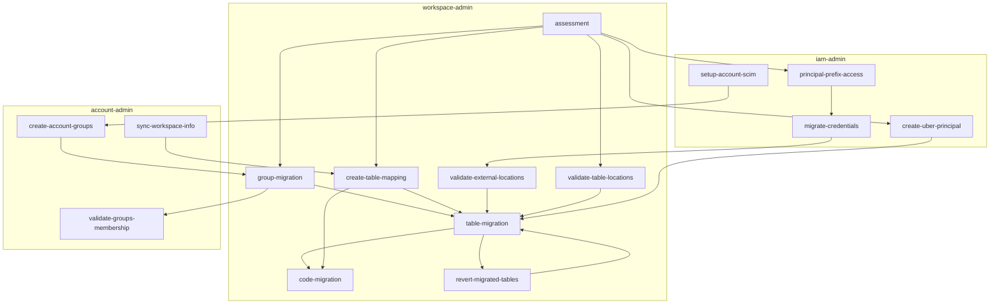
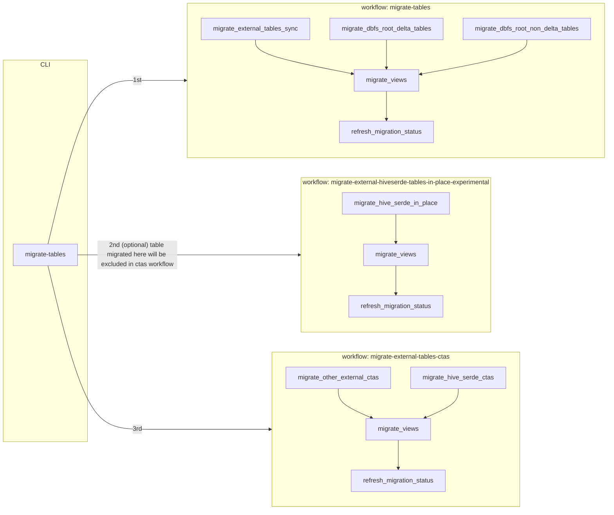

# Process

On a high level, the steps in migration process are:
1. [assessment](/docs/reference/workflows#assessment-workflow)
2. [group migration](/docs/reference/workflows#group-migration-workflow)
3. [table migration](/docs/process/#table-migration-process)
4. [data reconciliation](/docs/reference/workflows#post-migration-data-reconciliation-workflow)
5. [code migration](#code-migration)
6. [final details](#final-details)
5. [code migration](/docs/reference/commands#code-migration-commands)
6. [pipeline migration](/docs/process#pipeline-migration-process)

The migration process can be schematic visualized as:




## Table migration process

> You are required to complete the [assessment workflow](/docs/reference/workflows#assessment-workflow) before starting the table migration workflow.

This section explains how to migrate Hive metastore data objects to Unity Catalog. The table migration process consists
of more steps than only a [workflow](/docs/reference/workflows#table-migration-workflows), these steps are:

1. [Table mapping](#table-mapping) : Create a file that maps Hive metastore data objects to Unity Catalog locations.
2. [Data access](#data-access) : Setup identities to access table data.
3. [New Unity Catalog resources](#new-unity-catalog-resources) : Create **new** Unity Catalog resources that do not
   require touching existing Hive metastore resources.
4. [Migrate Hive metastore data objects](/docs/process/#migrate-hive-metastore-data-objects) : Migrate Hive metastore data objects to UC.

### Table mapping

This section details how to create the table mapping file. This file points existing Hive metastore tables and views to
Unity Catalog locations. When [migrating the tables and views](/docs/process/#migrate-hive-metastore-data-objects), the file is read
to decide where to migrate the tables and views to.

#### Step 1 : Create the mapping file

Create the mapping file in the [UCX installation folder](/docs/installation#installation-resources) by running the
[`create-table-mapping` command](/docs/reference/commands#create-table-mapping). By default, the file contains all the Hive metastore
tables and views mapped to a single UC catalog, while maintaining the original schema and table names.

#### Step 2: Update the mapping file

Edit the mapping file from the previous step to:
- Exclude tables and/or views by removing the lines
- Change UC location by editing the destination catalog and/or schema

The mapping file is in CSV format and can be edited using any text editor or Excel. If using Excel, save the file in CSV
format.

Example changes:

**Before editing**

| **workspace_name**   | **catalog_name** | **src_schema** | **dst_schema** | **src_table** | **dst_table** |
|----------------------|--------------|----------------|----------------|---------------|---------------|
| data_engineering_ws  | 123333333   | sales_analysis      | sales_analysis      | ytd_sales        | ytd_sales        |

**After editing**

| **workspace_name**   | **catalog_name** | **src_schema** | **dst_schema** | **src_table** | **dst_table** |
|----------------------|------------------|----------------|----------------|---------------|---------------|
| data_engineering_ws  | data_engineering | sales_analysis      | sales      | ytd_sales        | ytd_analysis        |

### Data access

> Throughout this guide, we refer to IAM roles/instance profiles in AWS & service principals/managed identities in
> as "cloud principals".

This section creates the cloud principals to access data in Unity Catalog and during the table data during migration. To
understand the motivation for this step, read how Databricks accesses cloud locations:
- [AWS - Create External Locations](https://docs.databricks.com/en/connect/unity-catalog/external-locations.html)
- [Azure - Create External Locations](https://learn.microsoft.com/en-us/azure/databricks/connect/unity-catalog/external-locations)

#### Step 1 : Map cloud principals to cloud storage locations

Map the cloud principals to cloud storage by running the
[`principal-prefix-access` command](/docs/reference/commands#principal-prefix-access).

#### Step 2 : Create or modify cloud principals and credentials

Manually create the cloud principals to access data from Unity Catalog:

- AWS:
  - [`create-missing-principals` command](/docs/reference/commands/#create-missing-principals) creates new AWS roles for Unity
    Catalog to access data.
  - Or, [Manually create storage credentials](https://docs.databricks.com/en/connect/unity-catalog/storage-credentials.html)
- Azure:
  - [Manually create storage Credentials](https://learn.microsoft.com/en-us/azure/databricks/sql/language-manual/sql-ref-storage-credentials)

Then, run the [`migrate-credentials` command](/docs/reference/commands#migrate-credentials) to migrate the cloud principal
credentials to Unity Catalog.

#### Step 3: Create the "uber" Principal

Create the "uber" principal by running the [`create-uber-principal` command](/docs/reference/commands#create-uber-principal).
The table migration requires a cloud principal with access to table data stored in cloud storage. These tables are known
as external tables. UCX name this cloud principal the "uber" principal as it has access to **all** in-scope cloud
storage. This principal is only required for the table migration process and not for ongoing UC usage. Once the upgrade
is completed, this principal should be deleted.

### New Unity Catalog resources

This section details the **new** Unity Catalog resources required for migration the data objects. These resources can be
created without touching the existing Hive metastore objecs.

#### Step 0: Attach a metastore

If skipping the [group migration](/docs/reference/workflows#group-migration-workflow), then a metastore should be attached to the workspace by
following [these instructions](https://docs.databricks.com/en/data-governance/unity-catalog/create-metastore.html) or running the [`assign-metastore` command](/docs/reference/commands#assign-metastore).

#### Step 1: Create external Locations

Create UC external locations by running the [`migration-locations` command](/docs/reference/commands#migrate-locations). The command
creates a location for each location found during the [assessment](/docs/reference/workflows#assessment-workflow). It uses the credentials
created in the previous steps.

Alternatively, manually create the external locations
- [AWS - Create External Locations](https://docs.databricks.com/en/connect/unity-catalog/external-locations.html)
- [Azure - Create External Locations](https://learn.microsoft.com/en-us/azure/databricks/connect/unity-catalog/external-locations)

##### Step 2: Create Catalogs and Schemas

Create Unity Catalog [catalogs](https://learn.microsoft.com/en-us/azure/databricks/catalogs/) and
[schemas](https://learn.microsoft.com/en-us/azure/databricks/schemas/) to organize the destination tables and views in
by running the
[`create-catalogs-schemas` command](/docs/reference/commands#create-catalogs-schemas). The command creates the UC catalogs and
schemas based on the [table mapping file](#table-mapping). Additionally, it migrates Hive metastore database
permissions if present.

This step requires considering how to [physically separate data in storage](https://docs.databricks.com/en/data-governance/unity-catalog/best-practices.html#data-is-physically-separated-in-storage)
within UC. As [Databricks recommends storing managed data at the catalog level](https://docs.databricks.com/en/data-governance/unity-catalog/best-practices.html#configure-a-unity-catalog-metastore),
we advise to prepare the external locations for the to-be created catalogs before running the `create-catalogs-schemas`
command. Either, reuse [previously created external locations](/docs/process/#step-1-create-external-locations) or create additional
external locations outside of UCX if data separation restrictions requires that. Note that external locations can be
reused when using subpaths, for example, a folder in a cloud storage
(`abfss://container@storage.dfs.core.windows.net/folder`) can reuse the external location of the cloud storage
(`abfss://container@storage.dfs.core.windows.net/`). (The previous example also holds for other clouds.)

### Migrate Hive metastore data objects

In this step, tables and views are migrated using the following workflows:



The [table migration workflows](/docs/reference/workflows#table-migration-workflows) can be triggered using the [`migrate-tables` command](/docs/reference/commands#migrate-tables) or by
starting the workflows from the workspace UI manually. The table migration workflows are designed to minimize data
copying and to maintain metadata while allowing users to choose preferred strategies where possible. Chose the
strategies for migrating tables using the table below:

| Object Type           | Description                                                                                            | Upgrade Method                                                                                                                                                                                                                                                                                                                                                                                                                                                                                                                                                                                                                                                                                                                                                                                                                                                                                                                                                                                                                                                                                                                                                                                         |
|-----------------------|--------------------------------------------------------------------------------------------------------|--------------------------------------------------------------------------------------------------------------------------------------------------------------------------------------------------------------------------------------------------------------------------------------------------------------------------------------------------------------------------------------------------------------------------------------------------------------------------------------------------------------------------------------------------------------------------------------------------------------------------------------------------------------------------------------------------------------------------------------------------------------------------------------------------------------------------------------------------------------------------------------------------------------------------------------------------------------------------------------------------------------------------------------------------------------------------------------------------------------------------------------------------------------------------------------------------------|
| `DBFS_ROOT_DELTA`     | Delta tables persisted on the Databricks file system (dbfs).                                           | Create a copy of the table with the [`DEEP CLONE` command](https://docs.databricks.com/en/sql/language-manual/delta-clone.html).                                                                                                                                                                                                                                                                                                                                                                                                                                                                                                                                                                                                                                                                                                                                                                                                                                                                                                                                                                                                                                                                       |
| `DBFS_ROOT_NON_DELTA` | Non-delta tables persisted on the Databricks file system (dbfs).                                       | Create a copy of the table with a [`CREATE TABLE AS SELECT * FROM` command](https://docs.databricks.com/en/sql/language-manual/sql-ref-syntax-ddl-create-table-using.html). The UC table will be a Delta table.                                                                                                                                                                                                                                                                                                                                                                                                                                                                                                                                                                                                                                                                                                                                                                                                                                                                                                                                                                                        |                                                                                                                                                                                                                                                                                                                                                                                                                                                                                                                   |
| `MANAGED`             | Managed Hive metastore tables.                                                                         | Depending on the managed table migration strategy chosen during installation:<br/>1. `CLONE`: Create a copy of the table with a [`CREATE TABLE LOCATION '<location>' AS SELECT * FROM` command](https://docs.databricks.com/en/sql/language-manual/sql-ref-syntax-ddl-create-table-using.html).<br/>2. `SYNC_AS_EXTERNAL`, synchronize the table metadata to UC with the [`SYNC` command](https://docs.databricks.com/en/sql/language-manual/sql-ref-syntax-aux-sync.html). **Warning**: If the managed Hive metastore table is dropped, the drop deletes the underlying data affecting the synchronised UC table as well.<br/>3. `CONVERT_TO_EXTERNAL`: First, in-place convert the managed Hive metastore to a non-managed table. Then, synchronize the table metadata to UC with the [`SYNC` command](https://docs.databricks.com/en/sql/language-manual/sql-ref-syntax-aux-sync.html). **Warning**: This strategy has the advantage over `SYNC_AS_EXTERNAL` that dropping the Hive metastore table does not delete the underlying data, however, impact should be carefully validated in existing workloads as the strategy converts the managed Hive metastore to an external table **in-place**. |
| `EXTERNAL_SYNC`       | External tables that the `SYNC` command supports: Delta, Parquet, CSV, JSON, ORC, text or Avro tables. | Synchronize the table metadata to UC with the [`SYNC` command](https://docs.databricks.com/en/sql/language-manual/sql-ref-syntax-aux-sync.html).                                                                                                                                                                                                                                                                                                                                                                                                                                                                                                                                                                                                                                                                                                                                                                                                                                                                                                                                                                                                                                                       |
| `EXTERNAL_NO_SYNC`    | External tables that the `SYNC` command does not support.                                              | Create a copy of the table with a [`CREATE TABLE AS SELECT * FROM` command](https://docs.databricks.com/en/sql/language-manual/sql-ref-syntax-ddl-create-table-using.html). The UC table will be a Delta table.                                                                                                                                                                                                                                                                                                                                                                                                                                                                                                                                                                                                                                                                                                                                                                                                                                                                                                                                                                                        |
| `EXTERNAL_HIVESERDE`  | External Hive SerDe tables that the `SYNC` command does not support.                                   | Depending on the migration workflow chosen:<br/>1. `migrate-external-tables-ctas` (officially supported) : Create a copy of the table with a [`CREATE TABLE AS SELECT * FROM` command](https://docs.databricks.com/en/sql/language-manual/sql-ref-syntax-ddl-create-table-using.html) The UC table will be a Delta table.<br/>2. `migrate-external-hiveserde-tables-in-place-experimental` (experimental) : Recreate the [Hive SerDe](https://cwiki.apache.org/confluence/display/Hive/SerDe) tables using the serialization and deserialization protocols. **Warning:** Although this strategy is supported, there is a risk that the old files created by Hive SerDe may not be processed correctly by Spark datasource in corner cases.                                                                                                                                                                                                                                                                                                                                                                                                                                                             |
| `VIEW`                | Views                                                                                                  | Recreate [views](https://docs.databricks.com/en/sql/language-manual/sql-ref-syntax-ddl-create-view.html) using their definitions after repointing their dependencies to UC objects. The migration process supports views depending on other views.                                                                                                                                                                                                                                                                                                                                                                                                                                                                                                                                                                                                                                                                                                                                                                                                                                                                                                                                                     |

The workflows may be executed multiple times. Each step is designed as a standalone operation that migrates all
in-scope tables. After migration, each object is marked with an `upgraded_to` property containing the UC identifier to
which the object is migrated. This property signals that the object is out-of-scope for other migration operations and
that the view dependency exists within UC. The created UC objects are marked with an `upgraded_from` property containing
the Hive metastore identifier from which the object was migrated.

Finally, the table migration workflows also migrate Hive metastore permissions to Unity Catalog.

Considerations:
- You may want to run the workflows multiple times to migrate tables in phases.
- If your Delta tables in DBFS root have a large number of files, consider:
  - Setting higher `Min` and `Max workers for auto-scale` when being asked during the UCX installation. More cores in the cluster means more concurrency for calling cloud storage API to copy files when deep cloning the Delta tables.
  - Setting higher `Parallelism for migrating DBFS root Delta tables with deep clone` (default 200) when being asked during the UCX installation. This controls the number of Spark tasks/partitions to be created for deep clone.
- Consider creating an instance pool, and setting its id when prompted during the UCX installation. This instance pool will be specified in the cluster policy used by all UCX workflows job clusters.
- You may also manually edit the job cluster configration per job or per task after the workflows are deployed.

Additional references:
- [Databricks file system (dbfs)](https://docs.databricks.com/en/dbfs/index.html)
- [External tables](https://docs.databricks.com/en/tables/external.html)

### Odds and Ends

The following sections detail how to repair/amend the UC metastore after the upgrade process.

#### Skip migrating schemas, tables or views

```bash
databricks labs ucx skip --schema X [--table Y] [--view Zj]
```

The [`skip` command](/docs/reference/commands/#skip) marks a schema, table or view as to-be skipped during the migration processes.

####  Move data objects

```bash
databricks labs ucx move --from-catalog A --from-schema B --from-table C --to-catalog D --to-schema E
```

The [`move` command](/docs/reference/commands#move) moves the object from the source to the target location. The `upgraded_from`
property are updated to reflect the new location on the source object. Use this command if the data object is migrated
to the wrong destination.

#### Alias data objects

```bash
databricks labs ucx alias --from-catalog A --from-schema B --from-table C --to-catalog D --to-schema E
```

This [`alias` command](/docs/reference/commands#alias) creates an alias for the object in the target location by creating a view reading
from the table that needs aliasing. It will create a mirror view to view that is marked as alias.
Use this command if Hive metastore tables point to the same location as UC does not support UC does not support tables
with overlapping data locations.

#### Revert migrated data objects

```bash
databricks labs ucx revert-migrated-tables --schema X --table Y [--delete-managed]
```

The [`revert-migrated-tables` command](/docs/reference/commands#revert-migrated-tables) drops the Unity Catalog table or view and reset
the `upgraded_to` property on the source object. Use this command to allow for migrating a table or view again.


## Code Migration

After you're done with the [table migration](#table-migration-process) and
[data reconciliation](/docs/reference/workflows#post-migration-data-reconciliation-workflow), you can proceed with code
migration.

Before migrating code, use the linter to investigate what should be changed to become Unity Catalog compatible:
- The `assessment` and `migration-progress` [dashboards](/docs/reference/dashboards) show details on
  linted workspace resources.
- [`lint-local-code` command](/docs/reference/commands#lint-local-code) lints code on your local file system.

The [linter advices show codes and messages](/docs/reference/linter_codes) on the detected compatability issues and how
to resolve them.

After investigating the code linter advices, code can be migrated. We recommend to:
- Use the [`migration-progress` dashboard](/docs/reference/dashboards) to prioritize and track resource migration.
- Use the [`migrate-` commands`](/docs/reference/commands#code-migration-commands) to migrate resources.
- Set the [default catalog](https://docs.databricks.com/en/catalogs/default.html) to Unity Catalog.

## Final details

Once you're done with the [code migration](#code-migration), you can run the:
- [`cluster-remap` command](/docs/reference/commands#cluster-remap) to remap the clusters to be UC compatible.


## Pipeline Migration Process

> You are required to complete the [assessment workflow](/docs/reference/workflows#assessment-workflow) before starting the pipeline migration workflow.

The pipeline migration process is an automated process that migrates Hive Metastore Delta Live Table (DLT) pipelines to the Unity Catalog.

Upon the first update, the cloned pipeline will copy over all the data and checkpoints, and then run normally thereafter. After the cloned pipeline reaches ‘RUNNING’, both the original and the cloned pipeline can run independently.


### Known issues and Limitations:
- Only clones from HMS to UC are supported.
- Pipelines may only be cloned into the same workspace.
- HMS pipelines must currently be publishing tables to some target schema.
- Only the following streaming sources are supported:
    - Delta
    - [Autoloader](https://docs.databricks.com/en/ingestion/cloud-object-storage/auto-loader/index.html)
        - If your pipeline uses Autoloader with file notification events, do not run the original HMS pipeline after cloning as this will cause some file notification events to be dropped from the UC clone. If the HMS original was started accidentally, missed files can be backfilled by using the `cloudFiles.backfillInterval` option in Autoloader.
    - Kafka where `kafka.group.id` is not set
    - Kinesis where `consumerMode` is not "efo"
- Maintenance is automatically paused (for both pipelines) while migration is in progress
- If an Autoloader source specifies an explicit `cloudFiles.schemaLocation`, `mergeSchema` needs to be set to true for the HMS original and UC clone to operate concurrently.
- Pipelines that publish tables to custom schemas are not supported.
- On tables cloned to UC, time travel queries are undefined when querying by timestamp to versions originally written on HMS. Time travel queries by version will work correctly, as will time travel queries by timestamp to versions written on UC.
- [All existing limitations](https://docs.databricks.com/en/delta-live-tables/unity-catalog.html#limitations) of using DLT on UC.
- [Existing UC limitations](https://docs.databricks.com/en/data-governance/unity-catalog/index.html#limitations)
    - If tables in the HMS pipeline specify storage locations (using the "path" parameter in Python or the LOCATION clause in SQL), the configuration "pipelines.migration.ignoreExplicitPath" can be set to "true" to ignore the parameter in the cloned pipeline.
